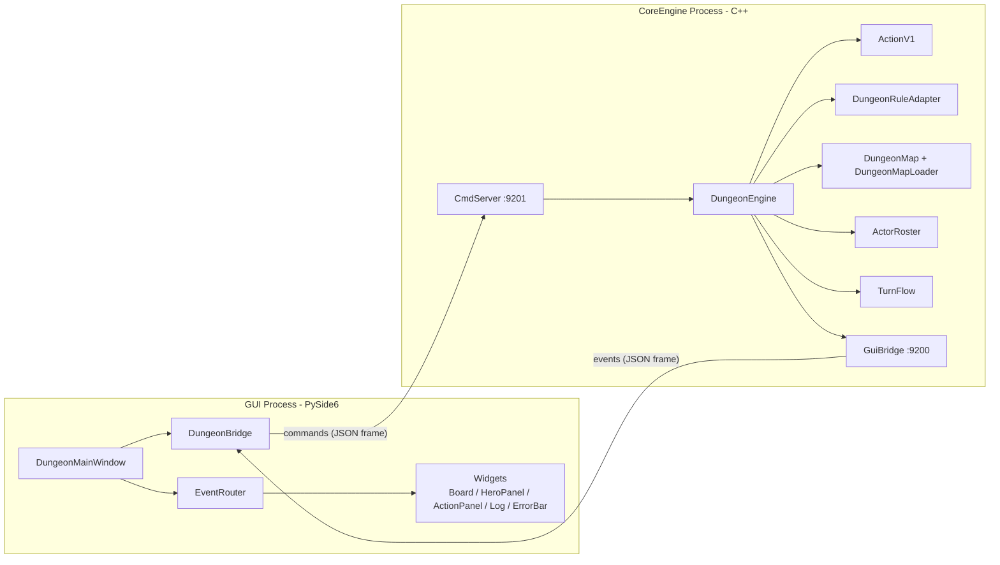
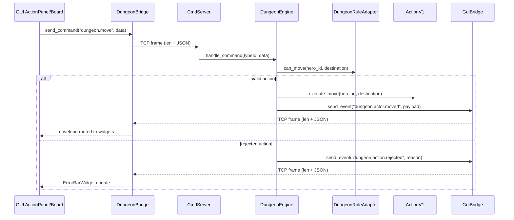

# Dungeon Crawler Basic — CoreEngine and GUI API

**Version:** 0.2
**Status:** FASE A completed (interfaces and stubs)
**Language:** C++17 (CoreEngine) + Python 3 / PySide6 (GUI)
**Namespace:** `gmDungeonBasic`
**Source directory:** `GAME/Dungeon-Crawler-Basic/`

---

## Table of Contents

- [Dungeon Crawler Basic — CoreEngine and GUI API](#dungeon-crawler-basic--coreengine-and-gui-api)
  - [Table of Contents](#table-of-contents)
  - [Overview](#overview)
  - [Architecture (Mermaid)](#architecture-mermaid)
  - [Runtime Flow (Mermaid)](#runtime-flow-mermaid)
  - [Dependencies](#dependencies)
  - [CoreEngine API (C++)](#coreengine-api-c)
    - [DungeonTypes](#dungeontypes)
    - [DungeonEngine](#dungeonengine)
    - [DungeonMap](#dungeonmap)
    - [DungeonMapLoader](#dungeonmaploader)
    - [ActorInfo and ActorRoster](#actorinfo-and-actorroster)
    - [TurnFlow](#turnflow)
    - [DungeonRuleAdapter](#dungeonruleadapter)
    - [ActionV1](#actionv1)
    - [GameLog](#gamelog)
    - [GuiBridge](#guibridge)
    - [CmdServer](#cmdserver)
  - [GUI API (Python)](#gui-api-python)
  - [Usage Examples](#usage-examples)
  - [Contract Notes](#contract-notes)
  - [FASE A Notes](#fase-a-notes)

---

## Overview

Dungeon Crawler Basic is implemented as two separate processes:

- **CoreEngine (C++)**: source of truth for game state and rules.
- **GUI (Python/PySide6)**: presentation and user input only.

The v1 gameplay scope is intentionally limited to:

- Move
- Heal
- Equip

Attack and Defend are intentionally outside v1 and planned for v2.

---

## Architecture (Mermaid)



---

## Runtime Flow (Mermaid)



---

## Dependencies

CoreEngine integrates these game libraries:

- `gmDispatch`
- `gmLog`
- `gmAlea`
- `gmFlow`
- `gmRules`
- `gmMap` (header-only)
- `gmSave` (JSON)
- `gmActor` (core sources compiled into target)

GUI reuses:

- `pyLib/gmGui/engine_bridge`

---

## CoreEngine API (C++)

### DungeonTypes

File: `CoreEngine/engine/DungeonTypes.hpp`

Provides shared enums and wire constants.

- Enums: `GamePhase`, `DungeonActorKind`, `GameOutcome`
- Ports: `ports::EVENTS = 9200`, `ports::COMMANDS = 9201`
- Command IDs: `dungeon.new_game`, `dungeon.move`, `dungeon.heal`, `dungeon.equip`, `dungeon.end_turn`
- Event IDs: `dungeon.session.started`, `dungeon.map.snapshot`, `dungeon.actor.snapshot`, `dungeon.actor.moved`, `dungeon.actor.healed`, `dungeon.actor.equipped`, `dungeon.actor.status_changed`, `dungeon.actor.hp_changed`, `dungeon.turn.started`, `dungeon.turn.ended`, `dungeon.action.rejected`, `dungeon.game.over`

---

### DungeonEngine

File: `CoreEngine/engine/DungeonEngine.hpp`

Facade/Mediator that coordinates all subsystems and emits GUI events.

#### Function details (from Doxygen comments)

| Signature | @brief | Details | @param | @return | @throws |
|---|---|---|---|---|---|
| `DungeonEngine()` | Constructs the engine and readies all subsystems. | No network connection is established at construction time; `GuiBridge` connects lazily on the first emitted event. | - | - | - |
| `void start_game(const std::string& map_file = "")` | Loads a dungeon map from JSON and starts a new session. | Resets all subsystems, loads map via `DungeonMapLoader`, populates `ActorRoster`, resets `TurnFlow`, emits initial snapshots and `session-started`. | `map_file`: path to JSON map file (see wire contract). | `void` | `std::runtime_error` if map file cannot be loaded. |
| `void handle_command(const std::string& typeId, const nlohmann::json& data)` | Processes one command received from the GUI. | Dispatches to the correct private handler based on `typeId`; unknown IDs are silently ignored. | `typeId`: command type identifier; `data`: command payload object. | `void` | - |
| `void advance_turn()` | Advances the game phase automatically where no hero input is needed. | Triggered by main loop for monster-turn logic and automatic phase transitions. | - | `void` | - |

---

### DungeonMap

File: `CoreEngine/world/DungeonMap.hpp`

Graph-based map abstraction over gmMap.

#### Function details (from Doxygen comments)

| Signature | @brief | @param | @return | @throws |
|---|---|---|---|---|
| `DungeonMap()` | Constructs an empty dungeon map. | - | - | - |
| `void create_room(const std::string& room_id)` | Creates a new room in the dungeon. | `room_id`: unique room identifier. | `void` | `std::invalid_argument` on duplicate room id. |
| `void add_connection(const std::string& from_id, const std::string& to_id, bool bidirectional = true)` | Adds a connection between two rooms. | `from_id`, `to_id`, `bidirectional`. | `void` | `std::invalid_argument` if either room does not exist. |
| `void set_room_tag(const std::string& room_id, const std::string& tag)` | Attaches a tag to a room. | `room_id`, `tag`. | `void` | `std::invalid_argument` if room does not exist. |
| `void remove_room_tag(const std::string& room_id, const std::string& tag)` | Removes a tag from a room. | `room_id`, `tag`. | `void` | - |
| `bool has_room(const std::string& room_id) const` | Checks whether a room with the given id exists. | `room_id`. | `true` if room exists. | - |
| `bool is_adjacent(const std::string& from_id, const std::string& to_id) const` | Checks whether two rooms are directly connected. | `from_id`, `to_id`. | `true` if direct connection exists. | - |
| `bool room_has_tag(const std::string& room_id, const std::string& tag) const` | Checks whether a room has a specific tag. | `room_id`, `tag`. | `true` if tag is present. | - |
| `std::vector<std::string> all_rooms() const` | Returns all room identifiers in the dungeon. | - | vector of room IDs (unspecified order). | - |
| `std::vector<std::string> rooms_adjacent_to(const std::string& room_id) const` | Returns rooms directly connected from one room. | `room_id`. | vector of adjacent room IDs. | `std::invalid_argument` if room does not exist. |
| `std::vector<std::string> tags_of_room(const std::string& room_id) const` | Returns all tags attached to a room. | `room_id`. | vector of tag strings. | `std::invalid_argument` if room does not exist. |
| `void reset()` | Removes all rooms, connections and tags. | - | `void` | - |

---

### DungeonMapLoader

File: `CoreEngine/world/DungeonMapLoader.hpp`

JSON loader for map + initial actor placement.

#### Function details (from Doxygen comments)

| Signature | @brief | Details | @param | @return | @throws |
|---|---|---|---|---|---|
| `DungeonMapLoader()` | Constructs a loader with no file loaded. | - | - | - | - |
| `bool load_from_file(const std::string& file_path, DungeonMap& map, ActorRoster& actors)` | Loads a dungeon definition from a JSON file. | Replaces existing content in map and actors. On failure call `last_error()`. | `file_path`: JSON path; `map`: target map; `actors`: target roster. | `true` on success, `false` on I/O or parse error. | - |
| `std::string last_error() const` | Returns a human-readable description of last load failure. | Empty string if last load succeeded. | - | error description string. | - |

---

### ActorInfo and ActorRoster

File: `CoreEngine/actors/ActorRoster.hpp`

`ActorInfo` fields:

- `id`, `kind`, `hp`, `max_hp`, `location`, `tags`, `statuses`

`ActorRoster` manages hero/monster/elite/boss actors.

#### Function details (from Doxygen comments)

| Signature | @brief | @param | @return | @throws |
|---|---|---|---|---|
| `ActorRoster()` | Constructs an empty roster. | - | - | - |
| `void add_actor(const ActorInfo& info)` | Registers a new actor in the roster. | `info`: actor data. | `void` | `std::invalid_argument` on duplicate actor id. |
| `void remove_actor(const std::string& actor_id)` | Removes an actor from the roster. | `actor_id`. | `void` | - |
| `bool has_actor(const std::string& actor_id) const` | Checks whether an actor exists. | `actor_id`. | `true` if actor is present. | - |
| `ActorInfo get_actor(const std::string& actor_id) const` | Returns a snapshot of one actor state. | `actor_id`. | `ActorInfo` snapshot. | `std::invalid_argument` if actor not found. |
| `std::vector<std::string> all_actor_ids() const` | Returns all actor identifiers. | - | vector of IDs. | - |
| `std::vector<std::string> heroes() const` | Returns ids of HERO actors. | - | vector of hero IDs. | - |
| `std::vector<std::string> enemies() const` | Returns ids of all enemy actors. | - | vector of enemy IDs. | - |
| `std::vector<std::string> actors_in_location(const std::string& location_id) const` | Returns ids of actors in a room. | `location_id`. | vector of actor IDs. | - |
| `void set_hp(const std::string& actor_id, int hp)` | Updates current HP of an actor. | `actor_id`, `hp`. | `void` | - |
| `void add_tag(const std::string& actor_id, const std::string& tag)` | Adds a tag to an actor. | `actor_id`, `tag`. | `void` | - |
| `void remove_tag(const std::string& actor_id, const std::string& tag)` | Removes a tag from an actor. | `actor_id`, `tag`. | `void` | - |
| `bool has_tag(const std::string& actor_id, const std::string& tag) const` | Checks whether an actor has a tag. | `actor_id`, `tag`. | `true` if tag is present. | - |
| `void add_status(const std::string& actor_id, const std::string& status_id)` | Applies a status to an actor. | `actor_id`, `status_id`. | `void` | - |
| `void remove_status(const std::string& actor_id, const std::string& status_id)` | Removes a status from an actor. | `actor_id`, `status_id`. | `void` | - |
| `bool has_status(const std::string& actor_id, const std::string& status_id) const` | Checks whether an actor has a status. | `actor_id`, `status_id`. | `true` if status is active. | - |
| `void move_to(const std::string& actor_id, const std::string& location_id)` | Moves an actor to a new room. | `actor_id`, `location_id`. | `void` | - |
| `void reset()` | Removes all actors and resets state. | - | `void` | - |

---

### TurnFlow

File: `CoreEngine/flow/TurnFlow.hpp`

Turn and round manager.

#### Function details (from Doxygen comments)

| Signature | @brief | @param | @return | @throws |
|---|---|---|---|---|
| `TurnFlow()` | Constructs TurnFlow in idle state. | - | - | - |
| `void start_session()` | Starts a new dungeon session. | - | `void` | - |
| `void end_session()` | Ends the current session. | - | `void` | - |
| `bool is_session_active() const` | Returns whether session is active. | - | `true` if started and not ended. | - |
| `void start_turn(const std::string& actor_id)` | Starts the turn for an actor. | `actor_id`. | `void` | `std::logic_error` if no active session. |
| `void end_turn()` | Ends current actor turn and advances cursor/round. | - | `void` | `std::logic_error` if no active turn. |
| `bool is_turn_active() const` | Returns whether a turn is in progress. | - | `true` between `start_turn` and `end_turn`. | - |
| `std::string current_actor_id() const` | Returns actor id for active turn. | - | actor id or empty string. | - |
| `int current_round() const` | Returns current round number (1-based). | - | round number or 0 if no session. | - |
| `void set_actor_order(const std::vector<std::string>& actor_order)` | Sets actor order for each round. | `actor_order`. | `void` | - |
| `std::string next_actor_id() const` | Returns next actor id in round order. | - | next actor id or empty if round complete. | - |
| `void reset()` | Resets to idle state. | - | `void` | - |

---

### DungeonRuleAdapter

File: `CoreEngine/rules/DungeonRuleAdapter.hpp`

Rule checker bridge for v1 actions.

#### Function details (from Doxygen comments)

| Signature | @brief | Details | @param | @return | @throws |
|---|---|---|---|---|---|
| `DungeonRuleAdapter(DungeonMap& map, ActorRoster& actors)` | Constructs adapter with references to live game state. | Non-owning refs to map and roster. | `map`, `actors`. | - | - |
| `bool can_move(const std::string& hero_id, const std::string& destination) const` | Checks whether hero can legally move. | Evaluates C_HeroExists, C_DestinationValid, adjacency and stun block trigger. | `hero_id`, `destination`. | `true` if move allowed. | - |
| `bool can_heal(const std::string& hero_id, const std::string& target_id) const` | Checks whether hero can use potion. | Evaluates C_HeroCanHeal (has_potion tag). | `hero_id`, `target_id`. | `true` if heal valid. | - |
| `bool can_equip(const std::string& hero_id, const std::string& item_tag) const` | Checks whether hero can equip weapon. | Evaluates C_HasBigSword and C_NoWeaponEquipped. | `hero_id`, `item_tag`. | `true` if equip valid. | - |
| `std::string rejection_reason() const` | Returns reason for last failed condition check. | Valid after a failed `can_*` call. | - | reason string. | - |

---

### ActionV1

File: `CoreEngine/actions/ActionV1.hpp`

Executor for Move/Heal/Equip only.

#### Function details (from Doxygen comments)

| Signature | @brief | Details | @param | @return | @throws |
|---|---|---|---|---|---|
| `ActionV1(DungeonMap& map, ActorRoster& actors, DungeonRuleAdapter& rules)` | Constructs executor with references to live game state. | References must outlive object. | `map`, `actors`, `rules`. | - | - |
| `bool execute_move(const std::string& hero_id, const std::string& destination)` | Moves hero to adjacent destination room. | GRS Move_Hero (priority 100), validates C_CanMove, calls `ActorRoster::move_to` on success. | `hero_id`, `destination`. | `true` executed, `false` rejected. | - |
| `bool execute_heal(const std::string& hero_id, const std::string& target_id)` | Uses potion to heal target actor. | GRS Heal_Self/Heal_Adjacent, validates C_HeroCanHeal, applies HEAL and REMOVE_TAG(has_potion). | `hero_id`, `target_id`. | `true` executed, `false` rejected. | - |
| `bool execute_equip(const std::string& hero_id, const std::string& item_tag)` | Equips weapon for hero. | GRS Equip_BigSword, validates C_HasBigSword and C_NoWeaponEquipped, adds equipped tag. | `hero_id`, `item_tag`. | `true` executed, `false` rejected. | - |
| `std::string last_rejection_reason() const` | Returns rejection reason from last failed execute call. | Empty if last call succeeded. | - | reason string. | - |

---

### GameLog

File: `CoreEngine/log/GameLog.hpp`

Structured logger for session lifecycle and actions.

#### Function details (from Doxygen comments)

| Signature | @brief | @param | @return | @throws |
|---|---|---|---|---|
| `GameLog()` | Constructs logger and initializes gmLog internals. | - | - | - |
| `void log_session_start(const std::string& session_id, const std::string& map_file)` | Logs session start. | `session_id`, `map_file`. | `void` | - |
| `void log_action(const std::string& actor_id, const std::string& action, const std::string& detail = "")` | Logs action performed by actor. | `actor_id`, `action`, `detail`. | `void` | - |
| `void log_rejection(const std::string& actor_id, const std::string& command, const std::string& reason)` | Logs rejected action and reason. | `actor_id`, `command`, `reason`. | `void` | - |
| `void log_session_end(const std::string& outcome)` | Logs session end with outcome. | `outcome`. | `void` | - |
| `void log_info(const std::string& message)` | Logs informational message. | `message`. | `void` | - |

---

### GuiBridge

File: `CoreEngine/bridge/GuiBridge.hpp`

Outbound event bridge (CoreEngine to GUI).

#### Function details (from Doxygen comments)

| Signature | @brief | Details | @param | @return | @throws |
|---|---|---|---|---|---|
| `GuiBridge(const std::string& host = "127.0.0.1", uint16_t port = ports::EVENTS)` | Constructs bridge pointing at GUI event server. | Lazy connect on first send. | `host`, `port`. | - | - |
| `void send_event(const std::string& typeId, const nlohmann::json& data)` | Sends one event to GUI. | Builds envelope with source `DungeonCore`, stores payload in `headers["data"]`, transport errors are ignored. | `typeId`, `data`. | `void` | - |

---

### CmdServer

File: `CoreEngine/bridge/CmdServer.hpp`

Inbound command server (GUI to CoreEngine).

#### Function details (from Doxygen comments)

| Signature | @brief | Details | @param | @return | @throws |
|---|---|---|---|---|---|
| `using CommandHandler = std::function<void(const std::string& typeId, const nlohmann::json& data)>` | Callback for decoded GUI commands. | Invoked for each valid decoded frame. | `typeId`, `data`. | - | - |
| `CmdServer(uint16_t port, CommandHandler handler)` | Constructs command server. | Sets listening port and callback. | `port`, `handler`. | - | - |
| `~CmdServer()` | Stops server and joins worker thread. | Safe cleanup path. | - | - | - |
| `void start()` | Starts accept/receive loop on background thread. | Enters bind/listen/accept lifecycle. | - | `void` | - |
| `void stop()` | Signals loop to stop and joins worker thread. | Allows graceful shutdown. | - | `void` | - |

---

## GUI API (Python)

### Application layer

- `GUI/main.py`: app entry point.
- `GUI/app/dungeon_main_window.py`: window composition and orchestration.
- `GUI/app/dungeon_bridge.py`: adapter over shared bridge.
- `GUI/app/event_router.py`: typeId-based dispatch to widgets.

#### DungeonMainWindow

- Orchestrates layout, bridge wiring and event routing.
- Key methods:
  - `_build_layout()`
  - `_build_toolbar()`
  - `_build_bridge()`
  - `_build_router()`
  - `_on_envelope(msg)`

#### DungeonBridge

- Wraps `EngineReceiver` and `EngineSender`.
- Key methods:
  - `send_command(type_id, data)`
  - `set_on_event(handler)`
- Properties:
  - `receiver`
  - `sender`

#### EventRouter

- Registry and dispatch by `typeId`.
- Key methods:
  - `register(type_id, handler)`
  - `dispatch(msg)`

### Widget layer

- `DungeonBoardWidget`: map rendering and move click source.
- `HeroPanelWidget`: actor roster visualization.
- `ActionPanelWidget`: v1 controls (`heal`, `equip`).
- `LogWidget`: action/event log list.
- `ErrorBarWidget`: rejection/feedback display.

All widgets expose:

- `on_envelope(msg)`

---

## Usage Examples

### C++ minimal startup

```cpp
#include "bridge/CmdServer.hpp"
#include "engine/DungeonEngine.hpp"
#include "engine/DungeonTypes.hpp"

int main()
{
gmDungeonBasic::DungeonEngine engine;
gmDungeonBasic::CmdServer server(
gmDungeonBasic::ports::COMMANDS,
[&engine](const std::string& typeId, const nlohmann::json& data)
{
engine.handle_command(typeId, data);
}
);

server.start();
server.stop();
return 0;
}
```

### Python GUI startup

```python
from PySide6.QtWidgets import QApplication
from app.dungeon_main_window import DungeonMainWindow

app = QApplication([])
window = DungeonMainWindow()
window.show()
app.exec()
```

### Command roundtrip

```python
bridge.send_command(
    "dungeon.move",
    {"hero_id": "hero", "destination": "room_2"}
)
```

---

## Contract Notes

Wire-level payload details are defined in:

- `GAME/Dungeon-Crawler-Basic/info/wire-contract-v1.md`

This API manual documents class-level interfaces and function semantics; the
wire-contract file remains the protocol source of truth.

---

## FASE A Notes

- Method bodies are stubs by design.
- C++ markers: `// ToBeImplemented //`.
- Python markers: `# ToBeImplemented //`.
- Full runtime implementation is scheduled for FASE B.
