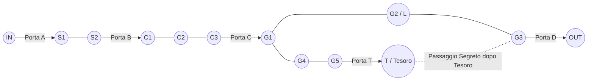

# Missione 0 — Simulazione A

Versione di test della **Missione 0: Recuperare il Tesoro**.

Questa simulazione usa un set minimo di regole, senza Boss e senza Carte Sequenza.

---

## 1. Scopo della Missione

I PG entrano dal punto `IN`, devono raggiungere la Stanza del Tesoro, recuperare il Tesoro e fuggire da `OUT`.

### Vittoria

La Missione è completata se almeno 1 PG esce da `OUT` portando il Tesoro.

### Sopravvivenza

Solo i PG che fuggono da `OUT` sono salvi.

I PG che restano nel dungeon alla fine della Missione muoiono definitivamente.

### Fallimento

La Missione fallisce se:

- tutti i PG sono **Caduti** contemporaneamente;
- i PG fuggono da `OUT` senza recuperare il Tesoro;
- nessun PG può più portare il Tesoro fuori dal dungeon.

---

## 2. Setup PG

La Missione si gioca con **2 PG**.

Ogni PG inizia con:

- **5 PV**;
- tutte le Carte Missione 0 in mano;
- 1 copia di ciascuna Carta Missione 0 indicata sotto.

### Gestione semplificata delle Carte

Per la Simulazione A:

- non si usa un Mazzo vero e proprio;
- non si pesca;
- non si rimescola;
- ogni PG inizia con tutte le Carte Missione 0 disponibili in mano;
- quando una Carta viene giocata, va negli Scarti;
- la **Pozione di Cura** viene eliminata dalla Missione dopo l’uso.

---

## 3. Azioni Base

### Movimento Semplice

Muovi fino a **2 Locazioni**.

Costo: **2⌛**.

### Attacco Semplice

Attacco in Mischia contro un Nemico nella tua Locazione.

Infliggi **1❌**.

Costo: **2⌛**.

### Interazione Semplice

Effettua 1 **Interazione** nella tua Locazione.

Può essere usata per:

- attivare la Leva `L`;
- recuperare il Tesoro;
- Perlustrare la Locazione;
- risolvere altri elementi indicati dalla Scheda Missione.

Costo: **3⌛**.

### Recupero Semplice

Recupera **1 PV**.

Costo: **3⌛**.

Nota: nella Simulazione A, **Recupero Semplice non rimuove Caduto**. Per rimuovere **Caduto** serve una Cura effettuata da un alleato, come la **Pozione di Cura**.

---

## 4. Regola Base sulle Locazioni Occupate

Come regola base, una Locazione non è mai controllata automaticamente da una miniatura.

Una miniatura può attraversare una Locazione occupata da miniature nemiche.

Attraversare una Locazione occupata da nemici non obbliga a fermarsi, non provoca Attacchi gratuiti e non impedisce il Movimento, salvo regole specifiche.

Carte, Effetti, Mostri Speciali, Boss o regole di Missione possono indicare che una Locazione è **Controllata**. Nella Simulazione A non ci sono Locazioni Controllate.

---

## 5. Mappa

### Stanze

| Stanza | Locazioni | Note |
|---|---|---|
| Esterno | `IN` | punto di partenza |
| Stanza Ingresso | `S1`, `S2` | contiene 1 Guardiano in `S2` |
| Corridoio | `C1`, `C2`, `C3` | **Passaggio Stretto 1** |
| Stanza Grande | `G1`, `G2`, `G3`, `G4`, `G5` | contiene la Leva `L` in `G2` |
| Stanza Tesoro | `T` | contiene il Tesoro e il Guardiano Elite |
| Uscita | `OUT` | punto di fuga |

### Grafo delle Connessioni

---

## 6. Porte

### Porte Semplici

Le Porte Semplici sono:

- Porta `A`: `IN ↔ S1`;
- Porta `B`: `S2 ↔ C1`;
- Porta `C`: `C3 ↔ G1`;
- Porta `D`: `G3 ↔ OUT`.

Regola ufficiale:

- Durante un Movimento, una miniatura può aprire e attraversare Porte Semplici.
- Ogni Porta Semplice aperta durante quel Movimento aumenta il costo del Movimento di **+1⌛**.
- Una Porta Semplice aperta rimane aperta fino alla fine della Missione.

Esempi:

- Movimento Semplice senza aprire Porte: fino a 2 Locazioni / **2⌛**.
- Movimento Semplice aprendo 1 Porta Semplice: fino a 2 Locazioni / **3⌛**.
- Passo Sicuro aprendo 1 Porta Semplice: fino a 3 Locazioni / **4⌛**.

### Porta Speciale T

La Porta `T` collega `G5 ↔ T`.

Non può essere aperta direttamente.

Si apre solo attivando la Leva `L` in `G2`.

---

## 7. Leva, Tesoro e Passaggio Segreto

### Leva L

La Leva `L` si trova in `G2`.

Può essere attivata con:

- **Interazione Semplice** / 3⌛;
- **Mano Sicura** / 2⌛.

Effetto:

- apre la Porta `T` tra `G5` e `T`.

### Tesoro

Il Tesoro si trova in `T`.

Può essere recuperato con:

- **Interazione Semplice** / 3⌛;
- **Mano Sicura** / 2⌛.

Quando un PG recupera il Tesoro, quel PG diventa il portatore del Tesoro.

Se il portatore del Tesoro diventa **Caduto**, il Tesoro cade nella sua Locazione.

Un altro PG nella stessa Locazione può raccogliere il Tesoro con Interazione, salvo diversa indicazione.

### Passaggio Segreto del Tesoro

Quando un PG recupera il Tesoro:

1. si apre immediatamente un Passaggio Segreto tra `T` e `G3`;
2. `T` e `G3` diventano Locazioni adiacenti fino alla fine della Missione;
3. il Passaggio Segreto può essere attraversato sia dai PG sia dai Guardiani, se aperto e raggiungibile;
4. si risolve l’**Allarme del Tesoro**.

---

## 8. Allarme del Tesoro

Quando il Tesoro viene recuperato:

1. si apre il Passaggio Segreto `T ↔ G3`;
2. tutti i Guardiani già attivi muovono immediatamente di **1 Locazione**.

Ogni Guardiano muove verso il PG che porta il Tesoro.

Se esistono più percorsi validi della stessa lunghezza, il Guardiano sceglie il percorso che lo avvicina a `G3`.

Se il PG con il Tesoro non è raggiungibile, il Guardiano muove verso `G3`.

Questo Movimento:

- non costa ⌛ ai Guardiani;
- non modifica la loro posizione sulla Linea Temporale;
- non permette ai Guardiani di aprire Porte;
- permette ai Guardiani di attraversare Porte già aperte e il Passaggio Segreto appena aperto.

---

## 9. Perlustrazione

Un PG può usare **Interazione Semplice** o **Mano Sicura** per Perlustrare la propria Locazione.

Quando un PG Perlustrata una Locazione, consulta la Scheda Missione e risolvi il risultato associato a quella Locazione.

Una Locazione può essere Perlustrata una sola volta per Missione.

Dopo la Perlustrazione, segna la Locazione come **Perlustrata**, anche se il risultato è “Nulla”.

Se nella Locazione è presente un elemento interagibile visibile, il PG deve scegliere se usare l’Interazione su quell’elemento oppure sulla Locazione per Perlustrare.

Una singola Interazione risolve un solo bersaglio.

### Risultati di Perlustrazione per Simulazione A

Nella Simulazione A standard non sono previsti ritrovamenti aggiuntivi.

| Locazione | Risultato |
|---|---|
| Tutte le Locazioni | Nulla |

Nota: la Scheda Missione potrà in futuro sostituire questa tabella con ritrovamenti specifici per Locazione.

---

## 10. Stato Caduto

**Caduto** è uno stato applicabile solo ai PG.

Un PG diventa **Caduto** quando i suoi PV scendono a **0**.

I PV non possono scendere sotto 0.

### Effetti di Caduto

Un PG Caduto:

- non può eseguire Azioni;
- non può giocare Carte;
- non può muovere;
- non può attaccare;
- non può interagire;
- non può usare Oggetti;
- non può portare il Tesoro;
- non conta ai fini della Prima Linea o della Retroguardia.

### Rimuovere Caduto

**Caduto** può essere rimosso solo tramite una Cura effettuata da un alleato.

Nella Simulazione A, la Cura disponibile è la **Pozione di Cura**.

Un PG Caduto non può usare la propria Pozione.

Se una Pozione di Cura viene usata su un PG Caduto:

- rimuovi **Caduto**;
- il PG rientra con **3 PV**;
- la Pozione viene eliminata dalla Missione.

### Penalità da Caduto

Quando un PG Caduto viene curato:

- scarta tutte le Carte in Gioco e in Mano;
- rimescola gli Scarti nel Mazzo, se si sta usando un Mazzo;
- elimina casualmente 1 Carta dalla propria dotazione di Missione, se applicabile;
- considera il proprio Livello PG ridotto di 1 per il resto della Missione, se il Livello è usato nella simulazione.

Nota per Simulazione A: la gestione di Livello, Mazzo e rimescolamento è semplificata. La penalità è riportata per coerenza con la regola generale, ma può essere ignorata se si sta usando solo la mano fissa della Simulazione A.

### Morte Definitiva

In una Missione, un PG può diventare **Caduto** al massimo 3 volte.

Se riceve **Caduto** per la quarta volta nella stessa Missione, muore definitivamente.

I PG che non escono da `OUT` alla fine della Missione muoiono definitivamente.

---

## 11. Carte Missione 0

Ogni PG riceve 1 copia di ciascuna delle seguenti Carte.

Nella Simulazione A non si usano Carte Sequenza.

---

### Passo Sicuro

**Tipo:** Carta Singola, Movimento  
**Costo:** 3⌛

Muovi fino a **3 Locazioni**.

Se durante questo Movimento apri una Porta Semplice, applica normalmente il costo aggiuntivo di **+1⌛** per ogni Porta Semplice aperta.

---

### Colpo Deciso

**Tipo:** Carta Singola, Attacco  
**Costo:** 3⌛

Effettua un Attacco in Mischia.

Infliggi **2❌**.

---

### Mano Sicura

**Tipo:** Carta Singola, Interazione  
**Costo:** 2⌛

Effettua 1 **Interazione** nella tua Locazione.

Può essere usata per:

- attivare la Leva `L`;
- recuperare il Tesoro;
- Perlustrare;
- risolvere altri elementi indicati dalla Scheda Missione.

---

### Parata Istintiva

**Tipo:** Carta Istantanea  
**Costo:** 1⌛

**Trigger:** quando subisci Danno da un Attacco.

Riduci quel Danno di **1❌**, fino a un minimo di **0❌**.

---

### Protezione Istintiva

**Tipo:** Carta Istantanea  
**Costo:** 1⌛

**Trigger:** quando un Alleato nella tua Locazione subisce un Attacco.

Puoi spostarti immediatamente in Prima Linea e subire tu tutti i Danni e gli Effetti di quell’Attacco al suo posto.

Questo effetto:

- non è Movimento;
- non permette di cambiare Locazione;
- non può essere usato da un PG Caduto;
- dopo la risoluzione, ti lascia in Prima Linea.

---

### Pozione di Cura

**Tipo:** Carta Oggetto, Consumabile  
**Costo:** 1⌛

Recupera **3 PV** a te stesso o a un Alleato nella tua Locazione.

Se usata su un PG **Caduto**:

- può essere usata solo da un alleato;
- rimuove **Caduto**;
- il PG rientra con **3 PV**.

Dopo l’uso, elimina questa Carta dalla Missione.

---

## 12. Mostri

Nella Simulazione A non ci sono Boss.

Sono presenti:

- 5 Guardiani Base;
- 1 Guardiano Elite.

### Distribuzione

| Stanza | Locazione | Mostri |
|---|---|---|
| Stanza Ingresso | `S2` | 1 Guardiano Base |
| Corridoio | `C2` | 1 Guardiano Base |
| Corridoio | `C3` | 1 Guardiano Base |
| Stanza Grande | `G3` | 1 Guardiano Base |
| Stanza Grande | `G4` | 1 Guardiano Base |
| Stanza Tesoro | `T` | 1 Guardiano Elite |

---

## 13. Attivazione dei Mostri per Stanza

Quando almeno 1 PG entra per la prima volta in una Stanza non ancora rivelata, tutti i Mostri previsti dalla Scheda Missione per quella Stanza compaiono e si attivano.

Da quel momento quei Mostri restano attivi fino alla fine della Missione, anche se i PG escono dalla Stanza.

### Mostri non ancora Attivati

I Mostri non ancora attivati:

- non sono fisicamente presenti sulla mappa;
- non occupano Locazioni;
- non agiscono;
- non attaccano;
- non inseguono;
- non aprono Porte;
- non hanno un indicatore sulla Linea Temporale;
- non possono essere bersagliati, danneggiati o influenzati.

### Quando una Stanza viene Attivata

Quando una Stanza viene attivata:

1. posiziona sulla mappa tutti i Mostri indicati dalla Scheda Missione per quella Stanza;
2. ogni Mostro viene posizionato nella Locazione indicata;
3. dividi i Mostri nei Gruppi previsti dalla Missione;
4. per ogni Gruppo Mostro, posiziona un indicatore sulla Linea Temporale;
5. l’indicatore viene posizionato nello stesso Spazio Temporale del PG che ha attivato la Stanza, in coda a quello Spazio.

Per la Simulazione A si usa il comportamento deterministico dei Guardiani, senza Carte Comportamento.

---

## 14. Gruppi Mostro e Linea Temporale

L’indicatore sulla Linea Temporale è complessivo dell’intero Gruppo.

I PV sono invece assegnati ai singoli Mostri.

Quando almeno 1 Mostro del Gruppo esegue un’Azione indicata dal comportamento del Gruppo, l’indicatore del Gruppo avanza del costo in ⌛ indicato.

Se più Mostri del Gruppo eseguono la stessa Azione, l’indicatore avanza una sola volta.

Se nessun Mostro del Gruppo può eseguire alcuna Azione valida, il Gruppo resta fermo e avanza di **1⌛**.

---

## 15. Guardiano Base

**PV:** 3  
**Movimento:** fino a 2 Locazioni / 2⌛  
**Attacco:** Mischia, 1❌ / 2⌛  
**Posizione:** Prima Linea  
**Comportamento:** Sentinella aggressiva

### Comportamento

Quando si attiva, il Guardiano Base risolve il primo comportamento valido:

1. se nella sua Locazione è presente almeno 1 PG bersaglio valido in Prima Linea, attacca quel PG;
2. altrimenti muove fino a 2 Locazioni verso il PG più vicino raggiungibile;
3. se non può attaccare e non può muovere verso alcun PG raggiungibile, resta fermo.

Il Guardiano Base non apre Porte.

Può attraversare Porte già aperte.

---

## 16. Guardiano Elite

**PV:** 4  
**Movimento:** fino a 2 Locazioni / 2⌛  
**Attacco:** Mischia, 2❌ / 3⌛  
**Posizione:** Prima Linea  
**Comportamento:** Sentinella aggressiva

### Comportamento

Quando si attiva, il Guardiano Elite risolve il primo comportamento valido:

1. se nella sua Locazione è presente almeno 1 PG bersaglio valido in Prima Linea, attacca quel PG;
2. altrimenti muove fino a 2 Locazioni verso il PG più vicino raggiungibile;
3. se non può attaccare e non può muovere verso alcun PG raggiungibile, resta fermo.

Il Guardiano Elite non apre Porte.

Può attraversare Porte già aperte.

---

## 17. Scelta del Bersaglio dei Guardiani

Quando un Guardiano deve scegliere un PG bersaglio, applica questi criteri in ordine:

1. PG nella stessa Locazione;
2. PG più vicino in numero di Locazioni;
3. PG con meno PV attuali;
4. PG più indietro sull’Asse Temporale;
5. se c’è ancora parità, scelgono i giocatori.

Se il percorso verso un PG richiede di attraversare una Porta chiusa che il Guardiano non può aprire, quel PG è considerato non raggiungibile per quel Guardiano.

---

## 18. Note di Bilanciamento Simulazione A

Questa simulazione usa:

- 2 PG da 5 PV;
- 1 Pozione di Cura per PG;
- nessuna Carta Sequenza;
- Guardiani che in una singola attivazione fanno **o Movimento o Attacco**, non entrambi;
- nessun controllo automatico delle Locazioni;
- Passaggio Segreto e Allarme del Tesoro attivi.

Il risultato atteso è una Missione più tesa rispetto ai 6 PV, ma ancora fattibile.

Il ruolo dei Guardiani è creare pressione, non bloccare fisicamente la mappa.

