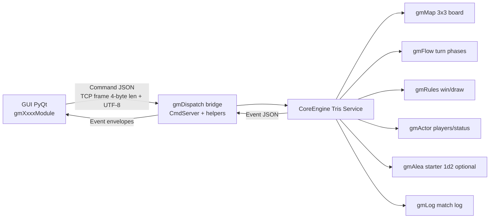
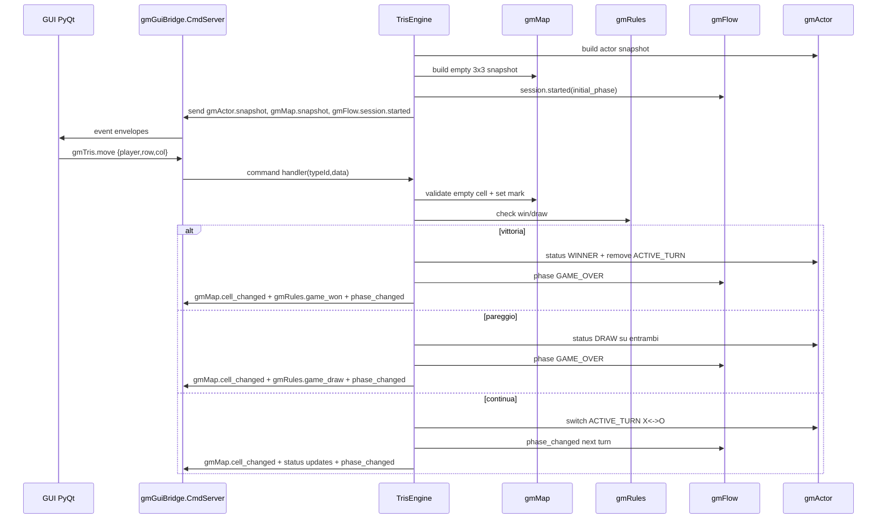

# TicTacToe (Tris) - Specifica di Implementazione CoreEngine + GUI

## Obiettivo

Implementare il gioco TicTacToe (Tris) con:

- CoreEngine C++ basato sulle librerie gmXxxx
- GUI PyQt basata sui moduli gmXxxxModule
- Comunicazione Engine <-> GUI tramite bridge su gmDispatch

Questo documento definisce architettura, contratti evento/comando, struttura dati,
regole di dominio e piano di implementazione allineato al framework del repository
cartella .github (istruzioni e convenzioni).

## Allineamento al framework .github

- Struttura librerie indipendenti: mantenuta (nessun include diretto cross-lib non previsto)
- Bridge di integrazione: in sottocartella bridges dove applicabile
- Convenzioni evento/comando: envelope gmDispatch con payload JSON serializzato
- Documentazione tecnica: Markdown lint-friendly, tabelle coerenti, blocchi code-fence

## Architettura ad alto livello



## Mapping Tris -> gmXxx

| Library | Ruolo in Tris | Naturalezza |
|---|---|---|
| gmMap | Griglia 3x3 con 9 LocationId, metadata mark = EMPTY/X/O | 5/5 |
| gmFlow | Fasi turni PLAYER1_TURN -> PLAYER2_TURN -> GAME_OVER | 4/5 |
| gmRules | Validazione mossa + controllo 8 combinazioni vincenti + draw | 5/5 |
| gmActor | Player_X e Player_O con status ACTIVE_TURN/WINNER/DRAW | 3/5 |
| gmAlea | Dado 1d2 per decidere chi inizia (opzionale) | 2/5 |
| gmDispatch | Bridge comando/evento Engine <-> GUI | 5/5 |
| gmLog | Tracciamento mosse, esito partita, errori input | 4/5 |

## Moduli GUI PyQt coinvolti

| Modulo | Uso |
|---|---|
| GmActorModule | Mostra Player X/O e status ACTIVE_TURN, WINNER, DRAW |
| GmFlowModule | Mostra fase corrente turno/sessione |
| GmMapModule | Render griglia 3x3 e mark nelle celle |
| GmDiceModule | Visualizza estrazione iniziale del primo giocatore (se attivo) |
| GmCompDeckModule | Non usato in Tris |

## Modello di dominio Tris

### Board

- Board: matrice 3x3
- Coordinate consentite: row e col in [1..3]
- Stato cella:
  - EMPTY
  - X
  - O
- Una cella valorizzata non e sovrascrivibile

### Giocatori

- Player_X
- Player_O

Status gestiti via gmActor:

- ACTIVE_TURN
- WINNER
- DRAW

### Fasi flow

- BOOTSTRAP
- PLAYER1_TURN
- PLAYER2_TURN
- GAME_OVER

Nota: PLAYER1/PLAYER2 sono ruoli di turno; il simbolo X o O associato al primo turno
puo essere determinato da regola fissa (X sempre inizia) o da gmAlea 1d2.

## Regole di gioco formalizzate per engine

### Inizializzazione

- Creare board vuota 3x3 in gmMap
- Registrare due attori in gmActor (X e O)
- Determinare starter:
  - Modalita standard: X inizia
  - Modalita opzionale: gmAlea 1d2 determina starter
- Impostare gmFlow.session.started con fase di turno iniziale
- Applicare ACTIVE_TURN al player iniziale

### Mossa valida

Una mossa e valida se:

- partita non in GAME_OVER
- player del comando coincide con ACTIVE_TURN
- coordinate row/col sono nel range 1..3
- cella target e EMPTY

In caso contrario emettere evento di errore validazione verso GUI.

### Vittoria

Un player vince se occupa una linea tra le seguenti 8:

- Righe: (1,1)(1,2)(1,3), (2,1)(2,2)(2,3), (3,1)(3,2)(3,3)
- Colonne: (1,1)(2,1)(3,1), (1,2)(2,2)(3,2), (1,3)(2,3)(3,3)
- Diagonali: (1,1)(2,2)(3,3), (1,3)(2,2)(3,1)

### Pareggio

- Se nessuna linea vincente e tutte le 9 celle sono valorizzate, risultato DRAW

## Contratto comandi GUI -> Engine

### Comando di mossa

TypeId:

- gmTris.move

Payload JSON data:

```json
{
  "player": "X",
  "row": 1,
  "col": 1
}
```

### Comando nuovo game

TypeId:

- gmTris.new_game

Payload JSON data:

```json
{
  "starter_mode": "fixed_x"  
}
```

Valori suggeriti starter_mode:

- fixed_x
- dice_1d2

## Contratto eventi Engine -> GUI

Eventi minimi consigliati:

- gmActor.snapshot
- gmMap.snapshot
- gmFlow.session.started
- gmFlow.session.phase_changed
- gmActor.actor.status_added
- gmActor.actor.status_removed
- gmMap.cell_changed
- gmRules.game_won
- gmRules.game_draw
- gmTris.invalid_move
- gmTris.error

### Esempio flusso runtime

```text
Engine avvia
 -> GmDice(1d2) opzionale: chi inizia?
 -> gmActor.snapshot
 -> gmMap.snapshot
 -> gmFlow.session.started
 -> gmActor.actor.status_added (ACTIVE_TURN)

GUI click cella (1,1)
 -> send_command("gmTris.move", {"player":"X","row":1,"col":1})

Engine riceve
 -> valida mossa
 -> gmMap: set mark
 -> gmRules: check win/draw
 -> gmMap.cell_changed
 -> switch status ACTIVE_TURN
 -> gmFlow.session.phase_changed
```

## Bridge CoreEngine <-> GUI (gmDispatch)

### Posizionamento

- gmDispatch/bridges/gui/GuiBridge.hpp
- gmDispatch/bridges/gui/GuiBridge.cpp

### Responsabilita bridge

- Ricezione comandi GUI su socket TCP dedicato (default 9001)
- Parsing frame wire-format compatibile con IpSocketChannel
- Dispatch verso CommandHandler C++
- Helper di costruzione envelope evento GUI-friendly
- Helper di invio event envelope verso GUI

### Wire format

- Prefix 4 byte big-endian con lunghezza payload
- Payload UTF-8 (JSON envelope)
- Compatibile con IpSocketChannel per ridurre divergenza protocollo

## Specifica GuiBridge.hpp

```cpp
// gmDispatch/bridges/gui/GuiBridge.hpp
#pragma once

#include "gmDispatch/Dispatcher.hpp"
#include "gmDispatch/channels/IpSocketChannel.hpp"
#include "gmSave/json.hpp"
#include <atomic>
#include <cstdint>
#include <functional>
#include <string>
#include <thread>

namespace gmGuiBridge
{

using CommandHandler = std::function<void(const std::string& typeId,
                                          const nlohmann::json& data)>;

// Helper envelope per GUI: headers["data"] = payload JSON serializzato
inline gmDispatch::Envelope make_gui_event(
    const std::string& typeId,
    const std::string& source,
    const nlohmann::json& data)
{
    gmDispatch::Envelope env;
    env.typeId = typeId;
    env.source = source;
    env.headers["data"] = data.dump();
    return env;
}

// Variante template richiesta: make_gui_envelope<T>()
// T deve essere convertibile a nlohmann::json
template <typename T>
inline gmDispatch::Envelope make_gui_envelope(
    const std::string& typeId,
    const std::string& source,
    const T& data)
{
    return make_gui_event(typeId, source, nlohmann::json(data));
}

class CmdServer
{
public:
    explicit CmdServer(uint16_t port, CommandHandler handler);
    ~CmdServer();

    void start();
    void stop();

private:
    void run();

    uint16_t _port;
    CommandHandler _handler;
    std::thread _thread;
    std::atomic<bool> _running{false};
    int _server_fd{-1};
};

} // namespace gmGuiBridge
```

## Specifica GuiBridge.cpp (logica)

Pseudo-flusso raccomandato:

```text
CmdServer::start()
 - se gia running, no-op
 - set running=true
 - spawn thread su run()

CmdServer::run()
 - crea socket server
 - bind su 0.0.0.0:_port
 - listen backlog 1
 - ciclo finche running:
   - accept con timeout breve
   - per ogni client connesso:
     - loop read_frame()
     - parse json envelope
     - estrai typeId
     - estrai headers.data o campo data
     - parse payload data in nlohmann::json
     - _handler(typeId, data)
 - cleanup socket client/server

CmdServer::stop()
 - set running=false
 - shutdown/close socket server
 - join thread se joinable
```

Requisiti robustezza minimi:

- Gestire errori parse JSON senza crash processo
- Se client GUI disconnette, tornare in accept
- Nessun busy loop (timeout + controllo running)
- Cleanup idempotente in destructor

## Helper JSON richiesti

### 1) Snapshot attori

Firma:

```cpp
nlohmann::json build_actor_snapshot(const gmActor::ActorStore& store);
```

Struttura JSON raccomandata:

```json
{
  "actors": [
    {
      "actor_id": "Player_X",
      "display_name": "Player X",
      "statuses": ["ACTIVE_TURN"]
    },
    {
      "actor_id": "Player_O",
      "display_name": "Player O",
      "statuses": []
    }
  ]
}
```

### 2) Snapshot zona deck

Firma:

```cpp
nlohmann::json build_deck_zone_snapshot(const gmAlea::GmCompDeck& deck,
                                        const std::string& zone_name);
```

Uso in Tris:

- Facoltativo, utile solo se si usa gmAlea per starter o scenari estesi

JSON raccomandato:

```json
{
  "zone": "starter_roll",
  "cards": [
    {"card_id": 1, "name": "Token#1"}
  ]
}
```

### 3) Serializzazione token

Firma:

```cpp
nlohmann::json card_to_json(uint32_t token_id);
```

JSON raccomandato:

```json
{
  "card_id": 7,
  "name": "Token#7"
}
```

## Sequenza di gioco dettagliata



## Macchina a stati minima

| Stato | Evento | Guard | Azione | Prossimo stato |
|---|---|---|---|---|
| BOOTSTRAP | start_game | sempre | init board/actors/flow | PLAYER1_TURN |
| PLAYER1_TURN | gmTris.move | mossa valida X | applica X + check esito | PLAYER2_TURN o GAME_OVER |
| PLAYER2_TURN | gmTris.move | mossa valida O | applica O + check esito | PLAYER1_TURN o GAME_OVER |
| GAME_OVER | gmTris.move | sempre | reject invalid_move | GAME_OVER |

## Piano di implementazione consigliato

### Fase 1 - Contratti e bridge

- Aggiungere GuiBridge.hpp e GuiBridge.cpp in gmDispatch/bridges/gui
- Implementare protocollo frame + parse JSON + callback CommandHandler
- Implementare helper make_gui_event e make_gui_envelope<T>

### Fase 2 - CoreEngine Tris service

- Creare servizio Tris con dipendenze gmMap/gmFlow/gmRules/gmActor/gmLog
- Implementare start_game e handle_move
- Emettere eventi snapshot e update incremental

### Fase 3 - GUI integrazione

- Collegare GmMapModule click -> comando gmTris.move
- Collegare GmFlowModule e GmActorModule agli eventi stato
- Bloccare input board in GAME_OVER

### Fase 4 - Test

- Unit test C++ regole mossa/win/draw
- Test bridge parsing/frame handling (messaggi validi e corrotti)
- Test integrazione end-to-end Engine <-> GUI

## Casi limite da coprire

- Mossa su cella occupata
- Mossa fuori range (row,col)
- Mossa del player non attivo
- Comando durante GAME_OVER
- Disconnessione GUI durante partita
- Riavvio partita immediato dopo GAME_OVER

## Logging minimo (gmLog)

Eventi da loggare:

- start_game con starter e modalita
- ogni mossa valida con coordinate e simbolo
- invalid_move con motivo
- game_won con player vincitore e linea
- game_draw
- connessione/disconnessione GUI bridge

Formato consigliato:

```text
[INFO] move player=X row=1 col=1
[WARN] invalid_move reason=cell_occupied row=1 col=1
[INFO] game_won player=O line=diag_secondary
```

## Criteri di accettazione

- La GUI visualizza sempre stato coerente con engine
- Le mosse illegali non alterano board e producono evento errore
- Win e draw vengono rilevati correttamente su tutte le 8 linee
- Dopo GAME_OVER nessuna mossa modifica stato partita
- Bridge tollera disconnessioni e payload malformati senza crash

## Nota finale

Questa specifica e pronta per guidare l'implementazione incrementale. Il punto chiave
per la comunicazione CoreEngine <-> GUI e l'introduzione del bridge
in gmDispatch/bridges/gui con protocollo compatibile IpSocketChannel e payload JSON.
