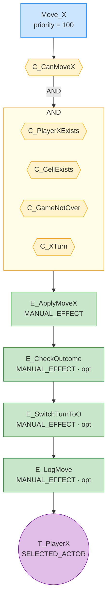
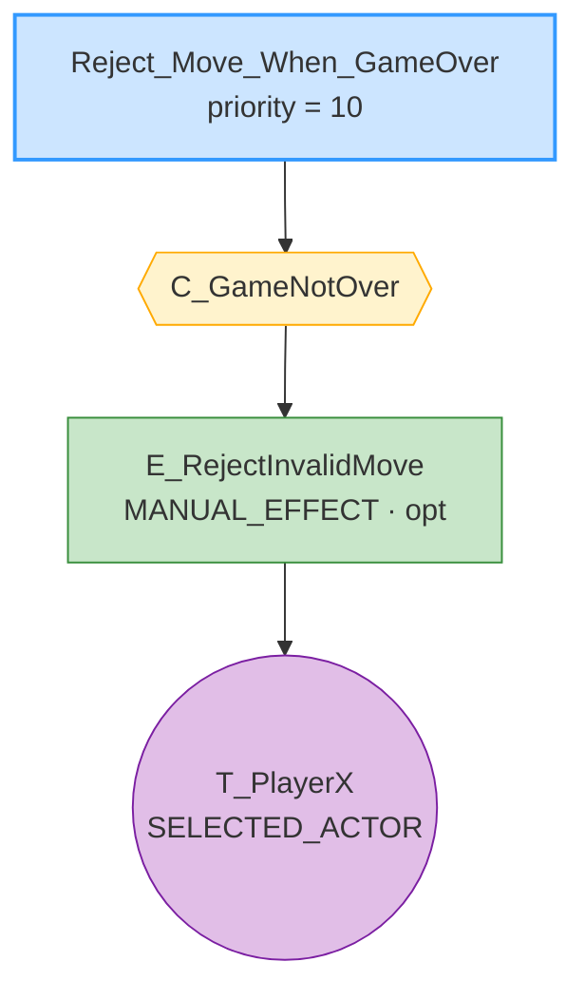

# GRS Rule Graphs — tictactoe

## Move_X

```mermaid
graph TD
    R_Move_X["Move_X\npriority = 100"]
    C_Move_X_C_CanMoveX{{"C_CanMoveX"}}
    R_Move_X --> C_Move_X_C_CanMoveX
    subgraph AG_Move_X_AND_1[" AND "]
        direction LR
        C_Move_X_C_PlayerXExists{{"C_PlayerXExists"}}
        C_Move_X_C_CellExists{{"C_CellExists"}}
        C_Move_X_C_GameNotOver{{"C_GameNotOver"}}
        C_Move_X_C_XTurn{{"C_XTurn"}}
    end
    C_Move_X_C_CanMoveX -- AND --> AG_Move_X_AND_1
    E_Move_X_0["E_ApplyMoveX\nMANUAL_EFFECT"]
    AG_Move_X_AND_1 --> E_Move_X_0
    E_Move_X_1["E_CheckOutcome\nMANUAL_EFFECT · opt"]
    E_Move_X_0 --> E_Move_X_1
    E_Move_X_2["E_SwitchTurnToO\nMANUAL_EFFECT · opt"]
    E_Move_X_1 --> E_Move_X_2
    E_Move_X_3["E_LogMove\nMANUAL_EFFECT · opt"]
    E_Move_X_2 --> E_Move_X_3
    TGT_Move_X(("T_PlayerX\nSELECTED_ACTOR"))
    E_Move_X_3 --> TGT_Move_X

    style R_Move_X fill:#CCE5FF,stroke:#3399FF,stroke-width:2px
    style C_Move_X_C_CanMoveX fill:#FFF3CD,stroke:#FFAA00
    style C_Move_X_C_PlayerXExists fill:#FFF3CD,stroke:#FFAA00
    style C_Move_X_C_CellExists fill:#FFF3CD,stroke:#FFAA00
    style C_Move_X_C_GameNotOver fill:#FFF3CD,stroke:#FFAA00
    style C_Move_X_C_XTurn fill:#FFF3CD,stroke:#FFAA00
    style AG_Move_X_AND_1 fill:#FFFDE7,stroke:#F9A825
    style E_Move_X_0 fill:#C8E6C9,stroke:#388E3C
    style E_Move_X_1 fill:#C8E6C9,stroke:#388E3C
    style E_Move_X_2 fill:#C8E6C9,stroke:#388E3C
    style E_Move_X_3 fill:#C8E6C9,stroke:#388E3C
    style TGT_Move_X fill:#E1BEE7,stroke:#7B1FA2
```

---

## Move_O

```mermaid
graph TD
    R_Move_O["Move_O\npriority = 100"]
    C_Move_O_C_CanMoveO{{"C_CanMoveO"}}
    R_Move_O --> C_Move_O_C_CanMoveO
    subgraph AG_Move_O_AND_1[" AND "]
        direction LR
        C_Move_O_C_PlayerOExists{{"C_PlayerOExists"}}
        C_Move_O_C_CellExists{{"C_CellExists"}}
        C_Move_O_C_GameNotOver{{"C_GameNotOver"}}
        C_Move_O_C_OTurn{{"C_OTurn"}}
    end
    C_Move_O_C_CanMoveO -- AND --> AG_Move_O_AND_1
    E_Move_O_0["E_ApplyMoveO\nMANUAL_EFFECT"]
    AG_Move_O_AND_1 --> E_Move_O_0
    E_Move_O_1["E_CheckOutcome\nMANUAL_EFFECT · opt"]
    E_Move_O_0 --> E_Move_O_1
    E_Move_O_2["E_SwitchTurnToX\nMANUAL_EFFECT · opt"]
    E_Move_O_1 --> E_Move_O_2
    E_Move_O_3["E_LogMove\nMANUAL_EFFECT · opt"]
    E_Move_O_2 --> E_Move_O_3
    TGT_Move_O(("T_PlayerO\nSELECTED_ACTOR"))
    E_Move_O_3 --> TGT_Move_O

    style R_Move_O fill:#CCE5FF,stroke:#3399FF,stroke-width:2px
    style C_Move_O_C_CanMoveO fill:#FFF3CD,stroke:#FFAA00
    style C_Move_O_C_PlayerOExists fill:#FFF3CD,stroke:#FFAA00
    style C_Move_O_C_CellExists fill:#FFF3CD,stroke:#FFAA00
    style C_Move_O_C_GameNotOver fill:#FFF3CD,stroke:#FFAA00
    style C_Move_O_C_OTurn fill:#FFF3CD,stroke:#FFAA00
    style AG_Move_O_AND_1 fill:#FFFDE7,stroke:#F9A825
    style E_Move_O_0 fill:#C8E6C9,stroke:#388E3C
    style E_Move_O_1 fill:#C8E6C9,stroke:#388E3C
    style E_Move_O_2 fill:#C8E6C9,stroke:#388E3C
    style E_Move_O_3 fill:#C8E6C9,stroke:#388E3C
    style TGT_Move_O fill:#E1BEE7,stroke:#7B1FA2
```

---

## Reject_Move_When_GameOver

```mermaid
graph TD
    R_Reject_Move_When_GameOver["Reject_Move_When_GameOver\npriority = 10"]
    C_Reject_Move_When_GameOver_C_GameNotOver{{"C_GameNotOver"}}
    R_Reject_Move_When_GameOver --> C_Reject_Move_When_GameOver_C_GameNotOver
    E_Reject_Move_When_GameOver_0["E_RejectInvalidMove\nMANUAL_EFFECT · opt"]
    C_Reject_Move_When_GameOver_C_GameNotOver --> E_Reject_Move_When_GameOver_0
    TGT_Reject_Move_When_GameOver(("T_PlayerX\nSELECTED_ACTOR"))
    E_Reject_Move_When_GameOver_0 --> TGT_Reject_Move_When_GameOver

    style R_Reject_Move_When_GameOver fill:#CCE5FF,stroke:#3399FF,stroke-width:2px
    style C_Reject_Move_When_GameOver_C_GameNotOver fill:#FFF3CD,stroke:#FFAA00
    style E_Reject_Move_When_GameOver_0 fill:#C8E6C9,stroke:#388E3C
    style TGT_Reject_Move_When_GameOver fill:#E1BEE7,stroke:#7B1FA2
```
