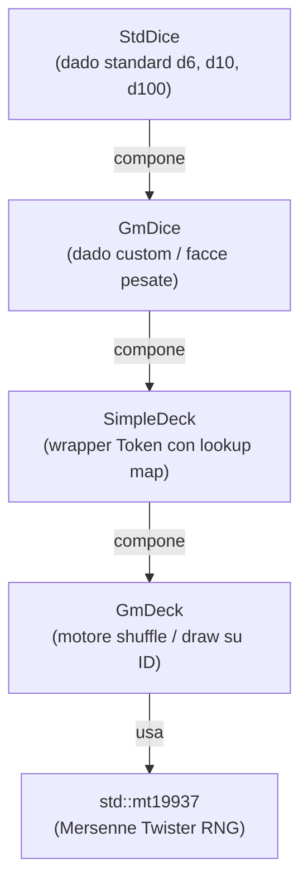
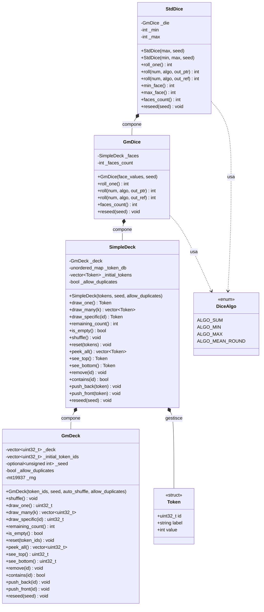
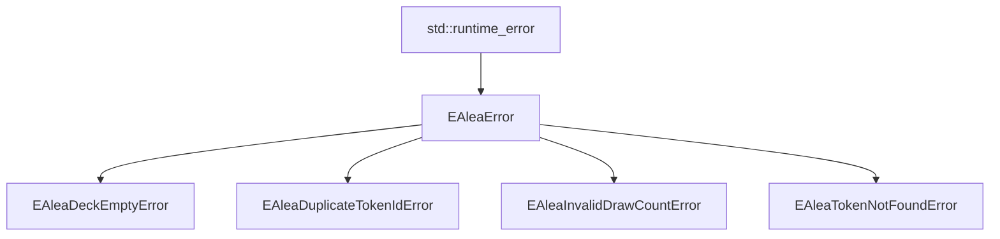
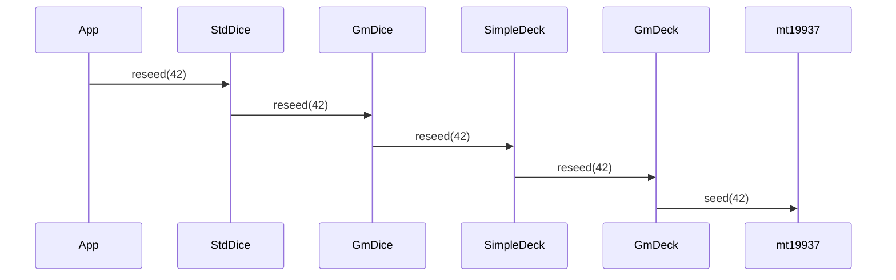

# gmAlea — API Reference

**Version:** 3.0  
**Status:** Production  
**Language:** C++17  
**Namespace:** `gmAlea`

---

## Indice

- [Panoramica](#panoramica)
- [Architettura](#architettura)
- [Gerarchia delle Eccezioni](#gerarchia-delle-eccezioni)
- [Classi](#classi)
  - [GmDeck](#gmdeck)
  - [SimpleDeck / Token](#simpledeck--token)
  - [GmDice](#gmdice)
  - [StdDice](#stddice)
- [DiceAlgo](#dicealgo)
- [Esempi d uso](#esempi-duso)
- [Caratteristiche di performance](#caratteristiche-di-performance)
- [Thread Safety](#thread-safety)
- [Build e Test](#build-e-test)

---

## Panoramica

**gmAlea** e una libreria C++17 deterministica per la gestione di mazzi di token, dadi custom e dadi standard. Non richiede dipendenze esterne: usa solo la libreria standard.

### Componenti

| Classe | Livello | Scopo |
|---|---|---|
| `GmDeck` | Core | Motore shuffle/draw su `uint32_t` ID |
| `SimpleDeck` | Wrapper | Aggiunge metadata embedded (`Token`) |
| `GmDice` | Facade | Dado custom con facce arbitrarie e pesate |
| `StdDice` | Facade | Dado standard range `[min..max]` |

---

## Architettura

### Catena di composizione



### Relazioni tra classi



### Gerarchia delle eccezioni



### Propagazione reseed



---

## Gerarchia delle Eccezioni

Tutte le eccezioni vivono nel namespace `gmAlea` e derivano da `std::runtime_error`.

| Classe | Quando viene lanciata |
|---|---|
| `EAleaError` | Base: catturare per gestire tutti gli errori di gmAlea |
| `EAleaDeckEmptyError` | `draw_one()` / `draw_many()` / `see_top()` / `see_bottom()` su mazzo vuoto |
| `EAleaDuplicateTokenIdError` | ID duplicati in costruttore o `reset()` con `allow_duplicates=false` |
| `EAleaInvalidDrawCountError` | `draw_many(k)` con `k <= 0` |
| `EAleaTokenNotFoundError` | `draw_specific(id)` con ID non presente |

---

## Classi

---

### GmDeck

**File:** `GmDeck.hpp` / `GmDeck.cpp`

Motore core della libreria. Gestisce esclusivamente l ordinamento e le operazioni su un vettore di `uint32_t` ID. Non conosce il significato semantico dei token.

#### Costruttore

```cpp
explicit GmDeck(
    const std::vector<uint32_t>& token_ids,
    std::optional<unsigned int>  seed             = std::nullopt,
    bool                         auto_shuffle     = true,
    bool                         allow_duplicates = false
);
```

| Parametro | Default | Descrizione |
|---|---|---|
| `token_ids` | — | Lista degli ID da inserire nel mazzo |
| `seed` | `std::nullopt` | Seed RNG per shuffle deterministico |
| `auto_shuffle` | `true` | Mescola automaticamente dopo la costruzione |
| `allow_duplicates` | `false` | Se `false`, lancia su ID duplicati |

#### Metodi

| Metodo | Firma | Descrizione |
|---|---|---|
| `shuffle` | `void shuffle()` | Mescola il mazzo con l RNG interno |
| `draw_one` | `uint32_t draw_one()` | Estrae e rimuove il token in cima |
| `draw_many` | `vector<uint32_t> draw_many(int k)` | Estrae k token |
| `draw_specific` | `uint32_t draw_specific(uint32_t id)` | Estrae un token specifico per ID |
| `remaining_count` | `int remaining_count() const` | Numero di token rimanenti |
| `is_empty` | `bool is_empty() const` | Vero se il mazzo e vuoto |
| `reset` | `void reset(optional<vector<uint32_t>>)` | Ripristina lo stato iniziale o con nuovi ID |
| `peek_all` | `vector<uint32_t> peek_all() const` | Copia di tutti i token rimanenti |
| `see_top` | `uint32_t see_top() const` | Legge il token in cima **senza rimuoverlo** |
| `see_bottom` | `uint32_t see_bottom() const` | Legge il token in fondo **senza rimuoverlo** |
| `remove` | `void remove(uint32_t id)` | Rimuove la prima occorrenza dell ID |
| `contains` | `bool contains(uint32_t id) const` | Vero se l ID e presente |
| `push_back` | `void push_back(uint32_t id)` | Aggiunge in fondo (senza shuffle) |
| `push_front` | `void push_front(uint32_t id)` | Aggiunge in cima (senza shuffle) |
| `reseed` | `void reseed(unsigned int seed)` | Aggiorna il seed RNG senza alterare il mazzo |

---

### SimpleDeck / Token

**File:** `SimpleDeck.hpp` / `SimpleDeck.cpp`

Wrapper su `GmDeck` che incorpora metadata direttamente nel mazzo tramite `Token`. Elimina la necessita di mantenere un dizionario esterno per casi semplici.

#### struct Token

```cpp
struct Token
{
    uint32_t    id;     // Identificatore univoco
    std::string label;  // Nome leggibile (es. "Face1", "Success")
    int         value;  // Valore numerico (es. valore della faccia)
};
```

#### Costruttore

```cpp
explicit SimpleDeck(
    const std::vector<Token>& tokens,
    std::optional<unsigned int> seed          = std::nullopt,
    bool                        allow_duplicates = false
);
```

#### Metodi

| Metodo | Firma | Descrizione |
|---|---|---|
| `draw_one` | `Token draw_one()` | Estrae il Token in cima |
| `draw_many` | `vector<Token> draw_many(int k)` | Estrae k Token |
| `draw_specific` | `Token draw_specific(uint32_t id)` | Estrae Token per ID |
| `remaining_count` | `int remaining_count() const` | Token rimanenti |
| `is_empty` | `bool is_empty() const` | Vero se vuoto |
| `shuffle` | `void shuffle()` | Mescola |
| `reset` | `void reset(optional<vector<Token>>)` | Ripristina |
| `peek_all` | `vector<Token> peek_all() const` | Copia tutti i Token rimanenti |
| `see_top` | `Token see_top() const` | Legge il Token in cima **senza rimuoverlo** |
| `see_bottom` | `Token see_bottom() const` | Legge il Token in fondo **senza rimuoverlo** |
| `remove` | `void remove(uint32_t id)` | Rimuove per ID |
| `contains` | `bool contains(uint32_t id) const` | Verifica presenza |
| `push_back` | `void push_back(const Token&)` | Aggiunge in fondo |
| `push_front` | `void push_front(const Token&)` | Aggiunge in cima |
| `reseed` | `void reseed(unsigned int seed)` | Aggiorna seed RNG |

---

### GmDice

**File:** `GmDice.hpp` / `GmDice.cpp`

Facade per dadi custom con facce a valore intero arbitrario. Supporta facce ripetute per simulare probabilita pesate.

#### Costruttore

```cpp
explicit GmDice(
    const std::vector<int>&     face_values,
    std::optional<unsigned int> seed = std::nullopt
);
```

Le facce duplicate nella lista aumentano la probabilita di quel valore:
`{1, 1, 1, 2, 3}` da probabilita `1 = 60%`, `2 = 20%`, `3 = 20%`.

#### Metodi

| Metodo | Firma | Descrizione |
|---|---|---|
| `roll_one` | `int roll_one()` | Singolo lancio: shuffle + `see_top().value` |
| `roll` | `int roll(int num, DiceAlgo algo, vector<int>* out)` | N lanci con aggregazione (pointer, retrocompatibile) |
| `roll` | `int roll(int num, DiceAlgo algo, vector<int>& out)` | N lanci con aggregazione (reference, **preferito**) |
| `faces_count` | `int faces_count() const` | Numero totale di facce (include duplicati) |
| `reseed` | `void reseed(unsigned int seed)` | Aggiorna seed RNG |

---

### StdDice

**File:** `StdDice.hpp` / `StdDice.cpp`

Facade conveniente per dadi standard con facce numeriche consecutive `[min..max]`.

#### Costruttori

```cpp
// d6 di default, oppure dN specificando max
explicit StdDice(int max = 6, std::optional<unsigned int> seed = std::nullopt);

// Range personalizzato [min..max]
StdDice(int min, int max, std::optional<unsigned int> seed = std::nullopt);
```

| Esempio | Risultato |
|---|---|
| `StdDice d6` | Facce: 1, 2, 3, 4, 5, 6 |
| `StdDice d10(10)` | Facce: 1 ... 10 |
| `StdDice d100(1, 100)` | Facce: 1 ... 100 |
| `StdDice fudge(-1, 1)` | Facce: -1, 0, +1 |
| `StdDice d6s(6, 42)` | d6 con seed=42 (deterministico) |

#### Metodi

| Metodo | Firma | Descrizione |
|---|---|---|
| `roll_one` | `int roll_one()` | Singolo lancio |
| `roll` | `int roll(int num, DiceAlgo algo, vector<int>* out)` | N lanci con aggregazione (pointer, retrocompatibile) |
| `roll` | `int roll(int num, DiceAlgo algo, vector<int>& out)` | N lanci con aggregazione (reference, **preferito**) |
| `min_face` | `int min_face() const` | Valore minimo della faccia |
| `max_face` | `int max_face() const` | Valore massimo della faccia |
| `faces_count` | `int faces_count() const` | Numero di facce (max - min + 1) |
| `reseed` | `void reseed(unsigned int seed)` | Aggiorna seed RNG |

---

## DiceAlgo

Enum che determina come aggregare N lanci multipli.

```cpp
enum class DiceAlgo
{
    ALGO_SUM,        // Somma di tutti i lanci (default)
    ALGO_MIN,        // Valore minimo tra i lanci
    ALGO_MAX,        // Valore massimo tra i lanci
    ALGO_MEAN_ROUND  // Media aritmetica arrotondata all intero piu vicino
};
```

| Algo | 3d6 = {2, 5, 3} | Utilizzo tipico |
|---|---|---|
| `ALGO_SUM` | 10 | RPG, punteggio totale |
| `ALGO_MIN` | 2 | Sistemi "prendi il peggio" |
| `ALGO_MAX` | 5 | Sistemi "prendi il meglio" |
| `ALGO_MEAN_ROUND` | 3 | Statistiche, test |

---

## Esempi d uso

### Dado standard

```cpp
#include "StdDice.hpp"
using namespace gmAlea;

// d6 standard
StdDice d6;
int val = d6.roll_one();

// 3d6 -> somma
int total = d6.roll(3);

// 4d6 -> tieni il minimo, pointer (retrocompatibile)
std::vector<int> singoli;
int worst = d6.roll(4, DiceAlgo::ALGO_MIN, &singoli);

// 4d6 -> tieni il minimo, reference (preferita per nuovo codice)
std::vector<int> results;
int worst2 = d6.roll(4, DiceAlgo::ALGO_MIN, results);

// d100 deterministico
StdDice d100(1, 100, 42);
int perc = d100.roll_one();

// Dado fudge [-1, 0, +1]
StdDice fudge(-1, 1);
int fudge_val = fudge.roll_one();
```

### Dado pesato (GmDice)

```cpp
#include "GmDice.hpp"
using namespace gmAlea;

// Dado truccato: "1" ha probabilita 3/5
GmDice biased({1, 1, 1, 2, 3});
int r = biased.roll_one();

// Dado simbolico: successo / fallimento
GmDice fate({1, 1, 1, 1, -1, -1, -1, -1, 0, 0});
int outcome = fate.roll_one();  // 1=successo, -1=fallimento, 0=pareggio
```

### SimpleDeck con token custom

```cpp
#include "SimpleDeck.hpp"
using namespace gmAlea;

std::vector<Token> cards = {
    {1, "Spada",   10},
    {2, "Scudo",    5},
    {3, "Pozione",  3}
};

SimpleDeck deck(cards, 42);

Token top  = deck.see_top();       // guarda senza pescare
Token card = deck.draw_one();      // pesca
deck.push_back({4, "Freccia", 7}); // aggiunge in fondo
```

### GmDeck uso avanzato

```cpp
#include "GmDeck.hpp"
using namespace gmAlea;

// Mazzo con duplicati (probabilita)
GmDeck prob({1, 1, 1, 2, 3}, std::nullopt, true, true);
uint32_t drawn = prob.draw_one();

// Reset e ispezione non distruttiva
GmDeck deck({10, 20, 30, 40}, 99);
deck.reset();
uint32_t top = deck.see_top();
uint32_t bot = deck.see_bottom();
```

### Riproducibilita con reseed

```cpp
StdDice d6(6, 42);
int a = d6.roll(3);   // serie deterministica

d6.reseed(42);         // reset RNG allo stesso seed
int b = d6.roll(3);   // stessa serie di a: b == a
```

---

## Caratteristiche di performance

| Operazione | Complessita | Note |
|---|---|---|
| `shuffle()` | O(n) | `std::shuffle` con mt19937 |
| `draw_one()` | O(n) | `erase` da front su `vector` |
| `draw_many(k)` | O(k*n) | k volte `draw_one()` |
| `see_top()` | O(1) | `_deck.front()` |
| `see_bottom()` | O(1) | `_deck.back()` |
| `contains()` | O(n) | `std::find` lineare |
| `push_back()` | O(1) amm. | `vector::push_back` |
| `push_front()` | O(n) | `vector::insert` in testa |
| `GmDice::roll_one()` | O(n) | shuffle + see_top |

### Perche uint32_t?

| Aspetto | string | uint32_t |
|---|---|---|
| Memoria per ID | 50-100+ byte | 4 byte |
| Confronto | O(n) | O(1) |
| Cache locality | Scarsa | Ottima |
| Velocita shuffle | 10-100x piu lenta | Baseline |

---

## Thread Safety

Nessuna classe di gmAlea e thread-safe. Se si accede a una stessa istanza da thread multipli, e necessario sincronizzare esternamente con un `std::mutex`.

---

## Build e Test

### Requisiti

| Strumento | Versione minima | Note |
|---|---|---|
| CMake | 3.15 | |
| Compiler | C++17 (`clang++`, `g++`, MSVC) | |
| Ninja / Make | qualsiasi | generatore CMake |

### Configurazione (prima volta)

```powershell
# Dalla root del workspace
cmake -S . -B build -G Ninja -DCMAKE_CXX_COMPILER=clang++
```

### Target disponibili

| Comando | Effetto |
|---|---|
| `cmake --build build --target gmAlea_all_tests` | Build incrementale + esecuzione di tutti e 4 i test |
| `cmake --build build` | Solo build (nessuna esecuzione) |
| `ctest --test-dir build --output-on-failure` | Solo esecuzione (su binary gia compilati) |

### Test registrati in CTest

| Nome CTest | Suite | Sorgente |
|---|---|---|
| `gmDeck_v2` | GmDeck | `gmAlea/tests/test_gmDeck_v2.cpp` |
| `gmCompDeck` | GmCompDeck | `gmAlea/tests/test_gmCompDeck.cpp` |
| `gmDice` | GmDice | `gmAlea/tests/test_gmDice.cpp` |
| `stdDice` | StdDice | `gmAlea/tests/test_stdDice.cpp` |

### Script PowerShell alternativo

Per build veloci senza configurazione CMake e disponibile anche lo script ad-hoc:

```powershell
powershell -ExecutionPolicy Bypass -File .\gmAlea\tests\run_all_gmAlea_tests.ps1
```
