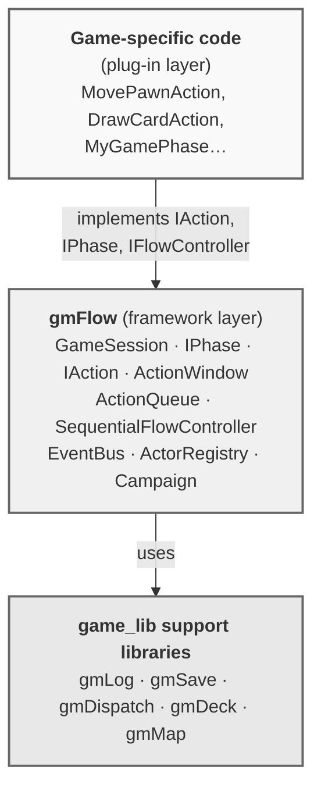
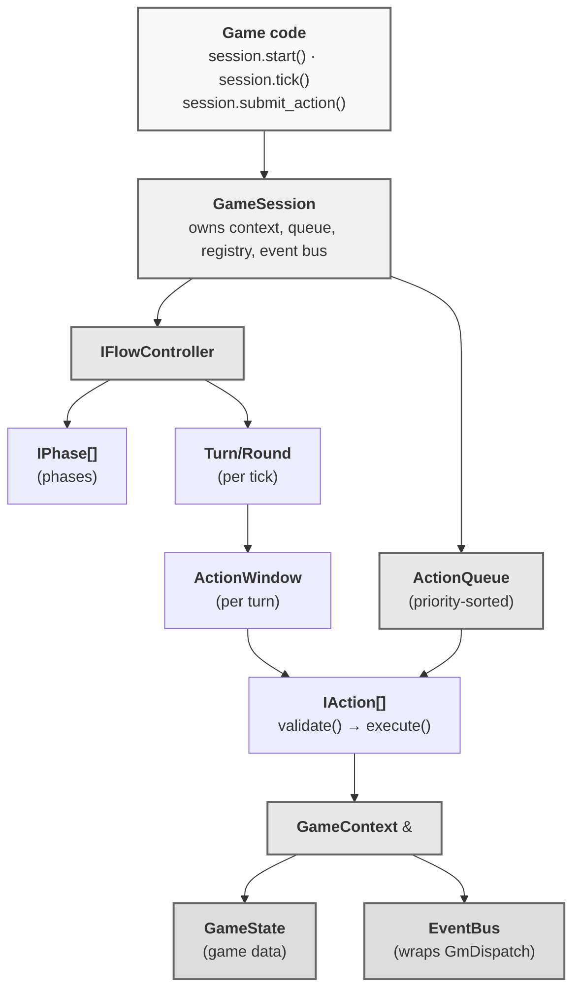

# gmFlow — Game Flow Control Framework

**Version:** 2.0
**Status:** Phase 5–7 — FlowPhase implemented (PhaseContext + FlowPhase + SequentialFlowController routing)
**Language:** C++17 Standard
**Namespace:** `gmFlow`
**Source directory:** `gmFlow/`

---

## Table of Contents

- [gmFlow — Game Flow Control Framework](#gmflow--game-flow-control-framework)
  - [Table of Contents](#table-of-contents)
  - [Overview](#overview)
    - [Key Features](#key-features)
  - [Design Philosophy](#design-philosophy)
  - [Requirements \& Setup](#requirements--setup)
  - [File Structure](#file-structure)
  - [Architecture](#architecture)
  - [Dependencies on Other Libraries](#dependencies-on-other-libraries)
  - [API Reference](#api-reference)
    - [core/ — Identifiers and Results](#core--identifiers-and-results)
      - [Ids.hpp](#idshpp)
      - [Result.hpp](#resulthpp)
        - [`enum class ValidationError`](#enum-class-validationerror)
        - [`class ValidationResult`](#class-validationresult)
        - [`class ActionResult`](#class-actionresult)
        - [`struct StepInput`](#struct-stepinput)
        - [`class StepResult`](#class-stepresult)
      - [GameState](#gamestate)
      - [GameContext](#gamecontext)
    - [actors/ — Participants](#actors--participants)
      - [Actor](#actor)
      - [ActorRegistry](#actorregistry)
    - [events/ — Event Bus](#events--event-bus)
      - [IEvent](#ievent)
      - [EventType.hpp](#eventtypehpp)
      - [FlowEvents.hpp](#floweventshpp)
      - [EventBus](#eventbus)
    - [actions/ — Action Model](#actions--action-model)
      - [ActionStatus](#actionstatus)
      - [ActionPriority](#actionpriority)
      - [IAction](#iaction)
      - [IActionStep](#iactionstep)
      - [ActionQueue](#actionqueue)
      - [ActionWindow](#actionwindow)
      - [StepBasedAction](#stepbasedaction)
    - [flow/ — Flow Control](#flow--flow-control)
      - [TurnPolicy](#turnpolicy)
      - [RoundPolicy](#roundpolicy)
      - [Turn](#turn)
      - [Round](#round)
      - [IPhase](#iphase)
      - [IFlowController](#iflowcontroller)
      - [PhaseContext](#phasecontext)
      - [FlowPhase](#flowphase)
      - [SequentialFlowController](#sequentialflowcontroller)
      - [TimelineFlowController](#timelineflowcontroller)
    - [session/ — Session Façade](#session--session-façade)
      - [SessionConfig](#sessionconfig)
      - [GameSession](#gamesession)
    - [campaign/ — Campaign Layer](#campaign--campaign-layer)
      - [CampaignState](#campaignstate)
      - [SessionDefinition](#sessiondefinition)
      - [Campaign](#campaign)
  - [Usage Examples](#usage-examples)
    - [Minimal Sequential Session](#minimal-sequential-session)
    - [Multi-step Action](#multi-step-action)
    - [Campaign with Unlock Conditions](#campaign-with-unlock-conditions)
  - [Event Reference](#event-reference)
  - [Architectural Invariants](#architectural-invariants)
  - [Future Extensions (V2+)](#future-extensions-v2)

---

## Overview

**gmFlow** is a game flow control framework.  It knows *who* can act, *when*,
and *in which context* — but it knows nothing about what "attack", "move", or
"draw a card" means.  Those are game-specific plug-ins.

### Key Features

| Feature | Detail |
| ------- | ------- |
| **Phase-based flow** | Ordered phases with enter/exit hooks and per-phase action availability |
| **Turn management** | Sequential or simultaneous turns via `TurnPolicy` |
| **Round counting** | Optional with configurable cap via `RoundPolicy` |
| **Action lifecycle** | Validation + execution with status tracking |
| **ActionWindow** | Unified mechanism for turns, reactions, and simultaneous play |
| **Event bus** | All lifecycle events published via `GmDispatch::EventBusChannel` |
| **Campaign layer** | Multi-session progression with unlock conditions |
| **Pause/resume** | Session snapshot via `gmSave` |
| **Standard C++17** | No external dependencies in the core |

---

## Design Philosophy



- `GameSession` is the **single entry point**. Construct one per scenario/match.
- `IFlowController` decides phase/turn/round ordering. Swap implementations to
  change game structure without touching action code.
- `IAction` is the **primary plug-in point**. Every game action is one class.
- `GameContext` is the **fat pointer** — never pass `GameState`, `EventBus`, or
  `ActorRegistry` separately; always pass `GameContext&`.
- `EventBus` is a thin wrapper over `GmDispatch::Dispatcher`. Never implement
  your own pub/sub.

---

## Requirements & Setup

- C++17-compatible compiler (Clang 5+, GCC 7+, MSVC 2017+)
- Standard headers: `<algorithm>`, `<functional>`, `<memory>`, `<optional>`,
  `<stdexcept>`, `<string>`, `<unordered_map>`, `<vector>`
- `gmDispatch` library (for `EventBus`)
- No external dependencies in the core flow layer

Compile all source files together with your game code:

```bash
clang++ -std=c++17 -I. \
    gmFlow/core/Result.cpp \
    gmFlow/core/GameContext.cpp \
    gmFlow/actors/ActorRegistry.cpp \
    gmFlow/actions/ActionQueue.cpp \
    gmFlow/actions/ActionWindow.cpp \
    gmFlow/actions/StepBasedAction.cpp \
    gmFlow/flow/Turn.cpp \
    gmFlow/flow/Round.cpp \
    gmFlow/flow/SequentialFlowController.cpp \
    gmFlow/events/EventBus.cpp \
    gmFlow/session/GameSession.cpp \
    gmFlow/campaign/Campaign.cpp \
    your_game_sources.cpp -o game.exe
```

---

## File Structure

```text
gmFlow/
├── ai-instructions.md             ← coding conventions for this library
├── FlowPhase_PLAN.md              ← V2 extension plan (FlowPhase + gmRules integration)
├── gmFlow_API.md                  ← this file
│
├── core/
│   ├── Ids.hpp                    ← type aliases: PlayerId, ActionId, …
│   ├── Result.hpp / .cpp          ← ValidationResult, ActionResult, StepResult
│   ├── GameState.hpp              ← abstract base for mutable game state
│   └── GameContext.hpp / .cpp     ← fat pointer: state + registry + event bus
│
├── actions/
│   ├── ActionStatus.hpp           ← enum class ActionStatus
│   ├── ActionPriority.hpp         ← enum class ActionPriority
│   ├── IAction.hpp                ← interface: validate(), execute()
│   ├── IActionStep.hpp            ← interface for one step in a multi-step action
│   ├── ActionQueue.hpp / .cpp     ← priority queue of pending actions
│   ├── ActionWindow.hpp / .cpp    ← time-bounded submission window
│   └── StepBasedAction.hpp / .cpp ← default multi-step skeleton
│
├── flow/
│   ├── TurnPolicy.hpp             ← struct: simultaneous, async, pass-based
│   ├── RoundPolicy.hpp            ← struct: max rounds, enabled flag
│   ├── Turn.hpp / .cpp            ← one turn, one or more active actors
│   ├── Round.hpp / .cpp           ← round container with 1-based index
│   ├── IPhase.hpp                 ← interface: on_enter, on_exit, available_actions
│   ├── IFlowController.hpp        ← interface: start, process, can_actor_act
│   ├── SequentialFlowController.hpp / .cpp ← default sequential implementation
│   ├── PhaseContext.hpp / .cpp    ← [V2] GameContext subclass with isolated IDs
│   └── FlowPhase.hpp / .cpp       ← [V2] IPhase that owns an IFlowController
│
├── actors/
│   ├── Actor.hpp                  ← ActorId + ActorType
│   └── ActorRegistry.hpp / .cpp   ← maps ActorId → Actor
│
├── events/
│   ├── IEvent.hpp                 ← base interface: type() const
│   ├── EventType.hpp              ← EVT_* string constants
│   ├── FlowEvents.hpp             ← concrete event structs
│   └── EventBus.hpp / .cpp        ← subscribe/publish (wraps gmDispatch)
│
├── session/
│   ├── SessionConfig.hpp          ← struct: actors, policies, session_id
│   └── GameSession.hpp / .cpp     ← main façade
│
├── campaign/
│   ├── CampaignState.hpp          ← completed, unlocked, persistent data
│   ├── SessionDefinition.hpp      ← unlock conditions + metadata
│   └── Campaign.hpp / .cpp        ← session progression orchestrator
│
└── tests/
    ├── test_action_queue.cpp
    ├── test_action_window.cpp
    ├── test_flow_sequential.cpp
    ├── test_flow_campaign.cpp
    ├── test_timeline_flow_controller.cpp
    └── test_flow_phase.cpp        ← [V2] 10 tests for PhaseContext + FlowPhase
```

---

## Architecture



---

## Dependencies on Other Libraries

| Library | Role in gmFlow |
| ------- | -------------- |
| `gmLog` | Log every phase transition, action event, validation failure (Phase 4) |
| `gmSave` | Serialize `GameSession` / `CampaignState` for pause/resume (Phase 4) |
| `gmDispatch` | `EventBus` wraps `GmDispatch::Dispatcher` + `EventBusChannel` |
| `gmDeck` | Used only inside game-specific `IAction` and `IPhase` plug-ins |
| `gmMap` | Used only inside game-specific plug-ins via `GameContext` |

---

## API Reference

---

### core/ — Identifiers and Results

#### Ids.hpp

All identifiers in gmFlow are `std::string` type aliases.  Use the distinct
alias for each context to make function signatures self-documenting.

```cpp
namespace gmFlow {
    using PlayerId  = std::string;  // human or remote player
    using ActorId   = std::string;  // any entity that can act
    using ActionId  = std::string;  // one action instance
    using StepId    = std::string;  // one step inside a multi-step action
    using PhaseId   = std::string;  // game phase ("SETUP", "COMBAT", …)
    using TurnId    = std::string;  // one turn within a round
    using RoundId   = std::string;  // one round within a session
    using SessionId = std::string;  // one play session
    using EventType = std::string;  // event routing key
}
```

---

#### Result.hpp

##### `enum class ValidationError`

Reason codes for failed validation:

| Value | Meaning |
| ----- | ------- |
| `NONE` | No error (valid result) |
| `NOT_ACTOR_TURN` | Actor is not eligible to act right now |
| `PHASE_DOES_NOT_ALLOW` | Current phase forbids this action type |
| `ACTION_WINDOW_CLOSED` | Target window is already closed |
| `INVALID_TARGET` | References a non-existent or illegal target |
| `NOT_ENOUGH_RESOURCES` | Actor lacks required resources |
| `RULE_VIOLATION` | Generic game-rule violation |
| `ACTION_ALREADY_SUBMITTED` | Same action ID submitted twice |

##### `class ValidationResult`

Returned by `IAction::validate()` and `GameSession::submit_action()`.

```cpp
static ValidationResult ok();
static ValidationResult fail(ValidationError error, std::string message);

bool                valid()   const;
ValidationError     error()   const;
const std::string&  message() const;
```

##### `class ActionResult`

Returned by `IAction::execute()`.

```cpp
static ActionResult success();
static ActionResult failure(std::string reason);

bool               succeeded() const;
const std::string& reason()    const;
```

##### `struct StepInput`

Opaque base for per-step player input.  Subclass to carry game-specific data:

```cpp
struct StepInput { virtual ~StepInput() = default; };
```

##### `class StepResult`

Returned by `IActionStep::execute()`.

```cpp
static StepResult done();
static StepResult needs_input(std::string prompt);
static StepResult failed(std::string reason);

bool               complete()    const;
bool               needs_input() const;
bool               failed()      const;
const std::string& prompt()      const;
const std::string& reason()      const;
```

---

#### GameState

Abstract base for the game-specific mutable state container.

```cpp
class GameState {
public:
    virtual const SessionId& session_id()  const = 0;
    virtual void on_session_started(const SessionId& id) = 0;
    virtual void on_session_completed() = 0;
};
```

Subclass this and put all game-specific data inside.  `GameContext::state()`
returns a reference; game code casts it to the concrete type:

```cpp
auto& state = static_cast<DungeonState&>(ctx.state());
```

---

#### GameContext

The "fat pointer" passed to every interface callback.  Never pass its members
individually.

```cpp
class GameContext {
public:
    GameContext(SessionId, GameState&, ActorRegistry&, EventBus&);

    const SessionId&    session_id()     const;
    GameState&          state();
    const GameState&    state()          const;
    ActorRegistry&      actor_registry();
    const ActorRegistry& actor_registry() const;
    EventBus&           event_bus();

    const PhaseId& current_phase_id() const;
    const RoundId& current_round_id() const;
    const TurnId&  current_turn_id()  const;

    // Called only by IFlowController:
    void set_current_phase_id(PhaseId id);
    void set_current_round_id(RoundId id);
    void set_current_turn_id(TurnId  id);
};
```

---

### actors/ — Participants

#### Actor

Immutable descriptor for any session participant.

```cpp
enum class ActorType {
    PLAYER, BOT, SYSTEM, TEAM, GAME_MASTER
};

class Actor {
public:
    explicit Actor(ActorId id, ActorType type);

    const ActorId&     id()           const;
    ActorType          type()         const;
    const std::string& display_name() const;
    void set_display_name(std::string name);
};
```

Actors carry no mutable game state.  Per-actor game data (health, resources,
position) belongs in the `GameState` subclass.

---

#### ActorRegistry

Session-scoped map from `ActorId` to `Actor`.

```cpp
class EUnknownActorError : public std::runtime_error { … };

class ActorRegistry {
public:
    void          add(Actor actor);
    bool          has(const ActorId& id)  const;
    const Actor&  get(const ActorId& id)  const;  // throws EUnknownActorError
    std::vector<ActorId> all_ids()        const;
    std::size_t   count()                 const;
};
```

The registry is populated by `GameSession::start()` from `SessionConfig::actors`.

---

### events/ — Event Bus

#### IEvent

Base interface for all events published on the bus.

```cpp
class IEvent {
public:
    virtual EventType type() const = 0;
};
```

---

#### EventType.hpp

String constants for all built-in event types.  Use these instead of raw
string literals when subscribing.

| Constant | Value | Published when |
| -------- | ----- | -------------- |
| `EVT_SESSION_STARTED` | `"gmFlow.session.started"` | `GameSession::start()` |
| `EVT_SESSION_PAUSED` | `"gmFlow.session.paused"` | `GameSession::pause()` |
| `EVT_SESSION_RESUMED` | `"gmFlow.session.resumed"` | `GameSession::resume()` |
| `EVT_SESSION_COMPLETED` | `"gmFlow.session.completed"` | Session finishes |
| `EVT_PHASE_ENTERED` | `"gmFlow.phase.entered"` | After `IPhase::on_enter()` |
| `EVT_PHASE_EXITED` | `"gmFlow.phase.exited"` | Before `IPhase::on_exit()` |
| `EVT_ROUND_STARTED` | `"gmFlow.round.started"` | New round begins |
| `EVT_ROUND_ENDED` | `"gmFlow.round.ended"` | Round completes |
| `EVT_TURN_STARTED` | `"gmFlow.turn.started"` | Active actors set |
| `EVT_TURN_ENDED` | `"gmFlow.turn.ended"` | Turn completes |
| `EVT_ACTION_SUBMITTED` | `"gmFlow.action.submitted"` | `submit_action()` accepted |
| `EVT_ACTION_VALIDATED` | `"gmFlow.action.validated"` | Validation passed |
| `EVT_ACTION_STARTED` | `"gmFlow.action.started"` | `execute()` begins |
| `EVT_ACTION_COMPLETED` | `"gmFlow.action.completed"` | `execute()` → COMPLETED |
| `EVT_ACTION_FAILED` | `"gmFlow.action.failed"` | `execute()` → FAILED |
| `EVT_ACTION_CANCELLED` | `"gmFlow.action.cancelled"` | Action cancelled |
| `EVT_WINDOW_OPENED` | `"gmFlow.window.opened"` | `ActionWindow` opens |
| `EVT_WINDOW_CLOSED` | `"gmFlow.window.closed"` | `ActionWindow` closes |
| `EVT_CAMPAIGN_SESSION_UNLOCKED` | `"gmFlow.campaign.session_unlocked"` | New session unlocked |
| `EVT_CAMPAIGN_COMPLETED` | `"gmFlow.campaign.completed"` | All sessions done |

---

#### FlowEvents.hpp

Concrete event structs.  All are non-owning value types (IDs and lightweight
snapshots, never pointers to live objects).

```cpp
struct SessionStartedEvent   : IEvent { SessionId session_id; };
struct SessionPausedEvent    : IEvent { SessionId session_id; };
struct SessionResumedEvent   : IEvent { SessionId session_id; };
struct SessionCompletedEvent : IEvent { SessionId session_id; };

struct PhaseEnteredEvent : IEvent { PhaseId phase_id; PhaseId previous_id; };
struct PhaseExitedEvent  : IEvent { PhaseId phase_id; PhaseId next_id; };

struct RoundStartedEvent : IEvent { RoundId round_id; int index; };
struct RoundEndedEvent   : IEvent { RoundId round_id; int index; };

struct TurnStartedEvent : IEvent {
    TurnId               turn_id;
    std::vector<ActorId> active_actors;
};
struct TurnEndedEvent : IEvent { TurnId turn_id; };

struct ActionSubmittedEvent  : IEvent { ActionId action_id; ActorId actor_id; };
struct ActionValidatedEvent  : IEvent { ActionId action_id; ActorId actor_id; };
struct ActionStartedEvent    : IEvent { ActionId action_id; ActorId actor_id; };
struct ActionCompletedEvent  : IEvent { ActionId action_id; ActorId actor_id; };
struct ActionFailedEvent     : IEvent { ActionId action_id; ActorId actor_id; std::string reason; };
struct ActionCancelledEvent  : IEvent { ActionId action_id; ActorId actor_id; };

struct WindowOpenedEvent : IEvent { std::vector<ActorId> eligible_actors; };
struct WindowClosedEvent : IEvent { };

struct CampaignSessionUnlockedEvent : IEvent { SessionId session_id; };
struct CampaignCompletedEvent       : IEvent { };
```

---

#### EventBus

Thin pub/sub façade over `GmDispatch::Dispatcher`.  One instance per session,
owned by `GameSession`.

```cpp
class EventBus {
public:
    using Handler = std::function<void(const IEvent&)>;

    explicit EventBus(std::shared_ptr<GmDispatch::Dispatcher> dispatcher);

    void subscribe(const EventType& event_type, Handler handler);
    void publish(const IEvent& event);
};
```

`subscribe()` wraps `handler` in a `GmDispatch::EventBusChannel` and registers
it on the underlying dispatcher.  `publish()` builds a `GmDispatch::Envelope`
and dispatches it synchronously.

Handlers are called synchronously on the publishing thread.  A handler must not
call `publish()` or `subscribe()` on the same `EventBus` (deadlock).

---

### actions/ — Action Model

#### ActionStatus

```cpp
enum class ActionStatus {
    CREATED,
    SUBMITTED,
    VALIDATING,
    WAITING_FOR_INPUT,    // multi-step waiting for UI input
    WAITING_FOR_REACTION, // ActionWindow open, awaiting responses
    EXECUTING,
    COMPLETED,
    FAILED,
    CANCELLED
    // Note: SUSPENDED does not exist in V1. Session-level pause/resume
    // is handled by GameSession::pause(), not by individual actions.
};
```

---

#### ActionPriority

Controls dequeue order in `ActionQueue`.  Highest priority first.

```cpp
enum class ActionPriority {
    IMMEDIATE,   // interrupts and cancellations
    REACTION,    // responses inside an open ActionWindow
    NORMAL,      // standard turn action
    DEFERRED     // end-of-phase cleanup
};
```

---

#### IAction

Primary plug-in point for all game-specific actions.

```cpp
class IAction {
public:
    virtual ActionId         id()     const = 0;
    virtual ActorId          owner()  const = 0;
    virtual ActionStatus     status() const = 0;

    virtual ValidationResult validate(const GameContext& ctx) const = 0;
    virtual ActionResult     execute(GameContext& ctx) = 0;

    virtual bool is_async()      const = 0;
    virtual bool requires_turn() const = 0;
    virtual bool is_multi_step() const = 0;
};
```

| Method | Contract |
| ------ | -------- |
| `validate()` | Must be **const and side-effect-free**. Does not mutate state or emit events. |
| `execute()` | Mutates `GameState` and emits events. Must update own `status_` to COMPLETED or FAILED before returning. |
| `is_async()` | `true` if the action may run out-of-turn via an open window. |
| `requires_turn()` | `true` for standard actions; `false` for free/reaction actions. |
| `is_multi_step()` | `true` if the action uses `StepBasedAction`. |

After `GameSession::submit_action()` accepts an action, the session takes
**exclusive ownership**.  The caller must not retain the pointer.

---

#### IActionStep

One step inside a `StepBasedAction`.

```cpp
class IActionStep {
public:
    virtual StepId id()                                                const = 0;
    virtual bool   can_enter(const GameContext& ctx)                   const = 0;
    virtual StepResult execute(GameContext& ctx, const StepInput& in)        = 0;
    virtual bool   is_complete(const GameContext& ctx)                 const = 0;
};
```

---

#### ActionQueue

Priority-sorted queue of pending actions, owned by `GameSession`.

```cpp
class ActionQueue {
public:
    void    push(std::unique_ptr<IAction> action, ActionPriority priority);
    IAction& front();
    void    pop();
    bool    empty() const;
    std::size_t size() const;
    void    clear();
};
```

Ordering: `IMMEDIATE > REACTION > NORMAL > DEFERRED`.  Within the same priority
level, insertion order is preserved (FIFO).

---

#### ActionWindow

A time-bounded opportunity for a set of actors to submit actions.

```cpp
enum class CompletionPolicy {
    ALL_SUBMITTED,    // every eligible actor has submitted
    ANY_SUBMITTED,    // first submission closes the window
    MANUAL_CLOSE,     // closed explicitly by the flow controller
    UNTIL_ALL_PASSED, // every eligible actor passes
    PRIORITY_RESOLVED // all collected, then resolved in priority order
    // Note: TIMEOUT_EXPIRED is deferred to V2.
};

class ActionWindow {
public:
    ActionWindow(std::vector<ActorId> eligible_actors, CompletionPolicy policy);

    bool             can_submit(const ActorId& actor_id) const;
    ValidationResult submit(const ActorId& actor_id,
                            std::unique_ptr<IAction> action);
    void             pass(const ActorId& actor_id);
    bool             is_complete(const GameContext& ctx) const;
    void             resolve(GameContext& ctx);
    void             force_close();
    bool             is_closed()        const;
    const std::vector<ActorId>& eligible_actors() const;
    std::size_t      submission_count() const;
};
```

| Policy | Typical scenario |
| ------ | ---------------- |
| `MANUAL_CLOSE` | Normal sequential turn (controller closes after actor acts) |
| `ALL_SUBMITTED` | Simultaneous planning (Gloomhaven: all players choose before reveal) |
| `ANY_SUBMITTED` | Reaction window (first responder wins) |
| `UNTIL_ALL_PASSED` | Pass-based end-of-turn (everyone must pass to close) |
| `PRIORITY_RESOLVED` | Card stack resolution (priority-sorted execution) |

---

#### StepBasedAction

Default skeleton for multi-step actions.  Register steps in the subclass
constructor via `add_step()`.  The base class drives sequencing.

```cpp
class StepBasedAction : public IAction {
public:
    // IAction defaults:
    bool is_async()      const override;  // returns false
    bool requires_turn() const override;  // returns true
    bool is_multi_step() const override;  // returns true

    ValidationResult validate(const GameContext& ctx) const override;
    ActionResult execute(GameContext& ctx) override;
    ActionResult execute(GameContext& ctx, const StepInput& input);

    std::size_t current_step_index() const;
    std::size_t step_count()         const;

protected:
    void add_step(std::unique_ptr<IActionStep> step);
};
```

---

### flow/ — Flow Control

#### TurnPolicy

```cpp
struct TurnPolicy {
    bool allow_simultaneous_turns    = false;
    bool allow_async_actions         = false;
    bool require_all_actors_to_pass  = false;
    bool allow_multiple_actions_per_turn = false;
};
```

---

#### RoundPolicy

```cpp
struct RoundPolicy {
    bool enabled    = true;
    int  max_rounds = -1;  // -1 = unlimited
};
```

---

#### Turn

```cpp
class Turn {
public:
    explicit Turn(TurnId id);
    const TurnId&              id()            const;
    void                       add_active_actor(const ActorId& id);
    const std::vector<ActorId>& active_actors()  const;
    bool                       is_actor_active(const ActorId& id) const;
};
```

---

#### Round

```cpp
class Round {
public:
    explicit Round(RoundId id, int index);
    const RoundId& id()    const;
    int            index() const;  // 1-based
};
```

---

#### IPhase

Plug-in point for game-specific phases.

```cpp
class IPhase {
public:
    virtual PhaseId id() const = 0;

    virtual void on_enter(GameContext& ctx) = 0;
    virtual void on_exit(GameContext& ctx) = 0;

    virtual std::vector<std::unique_ptr<IAction>>
        available_actions(const GameContext& ctx,
                          const ActorId& actor) const = 0;

    virtual bool is_complete(const GameContext& ctx) const = 0;
};
```

| Method | Called by | Contract |
| ------ | --------- | -------- |
| `on_enter()` | `IFlowController` on phase transition | Perform phase-start setup, open first ActionWindow |
| `on_exit()` | `IFlowController` before leaving phase | Cleanup, finalise scoring |
| `available_actions()` | Controller each tick, also used by UI | Must be **const**; return prototypes only |
| `is_complete()` | Controller each tick | Must be **const and side-effect-free** |

---

#### IFlowController

The brain of the session.  One implementation is injected at `GameSession`
construction.

```cpp
class IFlowController {
public:
    virtual void start(GameContext& ctx) = 0;
    virtual void process(GameContext& ctx) = 0;
    virtual bool can_actor_act(const GameContext& ctx,
                               const ActorId& actor) const = 0;
    virtual void on_action_completed(GameContext& ctx,
                                     const ActionResult& result) = 0;
    virtual bool is_session_complete(const GameContext& ctx) const = 0;
};
```

| Method | Called by | Purpose |
| ------ | --------- | ------- |
| `start()` | `GameSession::start()` | Initialise, enter first phase, open first window |
| `process()` | `GameSession::tick()` | Drain queue, advance window/turn/phase/round |
| `can_actor_act()` | `GameSession::submit_action()` | Gate: is the actor eligible right now? |
| `on_action_completed()` | Session after each `execute()` | React: trigger follow-ups, close window |
| `is_session_complete()` | `GameSession::tick()` after `process()` | Decide when the session ends |

---

#### SequentialFlowController

Default implementation for classic sequential-turn games.  In V2 it transparently
recognises `FlowPhase` instances and routes `accept_action()`, `can_actor_act()`,
and per-tick `process()` into the inner controller without exposing the nesting
to `GameSession`.

```cpp
class SequentialFlowController : public IFlowController {
public:
    explicit SequentialFlowController(
        std::vector<std::unique_ptr<IPhase>> phases);

    // IFlowController — see interface above.

    // [V2] Returns the currently active IPhase*, nullptr if session is complete.
    IPhase* current_phase() const;

protected:
    int _round_index;  // [V2] promoted to protected for FlowPhase subclasses

    // Override to customise actor ordering per phase (initiative, priority, etc.).
    virtual std::vector<ActorId>
        determine_turn_order(const GameContext& ctx) const;

    // [V2] Made virtual so subclasses can hook phase-transition timing.
    virtual void advance_phase(GameContext& ctx);
};
```

Phase order follows the constructor vector index.  Turns are allocated in the
order returned by `determine_turn_order()` (defaults to `ActorRegistry`
insertion order).

Supported game archetypes without subclassing:

| Archetype | Configuration |
| --------- | ------------- |
| HeroQuest / Dungeon Crawler | Default sequential, `TurnPolicy` defaults |
| Risiko! / Wargame | Default sequential, `RoundPolicy::max_rounds` set |
| Game of Thrones board game | Multiple phases with sequential per-actor turns |

---

#### PhaseContext

`[V2]` A `GameContext` subclass that provides **isolated** phase/round/turn IDs
for an inner `IFlowController` while **sharing** `GameState`, `ActorRegistry`,
and `EventBus` from the parent context by reference.

```cpp
class PhaseContext : public GameContext
{
public:
    // Constructs a PhaseContext borrowing all services from parent.
    // scope_prefix must not be empty (e.g. "epoch_1", "encounter_2").
    PhaseContext(GameContext& parent, std::string scope_prefix);

    // Returns the scope prefix supplied at construction.
    const std::string& scope_prefix() const;
};
```

`set_current_round_id()`, `set_current_phase_id()`, `set_current_turn_id()` are
inherited from `GameContext` and write **only** into this object — the parent
context is never modified.  Mutations to `GameState` (via `state()`) are visible
at every nesting level because both contexts hold a reference to the same object.

---

#### FlowPhase

`[V2]` An `IPhase` implementation that owns an `IFlowController` and a
`PhaseContext`.  From the enclosing controller's perspective it is a plain
`IPhase`; internally it runs a complete sub-flow (rounds, turns, actions).

```cpp
class FlowPhase : public IPhase
{
public:
    // scope_prefix becomes the phase ID returned by id().
    // controller must not be null.
    FlowPhase(std::string                      scope_prefix,
              std::unique_ptr<IFlowController> controller);

    // IPhase overrides.
    PhaseId id()                                                  const override;
    void    on_enter(GameContext& parent_ctx)                           override;
    void    on_exit(GameContext& ctx)                                   override;
    std::vector<std::unique_ptr<IAction>>
            available_actions(const GameContext& ctx,
                              const ActorId& actor)               const override;
    bool    is_complete(const GameContext& ctx)                   const override;

    // FlowPhase-specific: drive the inner controller one tick.
    void tick(GameContext& ctx);

    // Routing helpers used by SequentialFlowController.
    ValidationResult accept_action(GameContext& ctx,
                                   const ActorId& actor,
                                   std::unique_ptr<IAction> action);
    bool             can_actor_act(const GameContext& ctx,
                                   const ActorId& actor) const;

    // Returns the owned PhaseContext. Throws std::logic_error before on_enter().
    const PhaseContext& phase_context() const;
    const std::string&  scope_prefix()  const;
};
```

| Invariant | Guarantee |
| --------- | --------- |
| `GameState` shared | Mutations by inner actions visible at all nesting levels |
| IDs isolated | `PhaseContext.current_round_id()` never overwrites parent `GameContext` |
| EventBus shared | Inner events (ROUND_STARTED, TURN_STARTED…) arrive on the root session bus |
| Backward compatible | `GameSession`, `IPhase`, `IFlowController` are unchanged |

---


Continuous-timeline turn selection.  The actor with the **lowest timeline position**
acts next.  Ties are broken by a secondary rank, then by insertion order (stable sort).

Suitable for games with individual initiative/action-economy (Gloomhaven, solo roguelike,
real-time tactical).

```cpp
class TimelineFlowController : public IFlowController {
public:
    explicit TimelineFlowController(
        std::unique_ptr<ITimelineAdapter> adapter,
        const TimelinePolicy&             policy);

    // IFlowController interface — see above.
    void start(GameContext& ctx) override;
    void process(GameContext& ctx) override;
    bool can_actor_act(const GameContext& ctx, const ActorId& actor) const override;
    void on_action_completed(GameContext& ctx, const ActionResult& result) override;
    ValidationResult accept_action(GameContext& ctx, const ActorId& actor,
                                   std::unique_ptr<IAction> action) override;
    bool is_session_complete(const GameContext& ctx) const override;

    // Accessors.
    const std::optional<ActorId>& active_actor() const;
    TimelineValue                 current_time() const;
    bool                          has_action_window() const;
    void                          force_close_action_window();
    void                          open_reaction_window(const std::vector<ActorId>& eligible);
};
```

**Timeline selection algorithm:**

1. Collect all enabled actors from `ITimelineAdapter::timeline_actors()`.
2. Sort stably by:
   - PRIMARY: `timeline_position()` ASC (lowest first)
   - SECONDARY: `tie_break_rank()` ASC (lowest rank breaks ties)
   - TERTIARY: Insertion order (stable sort preserves original order for exact ties)
3. Select first actor in sorted order.
4. Open main `ActionWindow` with `_policy.open_main_action_window`.
5. On action completion:
   - If `actor_keeps_control()` → reopen main window for same actor.
   - Else → clear actor, auto-select next if `auto_select_next_actor`.
6. Detect time advance → publish `TimelineTimeAdvancedEvent`.
7. Detect tie (multiple actors at lowest position) → publish `TimelineTieDetectedEvent`.

**Key interfaces:**

- `ITimelineAdapter` — Maps game actors to timeline values (position, rank, enabled status).
- `TimelinePolicy` — Configures auto-selection, reaction windows, event publishing.
- `TimelineEvents.hpp` — Event structs (ActorSelected, TimeAdvanced, TieDetected, NoActorAvailable).

Supported game archetypes without subclassing:

| Archetype | Configuration |
| --------- | ------------- |
| Solo roguelike | Single actor (player), `auto_select_next_actor = false` |
| Gloomhaven-style | 1–4 actors, variable action economy (position ~= remaining actions) |
| Real-time tactical | Position ~= cooldown timer, rank ~= priority |
| Simultaneous planning + sequential resolution | Position ~= action cost, phases separate planning vs execution |

---

### session/ — Session Façade

#### SessionConfig

```cpp
struct SessionConfig {
    SessionId           session_id;
    std::string         session_name;
    std::vector<Actor>  actors;
    TurnPolicy          turn_policy;
    RoundPolicy         round_policy;
};
```

---

#### GameSession

Central façade.  Owns `GameContext`, `ActionQueue`, `ActorRegistry`, and
`EventBus`.

```cpp
enum class SessionState {
    CREATED, RUNNING, PAUSED, COMPLETED, FAILED
};

class GameSession {
public:
    GameSession(SessionConfig                           config,
                std::unique_ptr<IFlowController>        flow_controller,
                std::unique_ptr<GameState>              state,
                std::shared_ptr<GmDispatch::Dispatcher> dispatcher);

    void start();
    void tick();
    void pause();
    void resume();

    ValidationResult submit_action(const ActorId& actor,
                                   std::unique_ptr<IAction> action);

    bool         is_finished() const;
    bool         is_paused()   const;
    SessionState state()       const;

    const GameContext& context()    const;
    EventBus&          event_bus();
    const SessionId&   session_id() const;
};
```

| Method | Precondition | Effect |
| ------ | ------------ | ------ |
| `start()` | CREATED | Populates registry, calls `IFlowController::start()`, → RUNNING |
| `tick()` | RUNNING | Calls `process()`, checks `is_session_complete()` |
| `pause()` | RUNNING | Serialises state via gmSave, → PAUSED |
| `resume()` | PAUSED | Restores state, → RUNNING |
| `submit_action()` | RUNNING | Two-stage validation; pushes to queue on success |

`submit_action()` two-stage validation:

1. `IFlowController::can_actor_act()` — turn/window eligibility.
2. `IAction::validate()` — game-rule preconditions.

Both must pass for the action to be enqueued.

---

### campaign/ — Campaign Layer

#### CampaignState

Persistent, serializable campaign progress.

```cpp
class CampaignState {
public:
    void mark_completed(const SessionId& id, bool victory);
    bool is_completed(const SessionId& id)  const;
    bool is_victory(const SessionId& id)    const;

    void unlock(const SessionId& id);
    bool is_unlocked(const SessionId& id)   const;

    void        set_data(const std::string& key, std::string value);
    std::string get_data(const std::string& key,
                         const std::string& default_val = "") const;
    bool        has_data(const std::string& key)             const;
};
```

Use `set_data` / `get_data` for game-specific cross-session values
(hero XP, unlocked items, story flags, etc.) stored as strings.

---

#### SessionDefinition

Static metadata for one campaign session.

```cpp
struct SessionDefinition {
    SessionId              session_id;
    std::string            display_name;
    std::string            description;
    std::vector<SessionId> unlock_requires;  // all must be completed to unlock
    bool                   initial_unlock = false;
};
```

---

#### Campaign

```cpp
class ECampaignError : public std::runtime_error { … };

class Campaign {
public:
    using EventCallback = std::function<void(const std::string& event_type,
                                             const SessionId&   session_id)>;

    explicit Campaign(std::vector<SessionDefinition> definitions);

    void set_event_callback(EventCallback callback);

    const SessionDefinition& start_session(const SessionId& id);
    void complete_current_session(bool victory);

    bool is_complete() const;

    const CampaignState&                  state()              const;
    CampaignState&                        state();
    const std::vector<SessionDefinition>& sessions()           const;
    std::optional<SessionId>              current_session_id() const;
};
```

After `complete_current_session()`:

1. `CampaignState` is updated with the result.
2. Unlock conditions are re-evaluated for all locked sessions.
3. Callback is invoked with `EVT_CAMPAIGN_SESSION_UNLOCKED` for each newly
   unlocked session.
4. If all sessions are done, callback is invoked with `EVT_CAMPAIGN_COMPLETED`.

---

## Usage Examples

### Minimal Sequential Session

```cpp
#include "gmFlow/session/GameSession.hpp"
#include "gmFlow/flow/SequentialFlowController.hpp"
#include "gmFlow/actors/Actor.hpp"
#include "gmFlow/events/EventType.hpp"
#include "gmDispatch/DispatcherFactory.hpp"

// 1. Implement the minimum required types.
class MyState : public gmFlow::GameState {
public:
    bool game_over = false;
    const gmFlow::SessionId& session_id() const override { return id_; }
    void on_session_started(const gmFlow::SessionId& id)  override { id_ = id; }
    void on_session_completed()                           override {}
private:
    gmFlow::SessionId id_;
};

class MainPhase : public gmFlow::IPhase {
public:
    gmFlow::PhaseId id() const override { return "MAIN"; }
    void on_enter(gmFlow::GameContext&) override {}
    void on_exit(gmFlow::GameContext&)  override {}
    std::vector<std::unique_ptr<gmFlow::IAction>>
    available_actions(const gmFlow::GameContext&, const gmFlow::ActorId&) const override {
        return {};
    }
    bool is_complete(const gmFlow::GameContext& ctx) const override {
        return static_cast<const MyState&>(ctx.state()).game_over;
    }
};

// 2. Wire up the session.
auto dispatcher = GmDispatch::DispatcherFactory::createSyncDispatcher("GameBus");
auto state = std::make_unique<MyState>();

gmFlow::SessionConfig cfg;
cfg.session_id = "session_001";
cfg.actors     = { gmFlow::Actor("player_1", gmFlow::ActorType::PLAYER) };

std::vector<std::unique_ptr<gmFlow::IPhase>> phases;
phases.push_back(std::make_unique<MainPhase>());

auto ctrl = std::make_unique<gmFlow::SequentialFlowController>(std::move(phases));

gmFlow::GameSession session(cfg, std::move(ctrl), std::move(state), dispatcher);

// 3. Subscribe to lifecycle events.
session.event_bus().subscribe(gmFlow::EVT_TURN_STARTED,
    [](const gmFlow::IEvent& e) {
        const gmFlow::TurnStartedEvent& ev =
            static_cast<const gmFlow::TurnStartedEvent&>(e);
        // notify UI: ev.active_actors is now eligible
    });

// 4. Run.
session.start();
while (!session.is_finished()) {
    // submit player actions …
    session.tick();
}
```

---

### Multi-step Action

```cpp
#include "gmFlow/actions/StepBasedAction.hpp"

// Step 1: choose destination.
class ChooseTileStep : public gmFlow::IActionStep {
public:
    gmFlow::StepId id() const override { return "choose_tile"; }
    bool can_enter(const gmFlow::GameContext&) const override { return true; }

    gmFlow::StepResult execute(gmFlow::GameContext&,
                               const gmFlow::StepInput& raw) override
    {
        const TileInput& in = static_cast<const TileInput&>(raw);
        chosen_tile_ = in.tile;
        return gmFlow::StepResult::done();
    }
    bool is_complete(const gmFlow::GameContext&) const override {
        return chosen_tile_.has_value();
    }
    std::optional<TileCoord> chosen_tile_;
};

// Step 2: confirm.
class ConfirmStep : public gmFlow::IActionStep {
public:
    gmFlow::StepId id() const override { return "confirm"; }
    bool can_enter(const gmFlow::GameContext&) const override { return true; }
    gmFlow::StepResult execute(gmFlow::GameContext& ctx,
                               const gmFlow::StepInput&) override
    {
        // apply move to game state …
        return gmFlow::StepResult::done();
    }
    bool is_complete(const gmFlow::GameContext&) const override { return done_; }
    bool done_ = false;
};

// Multi-step action.
class MoveAction : public gmFlow::StepBasedAction {
public:
    MoveAction(gmFlow::ActorId actor)
        : owner_(std::move(actor)), id_("move_" + owner_)
    {
        add_step(std::make_unique<ChooseTileStep>());
        add_step(std::make_unique<ConfirmStep>());
    }
    gmFlow::ActionId     id()     const override { return id_; }
    gmFlow::ActorId      owner()  const override { return owner_; }
    gmFlow::ActionStatus status() const override { return status_; }
private:
    gmFlow::ActorId      owner_;
    gmFlow::ActionId     id_;
    gmFlow::ActionStatus status_ = gmFlow::ActionStatus::CREATED;
};
```

---

### Campaign with Unlock Conditions

```cpp
#include "gmFlow/campaign/Campaign.hpp"

std::vector<gmFlow::SessionDefinition> defs;

gmFlow::SessionDefinition s1;
s1.session_id    = "scenario_1";
s1.display_name  = "The Entrance Hall";
s1.initial_unlock = true;
defs.push_back(s1);

gmFlow::SessionDefinition s2;
s2.session_id       = "scenario_2";
s2.display_name     = "The Goblin Village";
s2.unlock_requires  = {"scenario_1"};
defs.push_back(s2);

gmFlow::SessionDefinition s3;
s3.session_id       = "scenario_3";
s3.display_name     = "The Witch Lord's Lair";
s3.unlock_requires  = {"scenario_2"};
defs.push_back(s3);

gmFlow::Campaign campaign(std::move(defs));

campaign.set_event_callback([](const std::string& type, const gmFlow::SessionId& id) {
    if (type == gmFlow::EVT_CAMPAIGN_SESSION_UNLOCKED) {
        std::cout << "Unlocked: " << id << "\n";
    } else if (type == gmFlow::EVT_CAMPAIGN_COMPLETED) {
        std::cout << "Campaign complete!\n";
    }
});

campaign.start_session("scenario_1");
campaign.complete_current_session(true);  // unlocks scenario_2
```

---

### Epoch Nested with FlowPhase

Demonstrates a two-level hierarchy: Session → Epoch → Morning/Evening.
The outer session only calls `start()`, `submit_action()`, and `tick()`;
it has no knowledge of the inner Epoch structure.

```cpp
#include "gmFlow/flow/FlowPhase.hpp"
#include "gmFlow/flow/PhaseContext.hpp"

// Inner sub-phases of the Epoch.
class MorningPhase : public gmFlow::IPhase {
public:
    gmFlow::PhaseId id() const override { return "morning"; }
    void on_enter(gmFlow::GameContext&) override {}
    void on_exit(gmFlow::GameContext&)  override {}
    std::vector<std::unique_ptr<gmFlow::IAction>>
    available_actions(const gmFlow::GameContext&,
                      const gmFlow::ActorId&) const override { return {}; }
    bool is_complete(const gmFlow::GameContext& ctx) const override {
        return static_cast<const MyState&>(ctx.state()).morning_done;
    }
};

class EveningPhase : public gmFlow::IPhase {
public:
    gmFlow::PhaseId id() const override { return "evening"; }
    void on_enter(gmFlow::GameContext&) override {}
    void on_exit(gmFlow::GameContext&)  override {}
    std::vector<std::unique_ptr<gmFlow::IAction>>
    available_actions(const gmFlow::GameContext&,
                      const gmFlow::ActorId&) const override { return {}; }
    bool is_complete(const gmFlow::GameContext& ctx) const override {
        return static_cast<const MyState&>(ctx.state()).evening_done;
    }
};

// Build the Epoch FlowPhase.
std::vector<std::unique_ptr<gmFlow::IPhase>> epoch_sub;
epoch_sub.push_back(std::make_unique<MorningPhase>());
epoch_sub.push_back(std::make_unique<EveningPhase>());

auto epoch = std::make_unique<gmFlow::FlowPhase>(
    "epoch_1",
    std::make_unique<gmFlow::SequentialFlowController>(std::move(epoch_sub)));

// Wire into the outer session (plain IPhase).
std::vector<std::unique_ptr<gmFlow::IPhase>> outer;
outer.push_back(std::make_unique<SetupPhase>());
outer.push_back(std::move(epoch));          // FlowPhase used as IPhase
outer.push_back(std::make_unique<EndPhase>());

auto ctrl = std::make_unique<gmFlow::SequentialFlowController>(std::move(outer));
gmFlow::GameSession session(cfg, std::move(ctrl), std::move(state), dispatcher);

// Subscribe to events on the root bus — inner events arrive here too.
session.event_bus().subscribe(gmFlow::EVT_ROUND_STARTED,
    [](const gmFlow::IEvent& e) {
        const auto& ev = static_cast<const gmFlow::RoundStartedEvent&>(e);
        std::cout << "Round started: " << ev.round_id << "\n";
    });

session.start();
while (!session.is_finished()) {
    session.submit_action("player_1", std::make_unique<MyAction>("player_1"));
    session.tick();
}
```

**Key points:**
- `epoch_1.current_round_id()` tracks only the Epoch-level rounds;
  the root `session.context().current_round_id()` tracks root-level IDs.
- All `EVT_ROUND_STARTED`, `EVT_TURN_STARTED`, etc. published by the inner
  controller arrive on the single shared `EventBus` of the root session.
- To add deeper nesting (e.g. Session → Epoch → Day), repeat the same
  pattern: build inner FlowPhase, pass to outer FlowPhase controller.

---

## Event Reference

All events are structs inheriting from `IEvent`.  Subscribe by string constant;
cast to the concrete type inside the handler.

```cpp
session.event_bus().subscribe(gmFlow::EVT_ACTION_FAILED,
    [](const gmFlow::IEvent& e) {
        const gmFlow::ActionFailedEvent& ev =
            static_cast<const gmFlow::ActionFailedEvent&>(e);
        log_error(ev.action_id + " failed: " + ev.reason);
    });
```

See [EventType.hpp](#eventtypehpp) for the full constant list and
[FlowEvents.hpp](#floweventshpp) for all struct definitions.

---

## Architectural Invariants

These constraints are enforced by design and must be preserved in all Phase 4
and Phase 5 implementations:

1. **Actions are atomic.**  `ActionStatus::SUSPENDED` does not exist.
   Session-level pause is via `GameSession::pause()` + gmSave snapshot.

2. **`EventBus` wraps `GmDispatch`.**  Never implement custom pub/sub.
   `EventBus::publish()` always builds a `GmDispatch::Envelope`.

3. **No timer-based `CompletionPolicy::TIMEOUT_EXPIRED` in V1.**  Deferred
   to V2.

4. **Dependency direction**: `campaign → session → flow/actions → core`.
   Lower layers never include higher-layer headers.

5. **`GameContext` is the fat pointer.**  Never pass `GameState`, `EventBus`,
   or `ActorRegistry` to interface methods individually.

6. **`IAction::validate()` is side-effect-free.**  It must not mutate state
   or emit events; `execute()` is the only mutation point.

---

## Future Extensions (V2+)

| Feature | Notes |
| ------- | ----- |
| `CompletionPolicy::TIMEOUT_EXPIRED` | Timer-based window expiry; requires platform timer abstraction |
| Async `IFlowController` | Threaded processing for AI bot turns |
| Undo/redo | Event-sourced `GameState` variant |
| Networked sessions | Serialised action submission over `gmDispatch::IpSocketChannel` |
| Scripted scenario trees | Campaign with branching (win/loss → different next session) |
| `ActionStatus::SUSPENDED` | Fine-grained mid-action pause (only if gmSave supports partial snapshots) |
