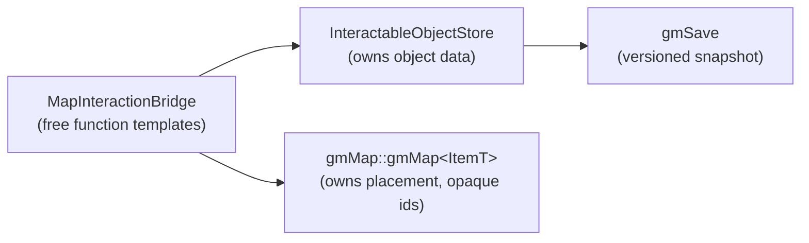
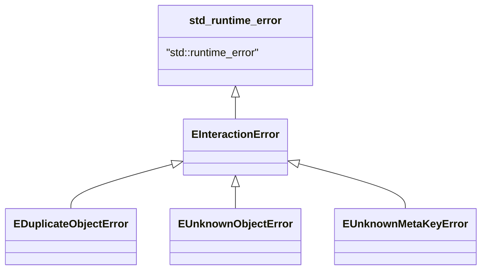

# gmInteraction — API Reference

> **Namespace:** `gmInteraction`
> **Language:** C++17 Standard
> **Status:** Phase 1 — Complete ✅
> **Dependencies:** `gmSave` (snapshot persistence). `gmMap` only through the
> bridge in `bridges/`.

`gmInteraction` is a standalone library that owns the *data* of interactable
objects (type, lifecycle state, metadata). It deliberately knows nothing about
*where* objects are placed: spatial placement is owned by `gmMap` and the two
views are linked through opaque `InteractableObjectId` values via the
`MapInteractionBridge`.

---

## 1. Architecture



- **`InteractableObjectStore`** — authoritative in-memory registry of objects.
- **`MapInteractionBridge`** — the only place allowed to `#include` `gmMap`.
- **`gmSave`** — versioned JSON snapshot (schema `v1`).

---

## 2. Public types

### `InteractableObjectId`

```cpp
using InteractableObjectId = std::uint64_t;
```

Opaque id shared with `gmMap`. A value of `0` is treated as unset.

### `Metadata`

```cpp
using Metadata = std::unordered_map<std::string, std::string>;
```

### `InteractableObject`

| Field   | Type                   | Description                          |
|---------|------------------------|--------------------------------------|
| `id`    | `InteractableObjectId` | Unique object id (default `0`).      |
| `type`  | `std::string`          | Domain type tag (e.g. `"door"`).     |
| `state` | `InteractionState`     | Lifecycle state (default `IDLE`).    |
| `meta`  | `Metadata`             | Free-form string key/value metadata. |

### `InteractionState`

```cpp
enum class InteractionState { IDLE, ACTIVE, USED, LOCKED, DISABLED };
```

| Free function | Signature | Notes |
|---------------|-----------|-------|
| `interaction_state_to_string` | `std::string(InteractionState)` | Stable string form. |
| `interaction_state_from_string` | `InteractionState(const std::string&)` | Throws `EInteractionError` on unknown input. |

---

## 3. `InteractableObjectStore`

In-memory registry of `InteractableObject` records. **Not thread-safe.**

### Lifecycle & queries

| Method | Signature | Throws |
|--------|-----------|--------|
| `create` | `void create(InteractableObjectId id, const std::string& type, InteractionState state = IDLE)` | `EDuplicateObjectError` if `id` exists. |
| `remove` | `void remove(InteractableObjectId id)` | `EUnknownObjectError` if `id` absent. |
| `has` | `bool has(InteractableObjectId id) const` | — |
| `get` | `const InteractableObject& get(InteractableObjectId id) const` | `EUnknownObjectError`. |
| `count` | `std::size_t count() const` | — |
| `all_ids` | `std::vector<InteractableObjectId> all_ids() const` | — |
| `clear` | `void clear()` | — |

### State

| Method | Signature | Throws |
|--------|-----------|--------|
| `set_state` | `void set_state(InteractableObjectId id, InteractionState state)` | `EUnknownObjectError`. |
| `state_of` | `InteractionState state_of(InteractableObjectId id) const` | `EUnknownObjectError`. |
| `type_of` | `const std::string& type_of(InteractableObjectId id) const` | `EUnknownObjectError`. |

### Metadata

| Method | Signature | Throws |
|--------|-----------|--------|
| `set_meta` | `void set_meta(InteractableObjectId id, const std::string& key, const std::string& value)` | `EUnknownObjectError`. |
| `get_meta` | `const std::string& get_meta(InteractableObjectId id, const std::string& key) const` | `EUnknownObjectError`, `EUnknownMetaKeyError`. |
| `has_meta` | `bool has_meta(InteractableObjectId id, const std::string& key) const` | `EUnknownObjectError`. |
| `remove_meta` | `void remove_meta(InteractableObjectId id, const std::string& key)` | `EUnknownObjectError` (no-op if key absent). |
| `metadata` | `const Metadata& metadata(InteractableObjectId id) const` | `EUnknownObjectError`. |

### Persistence (snapshot v1)

| Method | Signature | Throws |
|--------|-----------|--------|
| `export_snapshot_json` | `void export_snapshot_json(const std::string& filepath) const` | `gmSave::EFileWriteError`. |
| `import_snapshot_json` | `void import_snapshot_json(const std::string& filepath)` | `gmSave::EFileReadError`, `gmSave::EJsonParseError`. |

Snapshots are written through `gmSave::save_versioned` with `SNAPSHOT_VERSION = 1`
and re-read via `gmSave::peek_version` + `gmSave::load_versioned`.

---

## 4. `MapInteractionBridge` (bridges/)

Header-only free function templates parameterised on the `gmMap` item type.
This is the **only** translation unit in `gmInteraction` that includes `gmMap`.

| Function | Signature | Behaviour |
|----------|-----------|-----------|
| `spawn_object` | `void spawn_object(InteractableObjectStore&, gmMap::gmMap<ItemT>&, gmMap::LocationId, InteractableObjectId, const std::string& type, InteractionState = IDLE)` | `store.create` + `map.place_interactable`. |
| `despawn_object` | `void despawn_object(InteractableObjectStore&, gmMap::gmMap<ItemT>&, gmMap::LocationId, InteractableObjectId)` | `map.remove_interactable` + `store.remove` (if present). |
| `objects_at` | `std::vector<InteractableObject> objects_at(const InteractableObjectStore&, const gmMap::gmMap<ItemT>&, gmMap::LocationId)` | Resolves the ids placed at a location; ids absent from the store are skipped. |

---

## 5. Exceptions



| Exception | Thrown when |
|-----------|-------------|
| `EInteractionError` | Base class (message prefix `"EInteractionError: "`). |
| `EDuplicateObjectError` | `create` called with an id that already exists. |
| `EUnknownObjectError` | Any operation on an id not in the store. |
| `EUnknownMetaKeyError` | `get_meta` for a missing key. |

---

## 6. Minimal usage example

```cpp
#include "gmInteraction/gmInteraction.hpp"
#include "gmInteraction/bridges/MapInteractionBridge.hpp"
#include "gmMap/gmMap.hpp"

gmInteraction::InteractableObjectStore store;
gmMap::gmMap<std::string>              map;

const gmMap::LocationId room = map.create_location(1);

// Spawn a locked door at the room.
gmInteraction::spawn_object(store, map, room, /*id*/ 100, "door",
                            gmInteraction::InteractionState::LOCKED);

// Inspect what is in the room.
for (const gmInteraction::InteractableObject& obj
     : gmInteraction::objects_at(store, map, room))
{
    // obj.type == "door", obj.state == LOCKED
}

// Unlock and persist.
store.set_state(100, gmInteraction::InteractionState::IDLE);
store.export_snapshot_json("interactables.json");
```
