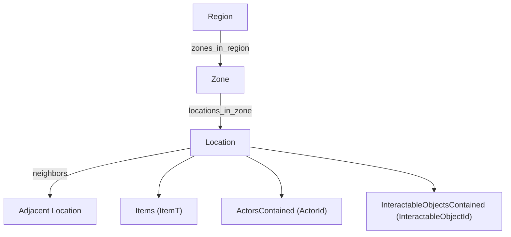

# gmMap – Generic Tabletop Game Map Library

**Version:** 2.0
**Status:** Active
**Language:** C++17 Standard
**Namespace:** `gmMap`
**Header:** `gmMap.hpp` (header-only class template)

---

## Table of Contents

- [Overview](#overview)
- [Design Philosophy](#design-philosophy)
- [Requirements](#requirements)
- [Hierarchy](#hierarchy)
- [API Reference](#api-reference)
  - [Type Aliases](#type-aliases)
  - [Exception Hierarchy](#exception-hierarchy)
  - [class gmMap\<ItemT\>](#class-gmmapitemt)
    - [Construction / Reset](#construction--reset)
    - [Location Management](#location-management)
    - [Zone Management](#zone-management)
    - [Region Management](#region-management)
    - [Location ↔ Zone Assignment](#location--zone-assignment)
    - [Zone ↔ Region Assignment](#zone--region-assignment)
    - [Adjacency](#adjacency)
    - [Items](#items)
    - [Contained Actors](#contained-actors)
    - [Contained Interactables](#contained-interactables)
    - [Location Metadata](#location-metadata)
    - [Zone Metadata](#zone-metadata)
    - [Region Metadata](#region-metadata)
    - [Runtime Entity Cache](#runtime-entity-cache)
    - [JSON Persistence](#json-persistence)
- [Snapshot Schema (v2)](#snapshot-schema-v2)
- [Class Invariants](#class-invariants)
- [Usage Example](#usage-example)
- [Error Handling](#error-handling)
- [Migration from v1](#migration-from-v1)

---

## Overview

**gmMap** is a generic, topology-agnostic game map library for C++17 tabletop
game applications. It provides a single class template, `gmMap<ItemT>`, that
manages the complete state of a game board without enforcing any coordinate
system or grid shape.

Supported use cases include dungeon crawlers, war games, tactical turn-based
games, abstract strategy games, territory-control games, and any other domain
that needs a named graph of locations with typed items and heterogeneous
metadata.

### Key Features

| Feature | Detail |
|---|---|
| **Topology-agnostic** | No grid forced; topology expressed via adjacency edges |
| **Three-level hierarchy** | Locations group into *Zones*, Zones group into *Regions* (both optional) |
| **Generic items** | `ItemT` template parameter; no constraint on the item domain |
| **Contained entities** | Opaque `ActorId` and `InteractableObjectId` sets per location |
| **Serializable metadata** | `MetadataValue` store on every location, zone and region |
| **Directed adjacency** | Edges can be unidirectional or bidirectional |
| **Versioned persistence** | JSON snapshot v2 via `gmSave`, with transparent v1 migration |
| **Safe by default** | Dedicated exception hierarchy; all invariants actively enforced |
| **Standard C++17** | Only depends on `gmSave` (which bundles nlohmann/json) |

---

## Design Philosophy

- **`gmMap` manages structure only.** Item types, metadata schemas, and game
  rules live in the application layer, not in this library.
- **IDs are plain integers.** `LocationId`, `ZoneId` and `RegionId` are
  `uint32_t`; `ActorId` and `InteractableObjectId` are `uint64_t` opaque
  references to entities owned by other libraries (no direct `#include`).
- **Membership is optional.** A location may exist without a zone, and a zone
  without a region. Membership is modelled with `std::optional`, not a sentinel.
- **Metadata is persistence-safe.** Values are schema-constrained via
  `MetadataValue` (serializable scalar types + UID references).
- **Adjacency is explicit.** There is no implicit neighbor calculation from
  coordinates; all edges are set by the caller. This supports irregular maps,
  portal connections, one-way passages, etc.

---

## Requirements

- C++17-compatible compiler (GCC 7+, Clang 5+, MSVC 2017+)
- `gmSave` (header + `gmSave.cpp`) reachable on the include path, with its
  bundled `json.hpp`
- Standard library headers: `<cstddef>`, `<cstdint>`, `<optional>`,
  `<stdexcept>`, `<string>`, `<unordered_map>`, `<unordered_set>`, `<utility>`,
  `<variant>`, `<vector>`

---

## Hierarchy



Region and Zone membership are both optional: a Location can stand alone, and a
Zone can stand alone.

---

## API Reference

### Type Aliases

Defined in namespace `gmMap`.

| Alias | Definition | Purpose |
|---|---|---|
| `LocationId` | `uint32_t` | Identifier for a Location node in the map graph |
| `ZoneId` | `uint32_t` | Identifier for a Zone (named group of locations) |
| `RegionId` | `uint32_t` | Identifier for a Region (named group of zones) |
| `ActorId` | `uint64_t` | Opaque identifier for an actor contained at a location |
| `InteractableObjectId` | `uint64_t` | Opaque identifier for an interactable object at a location |
| `EntityUid` | `uint64_t` | Stable reference for the transient runtime cache |

```cpp
struct UidRef { EntityUid value; };
using UidList = std::vector<UidRef>;
using MetadataValue =
    std::variant<std::nullptr_t, bool, int64_t, double, std::string, UidRef, UidList>;
using Metadata = std::unordered_map<std::string, MetadataValue>;
```

`Metadata` is a serializable key-value store attached to locations, zones and
regions. Keys are `std::string`; values are `MetadataValue` and can represent
scalar values, single UID references (`UidRef`) or UID lists (`UidList`).

---

### Exception Hierarchy

All exceptions derive from `std::runtime_error`.

```text
std::runtime_error
└── EMapError                    Base class for all gmMap errors
    ├── EDuplicateLocationError  create_location() called with existing ID
    ├── EUnknownLocationError    LocationId not found in the map
    ├── EDuplicateZoneError      create_zone() called with existing ID
    ├── EUnknownZoneError        ZoneId not found in the map
    ├── EDuplicateRegionError    create_region() called with existing ID
    ├── EUnknownRegionError      RegionId not found in the map
    ├── EInvalidAdjacencyError   Self-loop or adjacency invariant violation
    ├── EUnknownMetaKeyError     Metadata key not present
    └── EInvalidItemIndexError   Item index out of range
```

The base class `EMapError` prepends the prefix `"EMapError: "` to every message.

---

### class gmMap\<ItemT\>

```cpp
template <typename ItemT>
class gmMap;
```

| Template Parameter | Description |
|---|---|
| `ItemT` | Type of items stored at each location. Must be copyable and JSON-serializable for persistence. |

---

#### Construction / Reset

| Method | Description |
|---|---|
| `gmMap()` | Default constructor; creates an empty map. |
| `void clear()` | Removes all locations, zones, regions, adjacency, items, actors, interactables and metadata. |

---

#### Location Management

| Method | Returns | Description | Throws |
|---|---|---|---|
| `create_location(LocationId id)` | `void` | Creates a new empty location. | `EDuplicateLocationError` |
| `remove_location(LocationId id)` | `void` | Removes a location; unassigns it from its zone and from all neighbor lists. | `EUnknownLocationError` |
| `has_location(LocationId id) const` | `bool` | Whether the location exists. | — |
| `all_locations() const` | `std::vector<LocationId>` | All location IDs (order unspecified). | — |
| `location_count() const` | `std::size_t` | Number of locations. | — |

---

#### Zone Management

| Method | Returns | Description | Throws |
|---|---|---|---|
| `create_zone(ZoneId id)` | `void` | Creates a new empty zone. | `EDuplicateZoneError` |
| `remove_zone(ZoneId id)` | `void` | Removes a zone; ungroups its locations and detaches it from its region. | `EUnknownZoneError` |
| `has_zone(ZoneId id) const` | `bool` | Whether the zone exists. | — |
| `all_zones() const` | `std::vector<ZoneId>` | All zone IDs (order unspecified). | — |
| `zone_count() const` | `std::size_t` | Number of zones. | — |

---

#### Region Management

| Method | Returns | Description | Throws |
|---|---|---|---|
| `create_region(RegionId id)` | `void` | Creates a new empty region. | `EDuplicateRegionError` |
| `remove_region(RegionId id)` | `void` | Removes a region; ungroups its zones (does not delete them). | `EUnknownRegionError` |
| `has_region(RegionId id) const` | `bool` | Whether the region exists. | — |
| `all_regions() const` | `std::vector<RegionId>` | All region IDs (order unspecified). | — |
| `region_count() const` | `std::size_t` | Number of regions. | — |

---

#### Location ↔ Zone Assignment

| Method | Returns | Description | Throws |
|---|---|---|---|
| `assign_to_zone(LocationId loc, ZoneId zone)` | `void` | Assigns a location to a zone (re-assigns if already in another zone). | `EUnknownLocationError`, `EUnknownZoneError` |
| `unassign_from_zone(LocationId loc)` | `void` | Removes a location from its zone (no-op if unassigned). | `EUnknownLocationError` |
| `zone_of(LocationId loc) const` | `std::optional<ZoneId>` | The owning zone, or `std::nullopt`. | `EUnknownLocationError` |
| `locations_in_zone(ZoneId zone) const` | `std::vector<LocationId>` | All locations in a zone. | `EUnknownZoneError` |

---

#### Zone ↔ Region Assignment

| Method | Returns | Description | Throws |
|---|---|---|---|
| `assign_zone_to_region(ZoneId zone, RegionId region)` | `void` | Assigns a zone to a region (re-assigns if already in another region). | `EUnknownZoneError`, `EUnknownRegionError` |
| `unassign_zone_from_region(ZoneId zone)` | `void` | Removes a zone from its region (no-op if unassigned). | `EUnknownZoneError` |
| `region_of(ZoneId zone) const` | `std::optional<RegionId>` | The owning region, or `std::nullopt`. | `EUnknownZoneError` |
| `zones_in_region(RegionId region) const` | `std::vector<ZoneId>` | All zones in a region. | `EUnknownRegionError` |

---

#### Adjacency

| Method | Returns | Description | Throws |
|---|---|---|---|
| `set_adjacent(LocationId a, LocationId b, bool bidirectional = true)` | `void` | Creates a directed (or bidirectional) edge. | `EUnknownLocationError`, `EInvalidAdjacencyError` (self-loop) |
| `remove_adjacent(LocationId a, LocationId b, bool bidirectional = true)` | `void` | Removes the edge(s). | `EUnknownLocationError` |
| `are_adjacent(LocationId a, LocationId b) const` | `bool` | Whether `a → b` exists. | `EUnknownLocationError` |
| `adjacent_to(LocationId id) const` | `std::vector<LocationId>` | All neighbors reachable from `id`. | `EUnknownLocationError` |

---

#### Items

| Method | Returns | Description | Throws |
|---|---|---|---|
| `add_item(LocationId id, const ItemT& item)` | `void` | Appends an item to a location. | `EUnknownLocationError` |
| `remove_item(LocationId id, std::size_t index)` | `void` | Removes the item at `index`. | `EUnknownLocationError`, `EInvalidItemIndexError` |
| `items_at(LocationId id) const` | `const std::vector<ItemT>&` | The location's item list. | `EUnknownLocationError` |
| `clear_items(LocationId id)` | `void` | Removes all items from a location. | `EUnknownLocationError` |

---

#### Contained Actors

Actors are stored in an `std::unordered_set<ActorId>` per location: insertion is
idempotent and removal of an absent actor is a no-op.

| Method | Returns | Description | Throws |
|---|---|---|---|
| `place_actor(LocationId id, ActorId actor)` | `void` | Places an actor (idempotent). | `EUnknownLocationError` |
| `remove_actor(LocationId id, ActorId actor)` | `void` | Removes an actor (no-op if absent). | `EUnknownLocationError` |
| `has_actor(LocationId id, ActorId actor) const` | `bool` | Whether an actor is present. | `EUnknownLocationError` |
| `actors_at(LocationId id) const` | `std::vector<ActorId>` | All actors at the location (order unspecified). | `EUnknownLocationError` |
| `clear_actors(LocationId id)` | `void` | Removes all actors from a location. | `EUnknownLocationError` |

---

#### Contained Interactables

Interactables are stored in an `std::unordered_set<InteractableObjectId>` per
location, with the same idempotent semantics as actors.

| Method | Returns | Description | Throws |
|---|---|---|---|
| `place_interactable(LocationId id, InteractableObjectId object)` | `void` | Places an interactable (idempotent). | `EUnknownLocationError` |
| `remove_interactable(LocationId id, InteractableObjectId object)` | `void` | Removes an interactable (no-op if absent). | `EUnknownLocationError` |
| `has_interactable(LocationId id, InteractableObjectId object) const` | `bool` | Whether an interactable is present. | `EUnknownLocationError` |
| `interactables_at(LocationId id) const` | `std::vector<InteractableObjectId>` | All interactables at the location. | `EUnknownLocationError` |
| `clear_interactables(LocationId id)` | `void` | Removes all interactables from a location. | `EUnknownLocationError` |

---

#### Location Metadata

| Method | Returns | Description | Throws |
|---|---|---|---|
| `set_location_meta(LocationId id, const std::string& key, const MetadataValue& value)` | `void` | Sets/overwrites a metadata key. | `EUnknownLocationError` |
| `get_location_meta(LocationId id, const std::string& key) const` | `const MetadataValue&` | Reads a metadata value. | `EUnknownLocationError`, `EUnknownMetaKeyError` |
| `has_location_meta(LocationId id, const std::string& key) const` | `bool` | Whether the key exists. | `EUnknownLocationError` |
| `remove_location_meta(LocationId id, const std::string& key)` | `void` | Removes a key (no-op if absent). | `EUnknownLocationError` |
| `location_metadata(LocationId id) const` | `const Metadata&` | Full metadata map. | `EUnknownLocationError` |

---

#### Zone Metadata

| Method | Returns | Description | Throws |
|---|---|---|---|
| `set_zone_meta(ZoneId id, const std::string& key, const MetadataValue& value)` | `void` | Sets/overwrites a metadata key. | `EUnknownZoneError` |
| `get_zone_meta(ZoneId id, const std::string& key) const` | `const MetadataValue&` | Reads a metadata value. | `EUnknownZoneError`, `EUnknownMetaKeyError` |
| `has_zone_meta(ZoneId id, const std::string& key) const` | `bool` | Whether the key exists. | `EUnknownZoneError` |
| `remove_zone_meta(ZoneId id, const std::string& key)` | `void` | Removes a key (no-op if absent). | `EUnknownZoneError` |
| `zone_metadata(ZoneId id) const` | `const Metadata&` | Full metadata map. | `EUnknownZoneError` |

---

#### Region Metadata

| Method | Returns | Description | Throws |
|---|---|---|---|
| `set_region_meta(RegionId id, const std::string& key, const MetadataValue& value)` | `void` | Sets/overwrites a metadata key. | `EUnknownRegionError` |
| `get_region_meta(RegionId id, const std::string& key) const` | `const MetadataValue&` | Reads a metadata value. | `EUnknownRegionError`, `EUnknownMetaKeyError` |
| `has_region_meta(RegionId id, const std::string& key) const` | `bool` | Whether the key exists. | `EUnknownRegionError` |
| `remove_region_meta(RegionId id, const std::string& key)` | `void` | Removes a key (no-op if absent). | `EUnknownRegionError` |
| `region_metadata(RegionId id) const` | `const Metadata&` | Full metadata map. | `EUnknownRegionError` |

---

#### Runtime Entity Cache

A transient, non-persistent `EntityUid → const void*` cache. It is intentionally
excluded from save/load flows.

| Method | Returns | Description |
|---|---|---|
| `register_runtime_entity(EntityUid uid, const void* ptr)` | `void` | Registers/updates a runtime pointer. |
| `unregister_runtime_entity(EntityUid uid)` | `void` | Removes a mapping. |
| `runtime_entity(EntityUid uid) const` | `const void*` | The pointer, or `nullptr` if absent. |
| `clear_runtime_entity_cache()` | `void` | Clears all mappings. |

---

#### JSON Persistence

| Method | Description | Throws |
|---|---|---|
| `export_snapshot_json(const std::string& filepath) const` | Writes the full map state as a versioned JSON file (schema v2). | `gmSave::EFileWriteError` |
| `import_snapshot_json(const std::string& filepath)` | Clears the map and replaces it with the loaded state. Accepts both v1 and v2 files (v1 migrated transparently). | `gmSave::EFileReadError`, `gmSave::EJsonParseError` |

Versioning is delegated to `gmSave::save_versioned` / `gmSave::load_versioned`.
On import, `gmSave::peek_version` detects the on-disk schema version, so v1 and
v2 files are both accepted without throwing a version mismatch.

---

## Snapshot Schema (v2)

The persisted file is a `gmSave` version envelope:

```json
{
  "_version": 2,
  "payload": {
    "location_ids": [ ... ],
    "zone_ids": [ ... ],
    "region_ids": [ ... ],
    "location_to_zone": [ [loc, zone], ... ],
    "zone_to_region": [ [zone, region], ... ],
    "adjacency_edges": [ [from, to], ... ],
    "items_by_location": { "<loc>": [ ... ] },
    "actors_by_location": { "<loc>": [ ... ] },
    "interactables_by_location": { "<loc>": [ ... ] },
    "location_metadata_map": { "<loc>": { "<key>": { "_type": "...", "_value": ... } } },
    "zone_metadata_map": { "<zone>": { ... } },
    "region_metadata_map": { "<region>": { ... } }
  }
}
```

Each `MetadataValue` is serialized as a typed object `{ "_type": <tag>, "_value": <data> }`
where `<tag>` is one of `null`, `bool`, `int64`, `double`, `string`, `uid_ref`,
`uid_list`.

---

## Class Invariants

- A location belongs to at most one zone at a time.
- A zone belongs to at most one region at a time.
- Every neighbor referenced in an adjacency edge is a valid location.
- When `bidirectional` is `true`, adjacency is kept symmetric.
- Removing a location also removes it from its zone and from all neighbor lists.
- Removing a zone ungroups its locations and detaches the zone from its region;
  the locations are not deleted.
- Removing a region ungroups its zones; the zones are not deleted.

---

## Usage Example

```cpp
#include "gmMap/gmMap.hpp"

gmMap::gmMap<int> world;

// Build the hierarchy: Region 1 ⊃ Zone 10 ⊃ Locations 100, 101
world.create_region(1);
world.create_zone(10);
world.assign_zone_to_region(10, 1);

world.create_location(100);
world.create_location(101);
world.assign_to_zone(100, 10);
world.assign_to_zone(101, 10);

// Topology and contents
world.set_adjacent(100, 101);          // bidirectional by default
world.add_item(100, 42);               // a typed item
world.place_actor(100, 5000ULL);       // an opaque actor
world.place_interactable(101, 6000ULL); // an opaque interactable

// Metadata
world.set_region_meta(1, "name", std::string("Overworld"));
world.set_zone_meta(10, "biome", std::string("cave"));
world.set_location_meta(100, "name", std::string("Entrance"));

// Persistence
world.export_snapshot_json("world.json");

gmMap::gmMap<int> reloaded;
reloaded.import_snapshot_json("world.json");
```

---

## Error Handling

- Catch `gmMap::EMapError` to handle any map-level error uniformly.
- Contract violations (unknown/duplicate IDs, self-loops, out-of-range indices,
  missing metadata keys) throw; they are not used as control flow.
- Idempotent operations (`place_actor`, `remove_actor`, `place_interactable`,
  `remove_interactable`, `remove_*_meta`, `unassign_*`) never throw for the
  "already in target state" case.

---

## Migration from v1

Schema v1 (the legacy single-level *Tile* model) is read transparently by
`import_snapshot_json`:

| v1 field | v2 mapping |
|---|---|
| `tile_ids` | `zone_ids` |
| `assignments` | `location_to_zone` |
| `tile_metadata_map` | `zone_metadata_map` |
| *(none)* | `region_ids`, `zone_to_region`, `region_metadata_map` → empty |
| *(none)* | `actors_by_location`, `interactables_by_location` → empty |

The `Tile` naming was renamed to `Zone` across the API; callers that used
`create_tile`, `assign_to_tile`, `TileId`, etc. must switch to the corresponding
`*_zone` / `ZoneId` symbols.
