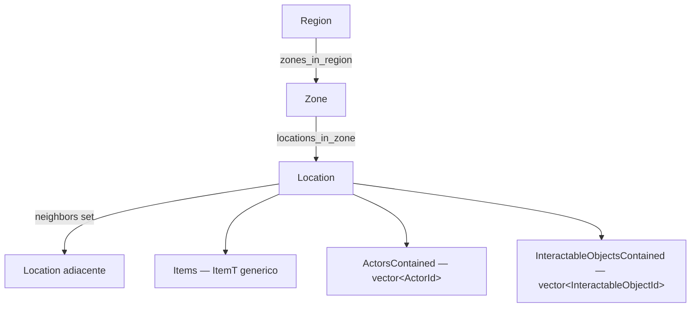

# gmMap — Piano di Evoluzione: Location / Zone / Region

**Data:** 2026-06-19
**Scope:** Refactor `gmMap<ItemT>` per supportare gerarchia a tre livelli
(Location → Zone → Region), contenitori game-independent sulla Location,
e fondamenta per la futura libreria `gmInteraction`.

---

## 1. Gap Analysis

### Modello attuale di `gmMap<ItemT>`

| Struttura       | Campi rilevanti                                                                      |
|-----------------|--------------------------------------------------------------------------------------|
| `LocationRecord`| `optional<TileId> tile_id`, `vector<ItemT> items`, `Metadata meta`, `unordered_set<LocationId> neighbors` |
| `TileRecord`    | `unordered_set<LocationId> locations`, `Metadata meta`                               |
| `MapSnapshot`   | location IDs, tile IDs, assignments, adjacency edges, items, metadata (v1 JSON)      |

Un solo livello di raggruppamento (**Tile**). Lookup inversi via `tile_of()` e
`locations_in_tile()`.

### Tabella gap

| # | Richiesta | Stato attuale | Gap | Severità |
|---|-----------|---------------|-----|----------|
| 0 | Location → Zone → Region (Tile diventa Zone + nuovo livello Region) | Solo Location → Tile | Rinomina `Tile` → `Zone` + intero livello `Region` da costruire da zero | **Alta** |
| 1 | Ogni Location appartiene a una Zone (`zone_id`) | `optional<TileId>` — opzionale | Rinomina; decidere se obbligatoria o opzionale con sentinel | Media |
| 2 | Ogni Zone appartiene a una Region (`region_id`) | Tile non ha parent | Aggiungere `optional<RegionId>` su Zone + API di gestione | **Alta** |
| 3 | Adiacenze dentro la Location come `vector` o `set` di `LocationId` | `unordered_set<LocationId> neighbors` | **Già soddisfatto** ✅ (possibile switch a `vector` — vedi §3) | Nessuna |
| 4 | Mappe inverse Region→Zone e Zone→Location costruite a runtime | Esiste solo Zone→Location (`TileRecord.locations`) | Aggiungere `Region→Zone`; aggiornamento O(1) a ogni assegnazione | Media |
| 5 | `ActorsContained` + `InteractableObjectsContained` game-independent su Location | Solo `vector<ItemT>` | Aggiungere due vettori di Id opachi + API + eventi + snapshot | **Alta** |
| 6 | Nuova libreria `gmInteraction` per `InteractableObject` | Non esiste | Nuova libreria standalone (progettazione separata) | **Alta** — separata |

### Punti di attenzione progettuali

- **Indipendenza librerie**: `gmMap` non può includere `gmActor` né `gmInteraction`
  (regola di progetto: cross-library solo via `bridges/`).
  Quindi `ActorId` e `InteractableObjectId` sono **handle numerici opachi** definiti
  dentro `gmMap` (es. `using ActorId = uint64_t;`).
  Il collegamento ai tipi reali avviene nel game/bridge layer.

- **Obbligatorietà appartenenza**: oggi l'appartenenza a Tile è opzionale.
  Le regole 1–2 implicano "ogni Location **ha** una Zone, ogni Zone **ha** una Region".
  **Decisione richiesta** (vedi §5 — Decision Point DP-1):
  obbligatoria in costruzione oppure opzionale con sentinel `UNASSIGNED`?

- **Persistenza**: il formato JSON sale a **v2**.
  Nuovi campi: `region_ids`, `zone_to_region`, `location_to_zone`,
  `actors_by_location`, `interactables_by_location`.
  Serve migrazione v1 → v2 in `gmSave`.

---

## 2. Impact Analysis — `gmMap` → modulo GUI

La GUI (`pyLib/gmGui`) **non usa affatto** Tile/Zone/Region.
Consuma solo: `gmMap.map.loaded` (locations + edges + metadata `terrain`/`items`),
`location.item_added/removed`, `metadata_changed`, e gli eventi attore.

| Componente | Impatto | Dettaglio |
|------------|---------|-----------|
| Rinomina Tile → Zone | **Nullo** sulla GUI | Nessun payload GUI usa la parola "tile" |
| Nuovo livello Region | **Basso / opzionale** | Arricchimento: nuovo "Layer" (colore per Region/Zone) nel `layer_combo` di `gm_map_module.py` (oggi: terrain / items / actors) |
| `ActorsContained` / `InteractableObjectsContained` | **Sinergia forte** ✅ | Mappano 1:1 sul widget `gm_map_area_info_module.py`. Oggi `actors[]`/`interactables[]` li costruisce il game (`DungeonEngine.build_area_info`); con il nuovo `gmMap` la sorgente diventa **nativa** e il Core risponde a `gmMap.area.info.request` leggendo direttamente da `gmMap`. |
| Payload `gmMap.map.loaded` | **Additivo** | Aggiungere `zone_id`/`region_id` su ogni location e campi `regions`/`zones`. Il parser GUI è tollerante (legge per chiave) — nessuna rottura. |
| Nuovi eventi | **Basso** | `gmMap.location.actor_added/removed`, `gmMap.location.interactable_changed`, `gmMap.region.*`. La GUI li sottoscrive solo se vuole reattività fine. |
| Adiacenze (edges nello snapshot) | **Nullo** | Restano emesse come `edges`; `MapScene` invariato. |
| `DungeonMap` (wrappa `gmMap`) | **Medio** | Adeguare i nomi rinominati; delegare `build_area_info` a `gmMap` (actors/interactables nativi). |

**Sintesi**: impatto GUI **basso e quasi tutto additivo**; il guadagno principale è che
l'area-info diventa alimentabile direttamente da `gmMap` invece che da logica
game-specific.

---

## 3. Scelta del contenitore: `vector` vs `unordered_set` vs `list`

### Tabella comparativa

| Contenitore | Layout memoria | Lookup membership | Inserimento | Rimozione | Ordine garantito | Iteratori stabili |
|-------------|---------------|-------------------|-------------|-----------|-----------------|-------------------|
| `std::vector<T>` | Contiguo, cache-friendly | O(n) (scan) | O(1) amm. in coda | O(n) shift, O(1) swap-and-pop | Sì (indice/inserzione) | No (realloc invalida) |
| `std::unordered_set<T>` | Nodi sparsi + hashtable | **O(1)** medio | O(1) medio | **O(1)** per chiave | No | Sì (tranne rehash) |
| `std::list<T>` | Nodi doppiamente collegati | O(n) | O(1) ovunque (con iteratore) | O(1) ovunque | Sì (inserzione) | **Sempre** |
| `std::unordered_map<K,V>` | Hashtable | O(1) per chiave | O(1) | O(1) | No | Sì (tranne rehash) |

### Regole pratiche

- **`vector`** — la scelta di default.
  Conviene quando: pochi elementi, iterazione frequente, ordine significativo,
  deduplicazione non richiesta.
  È il più veloce in iterazione e il più leggero in memoria grazie alla località di cache.
  Per rimozione veloce senza preservare l'ordine si usa lo **swap-and-pop** (`O(1)`).

- **`unordered_set`** — conviene quando: serve **deduplicazione automatica** e/o
  **test di appartenenza `O(1)`** e/o **rimozione per valore `O(1)`**, e l'ordine non importa.
  Costo: più memoria, iterazione meno cache-friendly, overhead di hashing.

- **`list`** — raramente la scelta migliore.
  Conviene solo se servono inserimenti/rimozioni `O(1)` in posizione **arbitraria**
  mantenendo **iteratori/riferimenti sempre validi** (es. cursori persistenti).
  Di norma sconsigliata per contenitori piccoli.

### Applicato a `gmMap`

| Uso | Scelta attuale | Raccomandazione | Motivazione |
|-----|---------------|-----------------|-------------|
| Adiacenze (`neighbors`) | `unordered_set<LocationId>` | **Mantieni `unordered_set`** | `are_adjacent()` e `remove_adjacent()` `O(1)`; dedup automatica; grado di nodo tipicamente piccolo (2–8) ma la generalità è preferibile |
| `ActorsContained` | — da creare | **`vector<ActorId>`** | Pochi elementi, iterazione frequente per UI, ordine di presenza significativo, rimozione swap-and-pop |
| `InteractableObjectsContained` | — da creare | **`vector<InteractableObjectId>`** | Stesse motivazioni di ActorsContained |
| Mappa inversa Region→Zone | — da creare | `unordered_map<RegionId, unordered_set<ZoneId>>` | Inserimento/rimozione/dedup `O(1)` quando le assegnazioni cambiano |
| Mappa inversa Zone→Location | già via `TileRecord.locations` | Mantieni `unordered_set<LocationId>` (già corretto) | Stesso ragionamento |
| `zone_id` su Location, `region_id` su Zone | scalare opzionale | `optional<ZoneId>` / `optional<RegionId>` | Non è un contenitore, è un campo scalare |

---

## 4. Piano delle attività

Le fasi sono **additive**: ogni fase è compilabile e testabile
in isolamento. `gmInteraction` resta come progettazione separata.

### Fase A — Design freeze & contratti *(no codice)* — ✅ completata

- [x] Decidere DP-1: **B** opzionale con `std::optional` (`zone_id`/`region_id` = `std::nullopt`).
- [x] Definire alias Id opachi:
  `RegionId = uint32_t`, `ZoneId = uint32_t` (ex `TileId`),
  `ActorId = uint64_t`, `InteractableObjectId = uint64_t`.
- [x] Congelare schema **JSON snapshot v2** (lista completa campi — vedi §7).
- [x] Elencare nuovi eventi GUI:
  `gmMap.region.*`, `gmMap.zone.*`,
  `gmMap.location.actor_added/removed`,
  `gmMap.location.interactable_added/removed`.

### Fase B — Refactor gerarchia (Tile → Zone + nuovo Region)

- [x] Rinomina `Tile` → `Zone` in tutta la codebase:
  alias, metodi, eccezioni (`EDuplicateTileError` → `EDuplicateZoneError`), test, docs.
- [x] Aggiungere `RegionRecord{ unordered_set<ZoneId> zones; Metadata meta; }`.
- [x] API Region: `create_region`, `remove_region`, `has_region`, `all_regions`, `region_count`.
- [x] Metadata Region: `set_region_meta`, `get_region_meta`, `has_region_meta`,
  `remove_region_meta`, `region_metadata`.
- [x] Parent link Zone → Region: `optional<RegionId>` in `ZoneRecord`.
- [x] API assegnazione: `assign_zone_to_region`, `unassign_zone_from_region`,
  `region_of(ZoneId)`, `zones_in_region(RegionId)`.
- [x] Mappa inversa Region→Zone mantenuta in `assign_zone_to_region`.
- [x] Helper privati: `_require_region(RegionId)`.
- [x] `remove_region`: sgancia le Zone (non le elimina).
- [x] `remove_zone`: aggiorna mappa inversa Region→Zone.

### Fase C — Contenitori game-independent sulla Location

- [x] Aggiungere a `LocationRecord` (decisione A1 — `unordered_set`, non `vector`):
  `std::unordered_set<ActorId> actors`,
  `std::unordered_set<InteractableObjectId> interactables`.
- [x] API attori sulla location:
  `place_actor(LocationId, ActorId)`,
  `remove_actor(LocationId, ActorId)` *(no-op se assente)*,
  `actors_at(LocationId) const`,
  `clear_actors(LocationId)`,
  `has_actor(LocationId, ActorId) const`.
- [x] API interactables sulla location: stessa struttura (`place_interactable`, …).
- [x] ~~Nuove eccezioni `EUnknownActorError`/`EUnknownInteractableError`~~ — **non introdotte**
  (remove idempotente; vedi nota di scope nella §5).

### Fase D — Snapshot v2 & persistenza

- [x] Estendere `MapSnapshot`:
  `region_ids`, `zone_ids` *(rinomina da `tile_ids`)*,
  `zone_to_region` *(rinomina + estende `assignments`)*,
  `location_to_zone` *(from Location)*,
  `actors_by_location`, `interactables_by_location`.
- [x] Bump versione JSON → **v2**.
- [x] **Migrazione v1 → v2**: Tile → Zone senza Region;
  `actors_by_location` e `interactables_by_location` vuoti
  (rilevata via `gmSave::peek_version` + `from_json` tollerante a entrambi gli schemi).
- [x] Test round-trip: export v2 → clear → import v2; assert full equality.

### Fase E — `gmInteraction` *(progettazione separata)*

- [ ] Definire `InteractableObject`, `InteractableObjectId`, stato e azioni.
- [ ] Eccezione base (`EInteractionError : std::runtime_error`).
- [ ] API pubblica della libreria.
- [ ] Bridge verso `gmMap` (solo Id opachi, no `#include` diretto da `gmMap`).

### Fase F — Allineamento GUI

- [ ] `gm_map_module.py`: layer opzionale "Region / Zone"
  (colore per gruppo nel `layer_combo`); parsing additivo di `zone_id`/`region_id`.
- [ ] `gm_map_area_info_module.py`: alimentazione nativa da `gmMap`
  (`actors`/`interactables` nel payload `gmMap.area.info.response`).

### Fase G — Integrazione Dungeon CoreEngine

- [ ] `DungeonMap.hpp/.cpp`: aggiornare alle API rinominate (Tile → Zone).
- [ ] `DungeonEngine`: delegare `build_area_info` a `gmMap.actors_at()` +
  `gmMap.interactables_at()` invece della logica custom attuale.

### Fase H — Documentazione & test

- [ ] Aggiornare `gmMap_API.md`:
  tabelle metodi, diagramma Mermaid Region → Zone → Location.
- [ ] Test unitari per ogni fase (coverage: create/remove/assign/inverse-lookup).
- [ ] Aggiornare `PLAN.md` con le nuove fasi appese.

---

## 5. Decision Points aperti

| ID | Domanda | Opzioni | Impatto se non deciso |
|----|---------|---------|----------------------|
| DP-1 | Appartenenza Zone/Region obbligatoria o opzionale? | **A** — obbligatoria in costruzione (`create_location(id, zoneId)`); **B** — opzionale con sentinel `0` o `nullopt` | Firma dell'API pubblica di Fase B e C non definibile |
| DP-2 | Adiacenze: mantenere `unordered_set` o passare a `vector`? | **A** — mantieni `unordered_set` (raccomandato); **B** — `vector` con swap-and-pop | Basso; non blocca altre fasi |
| DP-3 | `ActorId` e `InteractableObjectId`: alias distinti o `EntityUid` esistente? | **A** — alias distinti (`using ActorId = uint64_t`); **B** — riusa `EntityUid` | Leggibilità e type-safety dell'API |

### Decisioni congelate (Fase A)

| ID | Scelta | Note implementative |
|----|--------|---------------------|
| DP-1 | **B** — opzionale con `std::nullopt` | `LocationRecord::zone_id` e `ZoneRecord::region_id` sono `std::optional<>`; nessun sentinel numerico. |
| DP-2 | **A** — mantieni `unordered_set` per le adiacenze | Nessuna modifica al modello adiacenze. |
| A1 | `ActorsContained` e `InteractableObjectsContained` usano **`std::unordered_set`** | Sostituisce la bozza `std::vector` delle Fasi C/D: dedup nativa e `has_actor`/`remove_actor` O(1). |
| DP-3 | **A** — alias distinti | `using ActorId = uint64_t; using InteractableObjectId = uint64_t;` distinti da `EntityUid`. |

> **Nota di scope (deviazione consapevole):** poiché i contenitori usano `unordered_set`,
> `remove_actor`/`remove_interactable` sono **no-op idempotenti** se l'elemento è assente
> (coerenti con `remove_adjacent`). Le eccezioni `EUnknownActorError`/`EUnknownInteractableError`
> previste nella bozza di Fase C **non vengono introdotte** (sarebbero codice morto:
> error-handling per uno scenario che non è un errore di contratto).

---

## 6. Gerarchia target



---

## 7. Schema JSON snapshot v2 (bozza)

```json
{
  "version": 2,
  "region_ids":        [1, 2],
  "zone_ids":          [10, 11, 12],
  "location_ids":      [100, 101, 102, 103],
  "zone_to_region":    [[10, 1], [11, 1], [12, 2]],
  "location_to_zone":  [[100, 10], [101, 10], [102, 11], [103, 12]],
  "adjacency_edges":   [[100, 101], [101, 100], [101, 102]],
  "items_by_location": { "100": ["sword"], "102": ["potion"] },
  "actors_by_location":         { "100": [42, 43] },
  "interactables_by_location":  { "101": [7] },
  "location_metadata_map": {},
  "zone_metadata_map":     {},
  "region_metadata_map":   {}
}
```

**Note migrazione v1 → v2:**

- `tile_ids` diventa `zone_ids`; `tile_metadata_map` diventa `zone_metadata_map`.
- `assignments` (location → tile) diventa `location_to_zone`.
- Campi `region_ids`, `zone_to_region`, `actors_by_location`,
  `interactables_by_location`, `region_metadata_map` vengono aggiunti vuoti
  per i file v1 privi di questi dati.
