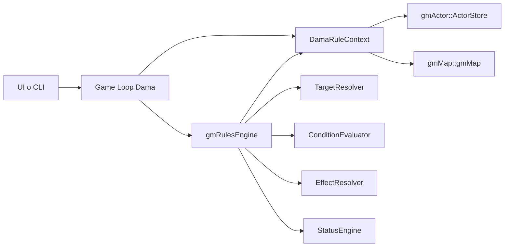
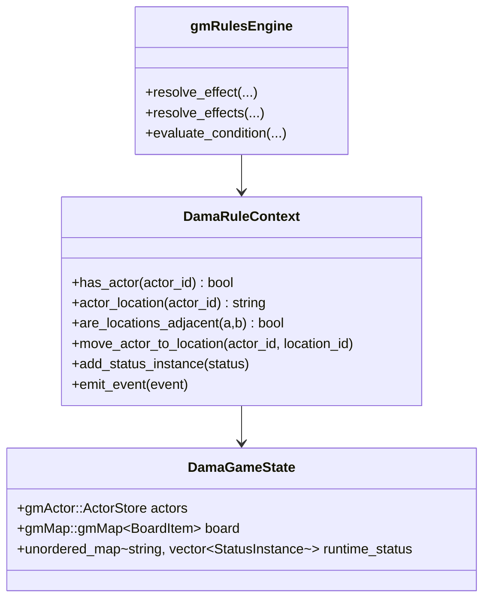
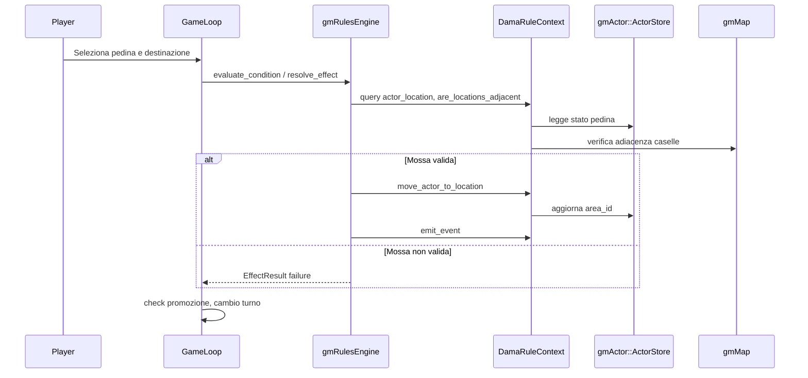

# Esempio Dama con gmRules + gmActor + gmMap

## Obiettivo

Questo documento mostra un approccio pratico per modellare il gioco della Dama
usando:

- `gmMap` per la topologia della scacchiera (caselle e adiacenze)
- `gmActor` per lo stato delle pedine (chi sono, dove stanno, se sono vive)
- `gmRules` per validazione ed esecuzione delle regole (mossa, cattura, promozione)

L'esempio e volutamente modulare: puoi sostituire facilmente il layer UI,
l'input umano o l'AI senza toccare la logica di regole.

## Mappatura concettuale

| Concetto Dama | gmMap | gmActor | gmRules |
|---|---|---|---|
| Casella scura | `LocationId` | riferimento in `common.area_id` | `LocationId` nel `RuleContext` |
| Pedina | item opzionale su casella | `HeroState` (o altro stato attore) | target di effetti |
| Colore (bianco/nero) | metadata casella opzionale | `faction_id` | `are_allies` / `are_enemies` |
| Mossa diagonale | adiacenza | update `area_id` | `EffectType::MOVE_ACTOR` |
| Cattura | salto su casella adiacente successiva | tag/status su pedina catturata | `MOVE_ACTOR` + `APPLY_STATUS` |
| Promozione a dama | metadata ultima traversa | tag `king` sull'attore | `ADD_TAG` |

## Architettura



## Diagramma entita



## 1) Setup scacchiera con gmMap

`gmMap` usa `LocationId` numerico (`uint32_t`), mentre `gmActor` usa `AreaId`
stringa. In questo esempio usiamo il formato stringa `sq_<id>` per `AreaId`.

```cpp
#include "gmMap/gmMap.hpp"

#include <cstdint>
#include <string>
#include <vector>

struct BoardItem
{
    std::string type;
    std::string actor_id;
};

static std::string to_area_id(gmMap::LocationId loc)
{
    return std::string("sq_") + std::to_string(loc);
}

static gmMap::LocationId to_loc_id(const std::string& area_id)
{
    // Atteso formato: sq_<numero>
    return static_cast<gmMap::LocationId>(std::stoul(area_id.substr(3)));
}

static void build_checkers_board(gmMap::gmMap<BoardItem>& board)
{
    // 32 caselle scure classiche (id 1..32)
    for (gmMap::LocationId id = 1; id <= 32; ++id)
    {
        board.create_location(id);
    }

    // Esempio minimale: alcune adiacenze diagonali (completa con tutta la mappa)
    board.set_adjacent(1, 5, true);
    board.set_adjacent(2, 5, true);
    board.set_adjacent(2, 6, true);
    board.set_adjacent(3, 6, true);

    // Tag utili per promozione
    board.set_location_meta(1, "promotion_black", true);
    board.set_location_meta(2, "promotion_black", true);
    board.set_location_meta(31, "promotion_white", true);
    board.set_location_meta(32, "promotion_white", true);
}
```

## 2) Setup pedine con gmActor

In Dama, ogni pedina puo essere trattata come un attore leggero.
Per semplicita usiamo `HeroState` per entrambe le fazioni, distinguendo il lato
tramite `faction_id` (`white` / `black`).

```cpp
#include "gmActor/actors/ActorStore.hpp"
#include "gmActor/actors/HeroState.hpp"
#include "gmActor/core/Enums.hpp"

#include <string>

static gmActor::HeroState make_piece(const std::string& id,
                                     const std::string& faction,
                                     const std::string& area)
{
    gmActor::HeroState piece;
    piece.common.actor_id = id;
    piece.common.kind = gmActor::ActorKind::HERO;
    piece.common.display_name = id;
    piece.common.faction_id = faction;
    piece.common.area_id = area;
    piece.common.area_position = gmActor::AreaPosition::NONE;
    piece.common.current_hp = 1;
    piece.common.max_hp = 1;
    piece.common.life_state = gmActor::ActorLifeState::ACTIVE;
    piece.common.can_act = true;
    piece.common.can_be_targeted = true;
    return piece;
}

static void spawn_initial_pieces(gmActor::ActorStore& store)
{
    store.add_hero(make_piece("w_01", "white", "sq_21"));
    store.add_hero(make_piece("w_02", "white", "sq_22"));
    store.add_hero(make_piece("b_01", "black", "sq_10"));
    store.add_hero(make_piece("b_02", "black", "sq_11"));
}
```

## 3) Adapter RuleContext per collegare gmRules

`gmRules` non accede direttamente alle librerie concrete. Usa sempre
`RuleContext`. Qui sotto una implementazione compatta specifica per Dama.

```cpp
#include "gmRules/core/RuleContext.hpp"
#include "gmRules/core/RuleResult.hpp"
#include "gmRules/core/RuleEvent.hpp"
#include "gmRules/status/StatusInstance.hpp"

#include "gmActor/actors/ActorStore.hpp"
#include "gmActor/stats/Health.hpp"

#include "gmMap/gmMap.hpp"

#include <algorithm>
#include <stdexcept>
#include <string>
#include <unordered_map>
#include <vector>

class DamaRuleContext : public gmRules::RuleContext
{
public:
    DamaRuleContext(gmActor::ActorStore& actors,
                    gmMap::gmMap<BoardItem>& board)
        : actors_(actors), board_(board)
    {
    }

    bool has_actor(const gmRules::ActorId& actor_id) const override
    {
        return actors_.has_actor(actor_id);
    }

    bool actor_has_tag(const gmRules::ActorId& actor_id,
                       const std::string& tag) const override
    {
        const gmActor::ActorStateCommon& c = actors_.common(actor_id);
        const std::vector<gmActor::Tag>& tags = c.tags;
        return std::find(tags.begin(), tags.end(), tag) != tags.end();
    }

    int actor_current_hp(const gmRules::ActorId& actor_id) const override
    {
        return actors_.common(actor_id).current_hp;
    }

    int actor_max_hp(const gmRules::ActorId& actor_id) const override
    {
        return actors_.common(actor_id).max_hp;
    }

    bool actor_has_status(const gmRules::ActorId& actor_id,
                          const gmRules::StatusId& status_id) const override
    {
        std::unordered_map<gmRules::ActorId, std::vector<gmRules::StatusInstance>>::const_iterator it;
        it = runtime_statuses_.find(actor_id);
        if (it == runtime_statuses_.end())
        {
            return false;
        }
        const std::vector<gmRules::StatusInstance>& statuses = it->second;
        for (const gmRules::StatusInstance& s : statuses)
        {
            if (s.status_id == status_id)
            {
                return true;
            }
        }
        return false;
    }

    std::vector<gmRules::StatusInstanceId>
    statuses_on_actor(const gmRules::ActorId& actor_id) const override
    {
        std::vector<gmRules::StatusInstanceId> out;
        std::unordered_map<gmRules::ActorId, std::vector<gmRules::StatusInstance>>::const_iterator it;
        it = runtime_statuses_.find(actor_id);
        if (it == runtime_statuses_.end())
        {
            return out;
        }

        const std::vector<gmRules::StatusInstance>& statuses = it->second;
        for (const gmRules::StatusInstance& s : statuses)
        {
            out.push_back(s.instance_id);
        }
        return out;
    }

    bool are_allies(const gmRules::ActorId& a,
                    const gmRules::ActorId& b) const override
    {
        return actors_.common(a).faction_id == actors_.common(b).faction_id;
    }

    bool are_enemies(const gmRules::ActorId& a,
                     const gmRules::ActorId& b) const override
    {
        return !are_allies(a, b);
    }

    void modify_actor_hp(const gmRules::ActorId& actor_id, int delta) override
    {
        gmActor::ActorStateCommon& c = actors_.common(actor_id);
        if (delta < 0)
        {
            gmActor::damage_hp(c, -delta);
        }
        else
        {
            gmActor::heal_hp(c, delta);
        }
    }

    void add_actor_tag(const gmRules::ActorId& actor_id,
                       const std::string& tag) override
    {
        std::vector<gmActor::Tag>& tags = actors_.common(actor_id).tags;
        if (std::find(tags.begin(), tags.end(), tag) == tags.end())
        {
            tags.push_back(tag);
        }
    }

    void remove_actor_tag(const gmRules::ActorId& actor_id,
                          const std::string& tag) override
    {
        std::vector<gmActor::Tag>& tags = actors_.common(actor_id).tags;
        std::vector<gmActor::Tag>::iterator it =
            std::remove(tags.begin(), tags.end(), tag);
        tags.erase(it, tags.end());
    }

    void add_status_instance(const gmRules::StatusInstance& status) override
    {
        runtime_statuses_[status.owner_actor_id].push_back(status);
    }

    void remove_status_instance(const gmRules::StatusInstanceId& instance_id) override
    {
        for (std::pair<const gmRules::ActorId, std::vector<gmRules::StatusInstance>>& kv : runtime_statuses_)
        {
            std::vector<gmRules::StatusInstance>& vec = kv.second;
            std::vector<gmRules::StatusInstance>::iterator it =
                std::remove_if(vec.begin(), vec.end(),
                    [&instance_id](const gmRules::StatusInstance& s)
                    {
                        return s.instance_id == instance_id;
                    });
            vec.erase(it, vec.end());
        }
    }

    bool has_location(const gmRules::LocationId& location_id) const override
    {
        return board_.has_location(to_loc_id(location_id));
    }

    gmRules::LocationId actor_location(const gmRules::ActorId& actor_id) const override
    {
        return actors_.common(actor_id).area_id;
    }

    bool are_locations_adjacent(const gmRules::LocationId& a,
                                const gmRules::LocationId& b) const override
    {
        return board_.are_adjacent(to_loc_id(a), to_loc_id(b));
    }

    int distance_between_locations(const gmRules::LocationId& a,
                                   const gmRules::LocationId& b) const override
    {
        if (a == b)
        {
            return 0;
        }
        if (are_locations_adjacent(a, b))
        {
            return 1;
        }
        return -1;
    }

    bool location_has_tag(const gmRules::LocationId& location_id,
                          const std::string& tag) const override
    {
        gmMap::LocationId id = to_loc_id(location_id);
        if (!board_.has_location_meta(id, tag))
        {
            return false;
        }
        const gmMap::MetadataValue& v = board_.get_location_meta(id, tag);
        const bool* p = std::get_if<bool>(&v);
        return p != nullptr && *p;
    }

    std::vector<gmRules::ActorId>
    actors_in_location(const gmRules::LocationId& location_id) const override
    {
        return actors_.actors_in_area(location_id);
    }

    void move_actor_to_location(const gmRules::ActorId& actor_id,
                                const gmRules::LocationId& location_id) override
    {
        actors_.common(actor_id).area_id = location_id;
    }

    bool has_deck(const gmRules::DeckId& /*deck_id*/) const override
    {
        return false;
    }

    std::vector<gmRules::CardId>
    draw_cards(const gmRules::DeckId& /*deck_id*/, int /*amount*/) override
    {
        return std::vector<gmRules::CardId>();
    }

    gmRules::RuleResult move_card_to_zone(const gmRules::DeckId& /*deck_id*/,
                                          const gmRules::CardId& /*card_id*/,
                                          const std::string& /*zone_name*/) override
    {
        return gmRules::RuleResult::ok();
    }

    void emit_event(const gmRules::RuleEvent& event) override
    {
        emitted_events_.push_back(event);
    }

private:
    static gmMap::LocationId to_loc_id(const std::string& area_id)
    {
        return static_cast<gmMap::LocationId>(std::stoul(area_id.substr(3)));
    }

private:
    gmActor::ActorStore& actors_;
    gmMap::gmMap<BoardItem>& board_;
    std::unordered_map<gmRules::ActorId, std::vector<gmRules::StatusInstance>> runtime_statuses_;
    std::vector<gmRules::RuleEvent> emitted_events_;
};
```

## 4) Regole Dama con gmRules

### 4.1 Mossa semplice diagonale

- target: pedina selezionata
- condizione: casella destinazione adiacente
- effetto: sposta attore in destinazione

```cpp
#include "gmRules/facade/gmRulesEngine.hpp"
#include "gmRules/effect/EffectSpec.hpp"
#include "gmRules/target/TargetRef.hpp"

#include <vector>

static gmRules::EffectSpec make_simple_move_effect(const std::string& destination_sq)
{
    gmRules::EffectSpec e;
    e.type = gmRules::EffectType::MOVE_ACTOR;
    e.target.kind = gmRules::TargetKind::ACTOR;
    e.target.selector = gmRules::TargetSelector::SELECTED_ACTOR;
    e.target.required = true;
    e.value = destination_sq; // es. "sq_17"
    return e;
}

static void apply_simple_move(gmRules::gmRulesEngine& engine,
                              DamaRuleContext& ctx,
                              const std::string& piece_id,
                              const std::string& destination_sq)
{
    gmRules::TargetRef selected;
    selected.kind = gmRules::TargetKind::ACTOR;
    selected.id = piece_id;

    std::vector<gmRules::TargetRef> selected_targets;
    selected_targets.push_back(selected);

    gmRules::EffectSpec move_effect = make_simple_move_effect(destination_sq);
    gmRules::EffectResult r =
        engine.resolve_effect(move_effect, piece_id, selected_targets, ctx);

    if (!r.succeeded())
    {
        throw std::runtime_error(r.message());
    }
}
```

### 4.2 Cattura (salto + marcatura catturato)

Strategia semplice:

1. `MOVE_ACTOR` sulla casella di arrivo del salto
2. `APPLY_STATUS("captured")` sul bersaglio nemico superato
3. Pulizia a fine turno: rimuovi dal board gli attori con status `captured`

```cpp
static std::vector<gmRules::EffectSpec>
make_capture_effects(const std::string& landing_sq)
{
    gmRules::EffectSpec move;
    move.type = gmRules::EffectType::MOVE_ACTOR;
    move.target.kind = gmRules::TargetKind::ACTOR;
    move.target.selector = gmRules::TargetSelector::SELECTED_ACTOR;
    move.value = landing_sq;

    gmRules::EffectSpec mark_captured;
    mark_captured.type = gmRules::EffectType::APPLY_STATUS;
    mark_captured.target.kind = gmRules::TargetKind::ACTOR;
    mark_captured.target.selector = gmRules::TargetSelector::SELECTED_ENEMY;
    mark_captured.value = "captured";

    std::vector<gmRules::EffectSpec> out;
    out.push_back(move);
    out.push_back(mark_captured);
    return out;
}
```

### 4.3 Promozione a dama

Se la pedina bianca arriva in una location con metadata `promotion_white=true`
o la nera in `promotion_black=true`, aggiungi tag `king`.

```cpp
static gmRules::EffectSpec make_promotion_effect()
{
    gmRules::EffectSpec e;
    e.type = gmRules::EffectType::ADD_TAG;
    e.target.kind = gmRules::TargetKind::ACTOR;
    e.target.selector = gmRules::TargetSelector::SELECTED_ACTOR;
    e.value = "king";
    return e;
}
```

## 5) Flusso turno esempio



## 6) Note implementative importanti

- `gmMap::LocationId` e numerico, `gmActor::AreaId` e stringa:
  mantieni una convenzione di conversione unica (`sq_<id>`).
- Le regole complesse di Dama (obbligo di cattura, multi-cattura, priorita
  tra sequenze) si gestiscono bene con pipeline `resolve_effects(...)` e con
  check iterativi nel game loop.
- `gmRules` decide *cosa* applicare; `RuleContext` decide *come* leggere e
  mutare lo stato reale.
- In produzione conviene aggiungere test dedicati per:
  - promozione
  - multi-cattura
  - blocco mosse non diagonali
  - blocco mossa in casella occupata

## 7) Mini bootstrap end-to-end

```cpp
#include "gmRules/facade/gmRulesEngine.hpp"

int main()
{
    gmMap::gmMap<BoardItem> board;
    build_checkers_board(board);

    gmActor::ActorStore actors;
    spawn_initial_pieces(actors);

    DamaRuleContext ctx(actors, board);
    gmRules::gmRulesEngine engine;

    apply_simple_move(engine, ctx, "w_01", "sq_17");

    return 0;
}
```

Questo bootstrap dimostra il wiring minimo. Da qui puoi aggiungere:

- validazione occupazione casella
- obbligo di cattura
- AI avversario
- serializzazione partita
