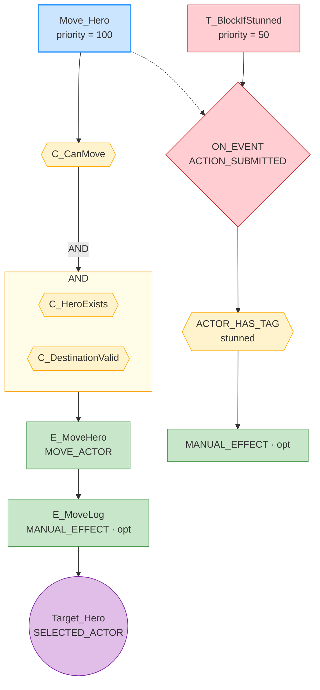
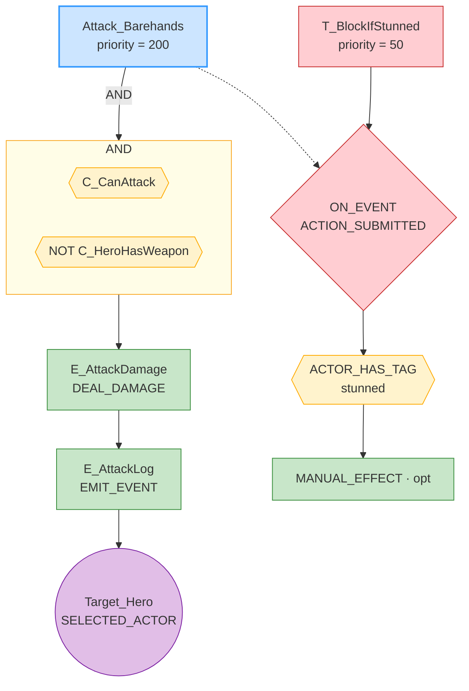
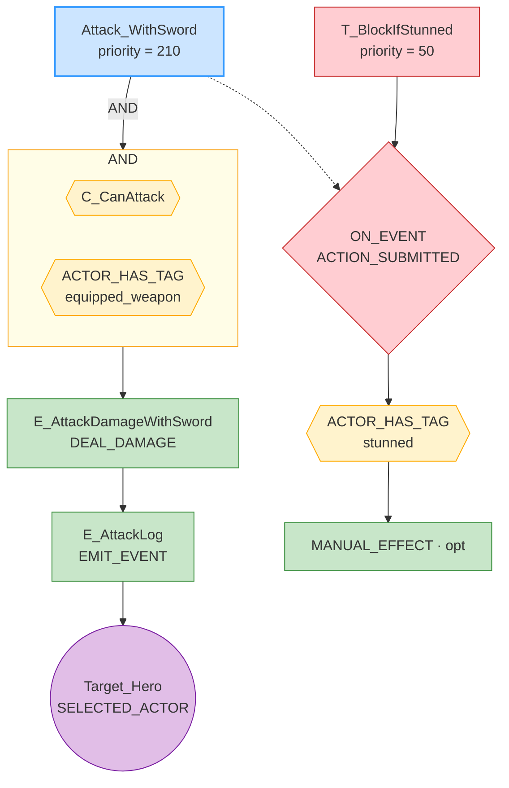
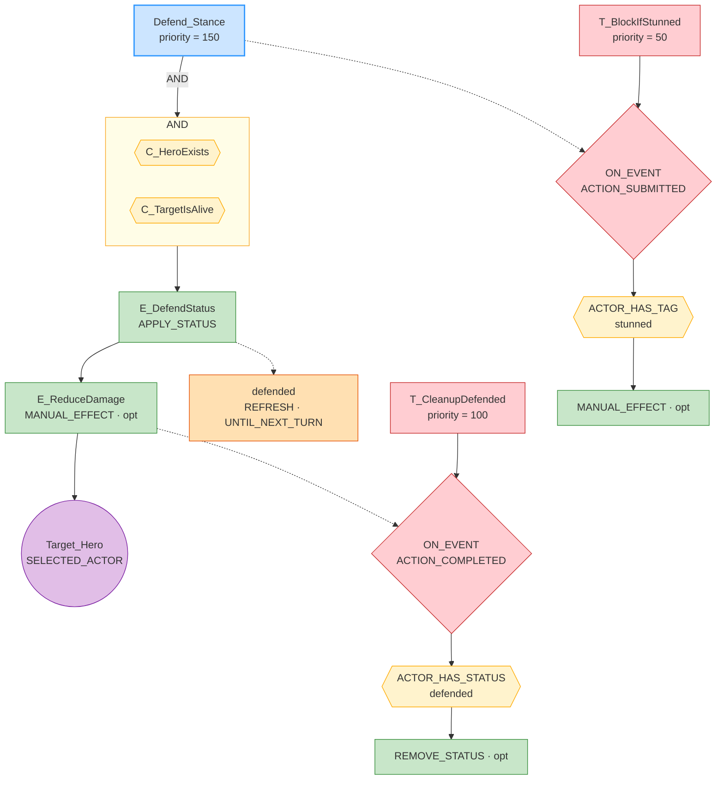
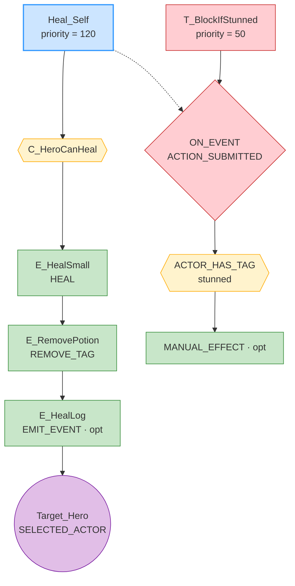
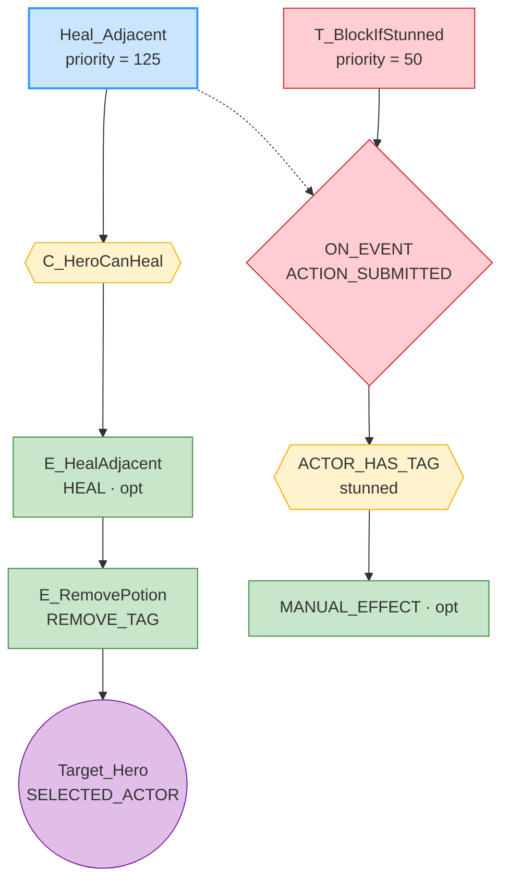
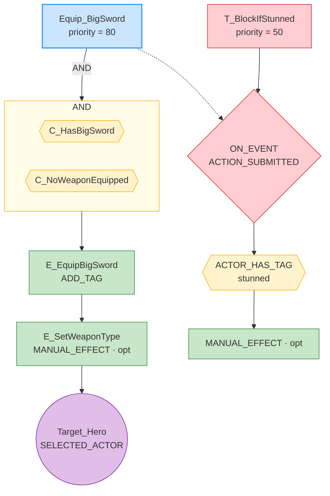

# GRS Rule Graphs — dungeon_crawler

## Move_Hero

---

## Attack_Barehands

---

## Attack_WithSword

---

## Defend_Stance

---

## Heal_Self

---

## Heal_Adjacent

---

## Equip_BigSword

