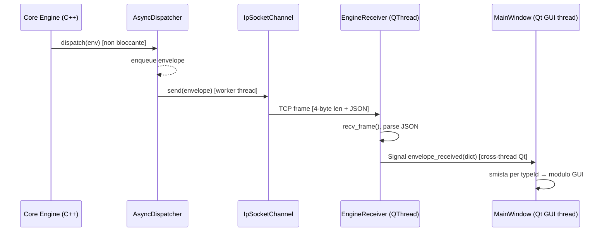

# gmGui – Development Plan

**Version:** 0.4.0
**Status:** Phase 4 – Planned ⏳
**Language:** Python 3.11+ / PySide6
**Package:** `gmGui`

---

## Goal

`gmGui` è la GUI Python/PySide6 per il GameLib engine C++17. Fornisce un'interfaccia
dockabile e modulare per visualizzare e interagire in tempo reale con le librerie
`gmActor`, `gmAlea` (GmCompDeck e GmDice), `gmFlow` e `gmMap`. La connessione al
motore C++ avviene tramite un bridge TCP bidirezionale che sfrutta `gmDispatch::IpSocketChannel`
e `gmDispatch::JsonSerializer` già implementati nel core, mantenendo i due processi
completamente separati per evitare conflitti con il GIL Python. Ogni modulo GUI mappa
1:1 una libreria del core ed espone una interfaccia uniforme (`IGmGuiModule`) che permette
a `MainWindow` di gestire registrazione, routing degli eventi e persistenza del layout
in modo uniforme e indipendente dal contenuto di ciascun modulo.

---

## Architecture

```
┌─────────────────────────────────────────────────────────────────────────────┐
│  C++17 Core Engine (processo separato)                                      │
│                                                                             │
│  GmDispatcher (AsyncDispatcher)                                             │
│    └─ IpSocketChannel("127.0.0.1", 9000)  ──── TCP frames ──►              │
│  CmdServer (thread) ◄────────────────────────── TCP frames ───             │
└─────────────────────────────────────────────────────────────────────────────┘
          ▲ porta 9001 (comandi GUI→Engine)       │ porta 9000 (eventi Engine→GUI)
          │                                       ▼
┌─────────────────────────────────────────────────────────────────────────────┐
│  gmGui (processo Python)                                                    │
│                                                                             │
│  engine_bridge/                                                             │
│    framing.py          ← wire protocol: uint32_t len-prefix + UTF-8 JSON   │
│    EngineReceiver      ← QThread: server TCP:9000, emette Signal(dict)      │
│    EngineSender        ← client TCP:9001, scrive frames                     │
│                                                                             │
│  MainWindow (QMainWindow)                                                   │
│    ├─ QMenuBar / QToolBar / QStatusBar   ← Header / Footer fissi           │
│    ├─ _routing: dict[typeId → [IGmGuiModule]]  ← dispatcher centrale       │
│    ├─ QDockWidget(GmFlowModule)          ← TopDockWidgetArea                │
│    ├─ QDockWidget(GmMapModule)           ← LeftDockWidgetArea               │
│    ├─ QDockWidget(GmActorModule)         ← RightDockWidgetArea              │
│    ├─ QDockWidget(GmCompDeckModule)      ← RightDockWidgetArea (tab)        │
│    └─ QDockWidget(GmDiceModule)          ← BottomDockWidgetArea             │
│                                                                             │
│  modules/                                                                   │
│    IGmGuiModule (ABC)  ← contratto: module_id, title, widget(),            │
│    BaseModule          │            subscribed_type_ids(), on_envelope()    │
│    GmFlowModule        ← QGraphicsScene timeline (TurnPolicy/Round/Phase)  │
│    GmActorModule       ← QTreeWidget attori + pannello dettaglio HP/status  │
│    GmCompDeckModule    ← 5 zone QListWidget con drag&drop                  │
│    GmDiceModule        ← SpinBox + Roll + animazione risultato              │
│    GmMapModule         ← QGraphicsScene nodi/archi LocationId               │
└─────────────────────────────────────────────────────────────────────────────┘
```

---

## File Structure

```
pyLib/
├── GUI_GameLib_plan.md          ← questo file
│
└── gmGui/
    ├── __init__.py              ← esporta MainWindow, IGmGuiModule
    ├── main.py                  ← entry point: QApplication + MainWindow
    ├── main_window.py           ← QMainWindow, dock manager, routing centrale
    ├── settings.py              ← QSettings wrapper: save/restore layout
    │
    ├── engine_bridge/
    │   ├── __init__.py
    │   ├── framing.py           ← send_frame(), recv_frame(), _recv_exact()
    │   ├── receiver.py          ← EngineReceiver(QThread), server TCP:9000
    │   └── sender.py            ← EngineSender, client TCP:9001
    │
    ├── modules/
    │   ├── __init__.py          ← esporta tutti i moduli
    │   ├── base_module.py       ← IGmGuiModule (ABC) + BaseModule
    │   ├── gm_flow_module.py    ← GmFlowModule
    │   ├── gm_actor_module.py   ← GmActorModule
    │   ├── gm_comp_deck_module.py  ← GmCompDeckModule
    │   ├── gm_dice_module.py    ← GmDiceModule
    │   └── gm_map_module.py     ← GmMapModule
    │
    ├── widgets/                 ← widget riusabili condivisi tra moduli
    │   ├── __init__.py
    │   ├── hp_bar.py            ← HpBar(QWidget): barra HP animata
    │   ├── timeline_scene.py    ← TimelineScene(QGraphicsScene)
    │   ├── map_scene.py         ← MapScene(QGraphicsScene)
    │   └── zone_list.py         ← ZoneList(QListWidget): drag&drop deck zone
    │
    └── tests/
        ├── test_framing.py      ← test wire protocol (loopback)
        ├── test_routing.py      ← test dispatcher centrale
        ├── test_gm_flow.py      ← test modulo flow con mock envelopes
        ├── test_gm_actor.py     ← test modulo actor con mock envelopes
        ├── test_gm_comp_deck.py ← test modulo deck con mock envelopes
        ├── test_gm_dice.py      ← test modulo dice con mock envelopes
        └── test_gm_map.py       ← test modulo map con mock envelopes
```

---

## Development Phases

---

### Phase 1 — Interfaces & Stubs ✅

- [x] Creare la directory `pyLib/gmGui/` con tutti i `__init__.py`
- [x] Definire `IGmGuiModule` (ABC) in `modules/base_module.py`
  - Proprietà astratte: `module_id`, `title`, `default_area`
  - Metodi astratti: `widget()`, `subscribed_type_ids()`, `on_envelope(msg)`
  - Metodi con default: `on_attach()`, `on_detach()`, `save_state()`, `restore_state()`
  - Metodo concreto: `send_command()` (delegato a `_sender`)
- [x] Definire `BaseModule(IGmGuiModule, ABC)` in `modules/base_module.py`
  - Costruttore: `_sender = None`, `_widget = None`
  - `set_sender(sender)` — iniettato da MainWindow
  - `widget()` — chiama `_build_widget()` una sola volta (cache)
  - `_build_widget()` astratto
- [x] Creare stub di `EngineReceiver(QThread)` in `engine_bridge/receiver.py`
  - Signal `envelope_received = Signal(dict)`
  - Signal `connection_lost = Signal()`
  - Metodi stub: `run()`, `stop()`
- [x] Creare stub di `EngineSender` in `engine_bridge/sender.py`
  - Metodi stub: `send_command(type_id, data)`, `close()`
- [x] Creare stub di `framing.py`
  - `send_frame(sock, payload)`, `recv_frame(sock)`, `_recv_exact(sock, n)` — raise `NotImplementedError`
- [x] Creare stub di tutti e 5 i moduli (solo `module_id`, `title`, `default_area`, `subscribed_type_ids()` e `_build_widget()` con `QLabel("stub")`)
  - `GmFlowModule`, `GmActorModule`, `GmCompDeckModule`, `GmDiceModule`, `GmMapModule`
- [x] Creare stub di `MainWindow(QMainWindow)` in `main_window.py`
  - `_register_modules()`, `_add_dock()`, `_on_envelope()` — implementati e funzionanti
- [x] Creare stub di `settings.py` — `save_layout()`, `restore_layout()` — corpi no-op
- [x] Creare `main.py` — `QApplication` + `MainWindow.show()`
- [x] Smoke test: `python -m gmGui` avvia senza eccezioni con 5 dock stub visibili

**Notes:**
- `IGmGuiModule` e `BaseModule` sono nel medesimo file `base_module.py`; `TYPE_CHECKING` usato per evitare import circolare con `EngineSender`.
- `MainWindow._register_modules()` è già funzionante: istanzia i 5 moduli, costruisce la routing table e aggiunge i dock widget. Le fasi successive completano i singoli moduli senza modificare `MainWindow`.
- `GmActorModule` e `GmCompDeckModule` sono tabificati sulla `RightDockWidgetArea` tramite `tabifyDockWidget()`.
- `EngineReceiver.run()` esce immediatamente in Phase 1; il loop TCP viene implementato in Phase 2.
- Tutti i test sono presenti come stub `@pytest.mark.skip` con reason che indica la fase di implementazione.

**Notes:**

- `IGmGuiModule` e `BaseModule` sono nel medesimo file per semplicità; se crescono si separano.
- I tipi hint `PySide6.QtCore.Qt.DockWidgetArea` richiedono `from __future__ import annotations`.
- Tutti i moduli ereditano da `BaseModule`, non direttamente da `IGmGuiModule`.

---

### Phase 2 — TCP Bridge (framing + EngineReceiver + EngineSender) ✅

- [x] Implementare `framing.send_frame(sock, payload: str) -> None`
  - Codifica `payload` in UTF-8
  - Scrive `struct.pack(">I", len(data)) + data` con `sock.sendall()`
- [x] Implementare `framing._recv_exact(sock, n: int) -> bytes`
  - Loop su `sock.recv()` fino a `n` byte esatti
  - Solleva `ConnectionError` se il socket chiude prima
- [x] Implementare `framing.recv_frame(sock) -> str`
  - Legge 4 byte big-endian → lunghezza
  - Chiama `_recv_exact(sock, length)` → decodifica UTF-8
- [x] Implementare `EngineReceiver.run()`
  - Crea `socket.socket(AF_INET, SOCK_STREAM)` con `SO_REUSEADDR`
  - `bind(host, 9000)` → `listen(1)` → `settimeout(1.0)` per `stop()` non-bloccante
  - Loop: `accept()` → `recv_frame()` → `json.loads()` → estrae `headers["data"]` se presente → `envelope_received.emit(msg)`
  - Gestione `socket.timeout`: `continue`
  - Gestione `ConnectionError` / `OSError`: emette `connection_lost`, `client = None` (attende riconnessione)
- [x] Implementare `EngineReceiver.stop()`
  - `self._running = False` → `self.wait()`
- [x] Implementare `EngineSender._ensure_connected()`
  - `socket.connect((host, 9001))` lazy
- [x] Implementare `EngineSender.send_command(type_id, data)`
  - `_ensure_connected()` → `send_frame(sock, json.dumps({"typeId": type_id, "source": "GUI", "data": data}))`
  - `OSError` → `self.close()` (reset silenzioso, GUI resiliente)
- [x] Implementare `EngineSender.close()`
  - Chiude il socket se aperto, `_sock = None`
- [x] Smoke test: test loopback `test_framing.py` — **9/9 PASSED**
  - Round-trip piccolo, JSON dict, 100 KB (thread), 3 frame sequenziali
  - Verifica big-endian, lunghezza in byte UTF-8
  - `ConnectionError` su socket chiuso mid-frame, `_recv_exact(n=0)`, consegna parziale

**Notes:**

- `socket.timeout` è sottoclasse di `OSError`; va catturata **prima** di `OSError` nel loop di `run()` per distinguere timeout (→ `continue`) da errore reale (→ `connection_lost`).
- Il client socket dentro `run()` riceve `settimeout(1.0)` al pari del server: permette a `stop()` di interrompere il thread entro ~1 s senza chiudere socket da un thread esterno.
- Il test 100 KB avvia il thread reader **prima** di chiamare `send_frame`: elude il potenziale deadlock su kernel buffer < payload. Tentare `join` prima di `send_frame` causa timeout perché nessun dato è ancora arrivato.
- `EngineSender.send_command` cattura `OSError` e chiama `close()` senza sollevare: la GUI rimane reattiva se il motore non è avviato; al prossimo comando il socket viene ricreato (lazy reconnect).

---

### Phase 3 — MainWindow & Dock System ✅

- [x] Implementare `MainWindow.__init__()`
  - `setWindowTitle("GameLib GUI")`, `resize(1280, 800)`
  - `setDockNestingEnabled(True)` — abilita split e tab tra dock
  - `_receiver = EngineReceiver()`, `_sender = EngineSender()`
  - Collega `_receiver.envelope_received` → `_on_envelope`
  - Avvia `_receiver.start()`
- [x] Implementare `MainWindow._register_modules()`
  - Istanzia tutti e 5 i moduli
  - Chiama `mod.set_sender(self._sender)` su ciascuno
  - Costruisce `_routing: dict[str, list[BaseModule]]` da `subscribed_type_ids()`
  - Chiama `_add_dock(mod)` per ciascuno
  - Chiama `mod.on_attach()` per ciascuno
- [x] Implementare `MainWindow._add_dock(mod)`
  - Crea `QDockWidget(mod.title, self)`
  - `dock.setObjectName(mod.module_id)` — necessario per `saveState()`
  - Imposta `DockWidgetMovable | DockWidgetFloatable | DockWidgetClosable`
  - `addDockWidget(mod.default_area, dock)`
  - Salva riferimento `self._docks[mod.module_id] = dock`
- [x] Implementare `MainWindow._on_envelope(msg: dict)`
  - `tid = msg.get("typeId", "")`
  - Per ogni modulo in `_routing.get(tid, [])`: `mod.on_envelope(msg)`
- [x] Aggiungere tabbing automatico di GmActorModule e GmCompDeckModule
  - `tabifyDockWidget(actor_dock, deck_dock)`
- [x] Implementare `settings.save_layout(window)` e `restore_layout(window)`
  - `QSettings("GameLib", "gmGui")`
  - `settings.setValue("geometry", window.saveGeometry())`
  - `settings.setValue("windowState", window.saveState())`
  - `restore_layout`: `restoreGeometry()` + `restoreState()`
- [x] Collegare `closeEvent` di `MainWindow` a `save_layout()` + `stop()` di `EngineReceiver`
- [x] Aggiungere `QMenuBar` con menu `View` (mostra/nasconde dock) e `Help`
- [x] Aggiungere `QStatusBar` con label connessione engine (`Disconnesso` / `Connesso`)
  - Collegato a `_receiver.connection_lost` e primo `envelope_received`
- [x] Test suite `test_routing.py` — **9/9 PASSED**

**Notes:**

- `dock.setObjectName()` è obbligatorio: `saveState()` usa il nome oggetto per identificare i dock.
- GmActorModule e GmCompDeckModule sono tabbed di default sulla `RightDockWidgetArea`; l'utente può separarli.
- `EngineReceiver` viene avviato prima che il motore C++ sia connesso; gestisce silenziosamente l'attesa.
- **Bug fix** (receiver.py): `_running` inizializzato a `True` in `__init__` invece che in `run()` per eliminare la race condition: `stop()` poteva impostare `False` prima che `run()` impostasse `True`.
- **Bug fix** (main_window.py): `_view_menu` e `_help_menu` salvati come attributi d'istanza; PySide6 cancella il C++ `QMenu*` se il wrapper Python è una variabile locale in `_build_menu()`.
- Nei test full-window (`test_five_docks_created_in_full_window`, `test_view_menu_has_toggle_action_per_dock`) si usa `unittest.mock.patch.object(EngineReceiver, 'start')` per evitare il binding su porta 9000 durante i test.

---

### Phase 4 — GmFlowModule ⏳

**typeId sottoscritti** (da `FlowEvents.hpp` + `TimelineEvents.hpp`):
`gmFlow.session.started`, `gmFlow.session.paused`, `gmFlow.session.completed`,
`gmFlow.phase.entered`, `gmFlow.phase.exited`,
`gmFlow.round.started`, `gmFlow.round.ended`,
`gmFlow.turn.started`, `gmFlow.turn.ended`,
`gmFlow.timeline.actor_selected`, `gmFlow.timeline.time_advanced`

- [ ] Implementare `widgets/timeline_scene.py` — `TimelineScene(QGraphicsScene)`
  - Asse X = `TimelineValue` (da `TimelineActorSelectedEvent.timeline_position`)
  - Ogni attore = `QGraphicsRectItem` con label `actor_id`
  - Attore attivo evidenziato con bordo colorato e z-order elevato
  - Metodi: `set_actors(actors: list[dict])`, `select_actor(actor_id)`, `advance_time(new_time)`
  - Linea verticale "tempo corrente" aggiornata da `advance_time()`
- [ ] Implementare `GmFlowModule._build_widget()`
  - Layout verticale:
    - Riga 1: label `Session`, label `Phase`, label `Round`, label `Turn`
    - Riga 2: `QGraphicsView` su `TimelineScene` (altezza 120px)
    - Riga 3: pulsanti `[▶ RESUME]` `[■ PAUSE]` `[■ STOP]`
    - Riga 4: `QListWidget` log eventi (ultimi 20, insert-top)
- [ ] Implementare `GmFlowModule.on_envelope(msg)`
  - `gmFlow.session.started` → aggiorna label Session, abilita pulsanti
  - `gmFlow.session.paused` → disabilita PAUSE, abilita RESUME
  - `gmFlow.session.completed` → disabilita tutti i pulsanti
  - `gmFlow.phase.entered` → aggiorna label Phase, appende log
  - `gmFlow.round.started/ended` → aggiorna label Round
  - `gmFlow.turn.started` → aggiorna label Turn + `timeline_scene.select_actor()`
  - `gmFlow.timeline.actor_selected` → `timeline_scene.select_actor()`
  - `gmFlow.timeline.time_advanced` → `timeline_scene.advance_time()`
- [ ] Collegare pulsanti a `send_command()`
  - PAUSE → `send_command("gmFlow.session.pause", {})`
  - RESUME → `send_command("gmFlow.session.resume", {})`
  - STOP → `send_command("gmFlow.session.stop", {})`
- [ ] Smoke test `test_gm_flow.py`
  - Costruisce `GmFlowModule` standalone
  - Inietta mock envelopes: `session.started`, `phase.entered`, `round.started`, `turn.started`, `timeline.actor_selected`
  - Verifica che label e scene riflettano i valori attesi

**Notes:**

- `TimelineValue` è un intero (da `TimelineTypes.hpp`); l'asse X della scena è scalato con `pixels_per_unit = 8`.
- Il log eventi usa `QListWidget.insertItem(0, text)` + `setMaximumCount(20)`.
- I pulsanti vengono disabilitati all'avvio e abilitati al primo `session.started`.

---

### Phase 5 — GmActorModule ⏳

**typeId sottoscritti** (da `ActorEvents.hpp`):
`gmActor.actor.hp_changed`, `gmActor.actor.status_added`, `gmActor.actor.status_removed`,
`gmActor.actor.moved_area`, `gmActor.actor.life_state_changed`,
`gmActor.actor.item_equipped`, `gmActor.actor.item_unequipped`

- [ ] Implementare `widgets/hp_bar.py` — `HpBar(QWidget)`
  - `paintEvent`: disegna rettangolo pieno proporzionale a `current/max`
  - Colore: verde `> 50%`, giallo `20–50%`, rosso `< 20%`
  - Metodo: `set_hp(current: int, max_hp: int)` con `QPropertyAnimation` sull'opacity al cambio
- [ ] Implementare `GmActorModule._build_widget()`
  - Layout orizzontale (splitter):
    - Pannello sinistro: `QComboBox` filtro (`Tutti / Eroi / Mostri / Alleati`) + `QTreeWidget`
      - Colonne: `Nome`, `HP`, `Stato`
      - Raggruppamento per fazione (`FactionId`) come nodi radice
    - Pannello destro (dettaglio attore selezionato):
      - `QLabel` nome, `HpBar`, `QFormLayout` stats
      - `QListWidget` status effetti (`StatusId`, stacks)
      - `QListWidget` equipaggiamento (`ItemInstanceId`, slot)
- [ ] Implementare `GmActorModule.on_envelope(msg)`
  - `hp_changed`: aggiorna riga albero + `HpBar` pannello dettaglio
  - `status_added` / `status_removed`: aggiorna colonna Stato + lista status
  - `moved_area`: aggiorna tooltip riga (mostra `new_area`)
  - `life_state_changed`: colorazione riga (`DEAD` → grigio, `DYING` → rosso)
  - `item_equipped` / `item_unequipped`: aggiorna lista equipaggiamento
- [ ] `QTreeWidget.itemSelectionChanged` → aggiorna pannello dettaglio
- [ ] `QComboBox` filtro → filtra riga per fazione (mostra/nasconde `QTreeWidgetItem`)
- [ ] Smoke test `test_gm_actor.py`
  - Inietta sequenza: `hp_changed` (da 100 a 40), `status_added` (Avvelenato x2), `life_state_changed` (ALIVE→DYING)
  - Verifica HpBar value, colore rosso, status presente in lista

**Notes:**

- `QTreeWidget` usa un dizionario interno `_actor_items: dict[ActorId, QTreeWidgetItem]` per aggiornamenti O(1).
- Il pannello dettaglio non ha un modello dati proprio: viene popolato direttamente al cambio di selezione rileggendo i dati dall'item dell'albero.
- `FactionId` non arriva negli event payload; viene comunicato con un envelope `gmActor.snapshot` alla connessione iniziale.

---

### Phase 6 — GmCompDeckModule ⏳

**typeId sottoscritti** (eventi custom deck):
`gmAlea.deck.card_moved`, `gmAlea.deck.zone_changed`, `gmAlea.deck.shuffled`, `gmAlea.deck.drawn`

- [ ] Implementare `widgets/zone_list.py` — `ZoneList(QListWidget)`
  - `setDragDropMode(QAbstractItemView.DragDropMode.DragDrop)`
  - `setDefaultDropAction(Qt.DropAction.MoveAction)`
  - Segnale personalizzato `card_dropped = Signal(str, str, str)` — `(card_id, from_zone, to_zone)`
  - Override `dropEvent`: emette `card_dropped` + chiama super
- [ ] Implementare `GmCompDeckModule._build_widget()`
  - `QComboBox` selezione deck (per supporto multi-player futuro)
  - 5 colonne `ZoneList` (MainDeck, CardHand, PlayArea, DiscardPile, BanishZone)
  - Etichetta contatore sotto ogni zona (`N carte`)
  - Pulsanti contestuali: `[Draw 1]` (MainDeck), `[Shuffle Discard→Main]`
- [ ] Implementare `GmCompDeckModule.on_envelope(msg)`
  - `card_moved`: sposta `QListWidgetItem` dalla zona sorgente a quella destinazione
  - `zone_changed`: full-refresh della zona indicata (replace tutti gli item)
  - `shuffled`: aggiorna etichetta MainDeck + animazione breve (opacity flash)
  - `drawn`: come `card_moved` da MainDeck a CardHand
- [ ] Collegare `ZoneList.card_dropped` → `send_command("gmAlea.deck.move_card", {"card_id":..., "from":..., "to":...})`
- [ ] Collegare `[Draw 1]` → `send_command("gmAlea.deck.draw", {"count": 1})`
- [ ] Collegare `[Shuffle Discard→Main]` → `send_command("gmAlea.deck.recycle_discard", {})`
- [ ] Smoke test `test_gm_comp_deck.py`
  - `zone_changed` su MainDeck con 3 carte → verifica contatore = 3
  - `card_moved` da MainDeck a CardHand → verifica contatori aggiornati
  - Drag & drop simulato → verifica `send_command` chiamato con parametri corretti

**Notes:**

- Gli item del `ZoneList` hanno `setData(Qt.ItemDataRole.UserRole, card_id)` per identificazione sicura.
- La zona BanishZone ha `setDragDropMode(NoDragDrop)` lato drop: si può trascinare fuori ma non dentro (rispecchia `BanishPolicy` C++: `is_insert_only = true`).
- Il contatore sotto la zona è un `QLabel` aggiornato ad ogni modifica.

---

### Phase 7 — GmDiceModule ⏳

**typeId sottoscritti**: `gmAlea.dice.roll_result`

- [ ] Implementare `GmDiceModule._build_widget()`
  - `QComboBox` tipo dado: `Standard` / `Custom`
  - Modalità Standard: `QSpinBox` numero dadi (1–20), `QSpinBox` facce (2–100)
  - Modalità Custom: `QComboBox` profilo dado (`d_combat`, `d_event`, …), `QSpinBox` n (1–10)
  - Pulsante `[LANCIA]` (espanso, prominente)
  - `QLabel` risultato principale (font grande, centro)
  - `QLabel` dettaglio singoli dadi (`3 + 5 + 2`)
  - `QListWidget` storico (ultimi 10 risultati, read-only)
  - Pulsante `[Clear storico]`
- [ ] Collegare `QComboBox` tipo → mostra/nasconde widget Standard vs Custom con `QStackedWidget`
- [ ] Collegare `[LANCIA]`
  - Modalità Standard: `send_command("gmAlea.dice.roll_request", {"count": n, "faces": f})`
  - Modalità Custom: `send_command("gmAlea.dice.roll_custom_request", {"profile": p, "count": n})`
- [ ] Implementare `GmDiceModule.on_envelope(msg)`
  - `roll_result`: estrae `data["dice"]` (list) e `data["total"]`
  - Aggiorna label dettaglio: `" + ".join(str(d) for d in dice)`
  - Aggiorna label risultato: `str(total)`
  - Avvia `QPropertyAnimation` su `opacity` del label risultato (0.0 → 1.0, 400ms)
  - Inserisce in cima allo storico: `f"{total}  [{', '.join(...)}]"`
- [ ] Smoke test `test_gm_dice.py`
  - Simula click `[LANCIA]` → verifica `send_command` chiamato
  - Inietta `roll_result` con `{"dice": [3, 5, 2], "total": 10}` → verifica label = "10", dettaglio = "3 + 5 + 2"
  - Verifica storico ha 1 voce dopo il primo lancio

**Notes:**

- I profili dado Custom sono caricati da `gmAlea.dice.profiles_snapshot` inviato dal motore alla connessione.
- `QPropertyAnimation` agisce sulla proprietà `windowOpacity` di un `QWidget` wrapper del label.

---

### Phase 8 — GmMapModule ⏳

**typeId sottoscritti**:
`gmMap.map.loaded`, `gmMap.location.item_added`, `gmMap.location.item_removed`,
`gmMap.location.metadata_changed`, `gmActor.actor.moved_area`, `gmActor.actor.position_changed`

- [ ] Implementare `widgets/map_scene.py` — `MapScene(QGraphicsScene)`
  - `LocationNode(QGraphicsEllipseItem)` — diameter 32px
    - Colore fill da metadata `terrain` (dizionario `terrain → QColor` configurabile)
    - Label `LocationId` centrata
    - Tooltip: lista item + metadata
  - `AdjacencyEdge(QGraphicsLineItem)` — connette coppie di nodi
  - `ActorMarker(QGraphicsPixmapItem)` — icona attore sovrapposta al nodo
  - Metodi:
    - `load_map(locations: list[dict], edges: list[tuple])` — costruisce scena da zero
    - `move_actor(actor_id, new_location_id)` — sposta marker
    - `update_location(loc_id, metadata: dict)` — aggiorna colore/tooltip nodo
- [ ] Implementare `GmMapModule._build_widget()`
  - `QGraphicsView` su `MapScene` con scroll e zoom tramite `wheelEvent`
  - Barra superiore: `[Zoom -]` `[Zoom +]` `[Fit]` + `QComboBox` layer (`terrain`, `items`, `actors`)
  - Barra inferiore: label selezione (`Location#N — terrain: X — Items: [Y]`)
- [ ] Collegare `MapScene.selectionChanged` → aggiorna barra inferiore con metadata location
- [ ] Implementare `GmMapModule.on_envelope(msg)`
  - `map.loaded`: chiama `map_scene.load_map()` con dati snapshot completo
  - `location.item_added/removed`: aggiorna tooltip nodo
  - `location.metadata_changed`: aggiorna colore nodo
  - `actor.moved_area`: `map_scene.move_actor(actor_id, new_location_id)`
  - `actor.position_changed`: aggiorna sotto-posizione marker (offset fine nel nodo)
- [ ] Zoom: `QGraphicsView.scale(factor, factor)` con limiti `[0.25, 4.0]`
- [ ] `[Fit]`: `QGraphicsView.fitInView(scene.itemsBoundingRect(), Qt.KeepAspectRatio)`
- [ ] Smoke test `test_gm_map.py`
  - Inietta `map.loaded` con 5 location e 4 edge → verifica 5 nodi e 4 archi nella scena
  - Inietta `actor.moved_area` → verifica marker spostato sul nodo corretto

**Notes:**

- `gmMap` non emette eventi nativi; il motore pubblica su `gmDispatch` con `typeId` prefissati `gmMap.*`.
- Il layer `items` colora i nodi in base al numero di item presenti (da metadata o da `location.item_added`).
- `ActorMarker` usa come icona una lettera iniziale dell'`actor_id` su cerchio colorato per fazione.

---

### Phase 9 — Layout Persistence & Module State ⏳

- [ ] Implementare `settings.save_layout(window: MainWindow)`
  - `QSettings("GameLib", "gmGui")` con `IniFormat`
  - Salva `geometry`, `windowState` (dock layout)
  - Per ogni modulo: `settings.setValue(f"module/{mod.module_id}/state", json.dumps(mod.save_state()))`
- [ ] Implementare `settings.restore_layout(window: MainWindow)`
  - `restoreGeometry()` + `restoreState()`
  - Per ogni modulo: `mod.restore_state(json.loads(settings.value(..., "{}")))`
- [ ] Implementare `GmMapModule.save_state()` / `restore_state()`
  - Persiste zoom level, posizione centrale della view, layer selezionato
- [ ] Implementare `GmCompDeckModule.save_state()` / `restore_state()`
  - Persiste deck selezionato nel `QComboBox`
- [ ] Implementare `GmFlowModule.save_state()` / `restore_state()`
  - Persiste `pixels_per_unit` (zoom timeline)
- [ ] Collegare `MainWindow.closeEvent` a `settings.save_layout()` + tutti `mod.on_detach()`
- [ ] Chiamare `settings.restore_layout()` in `MainWindow.__init__()` dopo `_register_modules()`
- [ ] Smoke test: avviare app, modificare layout dock, chiudere, riaprire → verifica identico layout ripristinato

**Notes:**

- `QMainWindow.saveState()` usa gli `objectName` dei `QDockWidget` impostati in Phase 3: senza nome l'ordine non è garantito.
- `QSettings` con `IniFormat` produce un file leggibile a scopo di debug sotto `%APPDATA%\GameLib\gmGui.ini` (Windows).

---

### Phase 10 — Integration & End-to-End Testing ⏳

- [ ] Creare `tests/mock_engine.py` — server TCP mock che simula `IpSocketChannel` C++
  - Accetta connessione su porta 9000 (riceve comandi GUI)
  - Si connette su porta 9001 (invia eventi al `EngineReceiver`)
  - Libreria di eventi canned: sequenza `session.started → phase.entered → turn.started → roll_result`
- [ ] Scrivere test E2E `test_integration.py`
  - Avvia `mock_engine` in thread background
  - Avvia `MainWindow` in modalità headless (`QApplication` con offscreen platform)
  - Invia sequenza eventi → verifica stato dei moduli dopo ogni evento
  - Invia comando da GUI (es. PAUSE) → verifica arrivo sul mock_engine
- [ ] Verificare gestione `connection_lost`:
  - Mock engine chiude socket durante test → `QStatusBar` mostra "Disconnesso"
  - Mock engine si riconnette → `QStatusBar` torna "Connesso"
- [ ] Verificare gestione JSON malformato:
  - Mock engine invia frame con JSON invalido → nessun crash, log in `QStatusBar`
- [ ] Smoke test finale: sessione completa simulata (10 turni, 3 attori, mappa 5 location, 2 lanci di dado)

**Notes:**

- Il mock engine usa lo stesso `framing.py` del client Python per garantire coerenza del wire protocol.
- I test headless richiedono `QT_QPA_PLATFORM=offscreen` come variabile di ambiente.
- L'integrazione con il motore C++ reale è fuori scope di questo piano; sarà oggetto di un piano separato (`gmGui_integration_plan.md`).

---

## Key Design Decisions

1. **Processi separati (TCP) anziché in-process (pybind11)**: il GIL Python e il mutex di `SyncDispatcher` sono incompatibili; un crash della GUI non deve abbattere il motore.
2. **Due porte distinte (9000/9001)**: `IpSocketChannel` è solo client TCP; per ricevere comandi dalla GUI il C++ deve esporre un secondo server (`CmdServer`). Una singola connessione bidirezionale richiederebbe framing applicativo aggiuntivo per distinguere direzione.
3. **`IGmGuiModule` + `BaseModule` separati**: `IGmGuiModule` è il contratto pubblico (testabile con mock), `BaseModule` fornisce il boilerplate senza inquinare l'interfaccia.
4. **Routing centrale in `MainWindow`**: ogni modulo dichiara i propri `typeId` di interesse; `MainWindow` costruisce la routing table una volta sola. Aggiungere un nuovo modulo non richiede modifiche a `MainWindow`.
5. **`dock.setObjectName(module_id)`**: `QMainWindow.saveState()` identifica i dock per nome oggetto; senza questo campo il ripristino del layout è non deterministico.
6. **`headers["data"]` come JSON string**: `JsonSerializer` serializza `payload` come `type().name()` (solo nome del tipo). I dati reali viaggiano in `headers["data"]` come stringa JSON, estratta dal bridge prima di emettere il Signal.
7. **Stub in Phase 1 prima di qualsiasi widget reale**: permette di verificare il boot completo dell'applicazione e il sistema di routing prima di implementare widget complessi.
│   ├── base_module.py      ← IGmGuiModule (ABC)
│   ├── gm_map_module.py
│   ├── gm_flow_module.py
│   ├── gm_comp_deck_module.py
│   ├── gm_dice_module.py
│   └── gm_actor_module.py
├── widgets/                ← widget riusabili (tile_grid, timeline_bar, …)
└── settings.py             ← QSettings wrapper (salva layout dock)
```

---

### 7. Formato Envelope sul socket

Usa il formato già definito in gmDispatch — JSON Lines con length-prefix (`uint32_t` big-endian + bytes UTF-8):

```json
{
  "typeId":  "map.cell_changed",
  "source":  "GmMap",
  "payload": { "x": 3, "y": 7, "terrain": "water" },
  "headers": {}
}
```

Lato Python, un singolo dispatcher di routing smista per `typeId`:

```python
def on_envelope(self, msg: dict):
    router = {
        "map.cell_changed":   self._map_module.on_envelope,
        "flow.phase_changed": self._flow_module.on_envelope,
        "dice.roll_result":   self._dice_module.on_envelope,
        "actor.stat_changed": self._actor_module.on_envelope,
    }
    handler = router.get(msg.get("typeId"))
    if handler:
        handler(msg)
```

---

### Riepilogo scelte chiave

| Decisione | Scelta | Alternativa scartata |
|---|---|---|
| Bridge C++/Python | TCP + `IpSocketChannel` | pybind11 in-process (GIL + deadlock) |
| Direzione comandi | socket bidirezionale (due porte) | callback C++ in Python (unsafe) |
| Layout | `QMainWindow` + `QDockWidget` | layout fisso (non dockabile) |
| Threading GUI | `QThread` per receiver, widget solo sul main thread | `asyncio` (incompatibile con event loop Qt) |
| Persistenza layout | `QSettings` + `saveState()` | file JSON manuale |

*********************************

## Design dettagliato: TCP Bridge gmDispatch ↔ Python GUI

---

### 1. Vincoli architetturali emersi dal codice

| Fatto dal codice | Impatto sul design |
|---|---|
| `IpSocketChannel` è solo **client** TCP (lazy-connect su primo `send()`) | Il C++ non può "ascoltare" — serve una soluzione asimmetrica per ciascuna direzione |
| Wire format: `[uint32_t big-endian, 4 byte] + [payload JSON UTF-8]` | Python deve implementare lo stesso framing |
| `JsonSerializer.payload` = `type().name()` stringa (**non** i dati) | I dati reali vanno messi in `headers["data"]` come JSON string |
| `AsyncDispatcher` disponibile | Il game loop non si blocca mentre la GUI è lenta |
| `headers` è `std::map<std::string,std::string>` | Può trasportare JSON serializzato come stringa |

---

### 2. Due canali distinti (bidirezionalità)

Dato che `IpSocketChannel` è solo client, servono **due server TCP** — uno per direzione:

```
C++ Core Engine (process)              Python GUI (process)
──────────────────────────             ──────────────────────────────
                                       :9000  QTcpServer / socket.server
IpSocketChannel  ──── TCP ──────────►  EngineReceiver (QThread)
("127.0.0.1", 9000)                    legge frames, emette Signal

CmdServer (thread)  ◄─── TCP ─────────  EngineSender
ascolta :9001                           scrive frames
```

| Porta | Server | Client | Direzione |
|---|---|---|---|
| `9000` | Python (`socket.server`) | C++ (`IpSocketChannel`) | Engine → GUI (eventi) |
| `9001` | C++ (thread dedicato) | Python (`socket.socket`) | GUI → Engine (comandi) |

---

### 3. Lato C++: setup del bridge

#### 3a. Dispatcher da usare: `AsyncDispatcher`

Il canale verso la GUI **non deve bloccare il game loop**. Usa `AsyncDispatcher` + `IpSocketChannel`:

```cpp
// In CoreEngine::init_gui_bridge()
auto router = std::make_unique<gmDispatch::SyncRouter>();
gmDispatch::GmDispatcher gui_bus(
    gmDispatch::DispatcherConfig{ "GuiBus", true },
    std::make_unique<gmDispatch::AsyncDispatcher>(std::move(router))
);

auto gui_channel = std::make_shared<gmDispatch::IpSocketChannel>(
    "127.0.0.1",
    9000,
    "gui-sink"
);
gui_bus.subscribe("*", gui_channel);   // riceve tutti gli eventi
```

#### 3b. Payload serialization: usare `headers["data"]`

Poiché `JsonSerializer.payload` emette solo il nome del tipo, la **convenzione del bridge** è:

```cpp
// Helper da mettere in un file bridges/GmGuiBridge.hpp
template<typename T>
gmDispatch::Envelope make_gui_envelope(
    const std::string& typeId,
    const std::string& source,
    const T& data)
{
    gmDispatch::Envelope env;
    env.typeId  = typeId;
    env.source  = source;
    env.headers["data"] = serialize_to_json(data);   // JSON string
    // env.payload rimane vuoto — non usato dal bridge GUI
    return env;
}
```

`serialize_to_json` usa **nlohmann/json** (già presente in gmSave):

```cpp
// in bridges/GmGuiBridge.cpp — usa gmSave/json.hpp
#include "../gmSave/json.hpp"

template<typename T>
std::string serialize_to_json(const T& data)
{
    nlohmann::json j = data;   // richiede to_json(j, data) ADL
    return j.dump();
}
```

> Nota: questo helper vive in `gmDispatch/bridges/gui/` e dipende da `nlohmann/json`. Non inquina le intestazioni core di gmDispatch.

#### 3c. Server TCP per i comandi dalla GUI (porta 9001)

Un thread C++ semplice che legge frames e re-dispatcha come `Envelope` interni:

```cpp
// CmdServer: thread separato, NON parte di gmDispatch core
void CmdServer::run()
{
    // accept(), poi loop:
    while (_running)
    {
        uint32_t len_be = 0;
        recv_all(_client_fd, &len_be, 4);
        uint32_t len = ntohl(len_be);

        std::string buf(len, '\0');
        recv_all(_client_fd, buf.data(), len);

        // Deserializza e re-dispatcha
        nlohmann::json j = nlohmann::json::parse(buf);
        gmDispatch::Envelope env;
        env.typeId  = j.value("typeId", "");
        env.source  = "GUI";
        if (j.contains("data"))
            env.headers["data"] = j["data"].dump();
        _internal_bus.dispatch(env);
    }
}
```

---

### 4. Lato Python: `engine_bridge/`

#### 4a. Framing — funzioni condivise

```python
# engine_bridge/framing.py
import struct, socket

def send_frame(sock: socket.socket, payload: str) -> None:
    data  = payload.encode("utf-8")
    frame = struct.pack(">I", len(data)) + data   # uint32 big-endian
    sock.sendall(frame)

def recv_frame(sock: socket.socket) -> str:
    raw_len = _recv_exact(sock, 4)
    length  = struct.unpack(">I", raw_len)[0]
    return _recv_exact(sock, length).decode("utf-8")

def _recv_exact(sock: socket.socket, n: int) -> bytes:
    buf = b""
    while len(buf) < n:
        chunk = sock.recv(n - len(buf))
        if not chunk:
            raise ConnectionError("Socket closed")
        buf += chunk
    return buf
```

#### 4b. `EngineReceiver` — QThread lato GUI

```python
# engine_bridge/receiver.py
import socket, json
from PySide6.QtCore import QThread, Signal
from .framing import recv_frame

class EngineReceiver(QThread):
    envelope_received = Signal(dict)   # {"typeId":..., "source":..., "data":...}
    connection_lost   = Signal()

    def __init__(self, host: str = "127.0.0.1", port: int = 9000):
        super().__init__()
        self._host    = host
        self._port    = port
        self._running = False

    def run(self) -> None:
        self._running = True
        srv = socket.socket(socket.AF_INET, socket.SOCK_STREAM)
        srv.setsockopt(socket.SOL_SOCKET, socket.SO_REUSEADDR, 1)
        srv.bind((self._host, self._port))
        srv.listen(1)
        srv.settimeout(1.0)   # sblocca il thread per stop()

        client = None
        while self._running:
            try:
                if client is None:
                    client, _ = srv.accept()   # C++ si connette qui
                raw = recv_frame(client)
                msg = json.loads(raw)
                # Estrae headers["data"] se presente
                if "headers" in msg and "data" in msg["headers"]:
                    msg["data"] = json.loads(msg["headers"]["data"])
                self.envelope_received.emit(msg)
            except socket.timeout:
                continue
            except (ConnectionError, OSError):
                self.connection_lost.emit()
                client = None   # attende riconnessione C++

    def stop(self) -> None:
        self._running = False
        self.wait()
```

#### 4c. `EngineSender` — comandi verso C++

```python
# engine_bridge/sender.py
import socket, json
from .framing import send_frame

class EngineSender:
    def __init__(self, host: str = "127.0.0.1", port: int = 9001):
        self._host = host
        self._port = port
        self._sock: socket.socket | None = None

    def _ensure_connected(self) -> None:
        if self._sock is None:
            self._sock = socket.socket(socket.AF_INET, socket.SOCK_STREAM)
            self._sock.connect((self._host, self._port))

    def send_command(self, type_id: str, data: dict) -> None:
        self._ensure_connected()
        msg = {"typeId": type_id, "source": "GUI", "data": data}
        send_frame(self._sock, json.dumps(msg))

    def close(self) -> None:
        if self._sock:
            self._sock.close()
            self._sock = None
```

---

### 5. Sequenza completa di un evento Engine → GUI



---

### 6. Startup / shutdown

#### Ordine di avvio (importante)

```
1. Python GUI avvia  EngineReceiver → srv.bind(9000), srv.listen(1)
2. C++  Core Engine avvia  CmdServer      → bind(9001), listen(1)
3. Python GUI avvia  EngineSender   → connect(9001)  [può ritentare]
4. C++  IpSocketChannel             → connect(9000) al primo dispatch
```

#### Ordine di spegnimento

```
1. GUI invia {"typeId": "gui.shutdown"} via EngineSender
2. C++ riceve → avvia shutdown ordinato del motore
3. C++ chiude IpSocketChannel → EngineReceiver.connection_lost emesso
4. GUI chiama EngineReceiver.stop() + EngineSender.close()
```

---

### 7. `typeId` convention consigliata per il bridge

| Direzione | `typeId` | data |
|---|---|---|
| Engine → GUI | `"map.cell_changed"` | `{"x":3,"y":7,"terrain":"water"}` |
| Engine → GUI | `"actor.stat_changed"` | `{"id":"p1","hp":80,"max_hp":100}` |
| Engine → GUI | `"flow.phase_changed"` | `{"phase":"combat","turn":3}` |
| Engine → GUI | `"dice.roll_result"` | `{"dice":[3,5,2],"total":10}` |
| GUI → Engine | `"gui.command"` | `{"action":"move","actor":"p1","to":{"x":4,"y":7}}` |
| GUI → Engine | `"gui.roll_request"` | `{"count":3,"faces":6}` |
| GUI → Engine | `"gui.shutdown"` | `{}` |

---

### 8. Riepilogo dei componenti da creare

#### C++ (in `gmDispatch/bridges/gui/`)

| File | Responsabilità |
|---|---|
| `GmGuiBridge.hpp/.cpp` | `make_gui_envelope<T>()`, `serialize_to_json<T>()` |
| `CmdServer.hpp/.cpp` | TCP server porta 9001, re-dispatch come `Envelope` interni |
| `GmGuiBridgeConfig.hpp` | Struct con `host`, `port_out`, `port_in` |

#### Python (in `gui/engine_bridge/`)

| File | Responsabilità |
|---|---|
| `framing.py` | `send_frame()`, `recv_frame()` — wire protocol |
| `receiver.py` | `EngineReceiver(QThread)` — server porta 9000 |
| `sender.py` | `EngineSender` — client porta 9001 |
| `dispatcher.py` | routing `dict[typeId → callable]` dei Signal |


********************************************


Ho tutto il necessario. Rispondo con il design dettagliato.

---

## Design dettagliato: `IGmGuiModule` e struttura moduli GUI

---

### 1. `IGmGuiModule` — interfaccia base

Ogni modulo è una classe Python che implementa questo contratto:

```python
# gui/modules/base_module.py
from __future__ import annotations
from abc import ABC, abstractmethod
from PySide6.QtCore import Qt
from PySide6.QtWidgets import QWidget


class IGmGuiModule(ABC):
    """Contratto comune a tutti i moduli GUI di GameLib."""

    # ── Identità e layout ─────────────────────────────────────────────────────

    @property
    @abstractmethod
    def module_id(self) -> str:
        """Identificatore univoco usato da QSettings per il restore del layout.
        Esempi: "gm_actor", "gm_flow", "gm_comp_deck", "gm_dice", "gm_map"
        """

    @property
    @abstractmethod
    def title(self) -> str:
        """Titolo del QDockWidget."""

    @property
    @abstractmethod
    def default_area(self) -> Qt.DockWidgetArea:
        """Area dock di default al primo avvio."""

    @abstractmethod
    def widget(self) -> QWidget:
        """Restituisce il widget radice da inserire nel QDockWidget.
        Chiamato una sola volta da MainWindow.
        """

    # ── Ciclo di vita ─────────────────────────────────────────────────────────

    def on_attach(self) -> None:
        """Chiamato da MainWindow dopo che il widget è stato aggiunto al layout.
        Override opzionale: avvia timer, sottoscrizioni, ecc.
        """

    def on_detach(self) -> None:
        """Chiamato da MainWindow prima della chiusura dell'applicazione.
        Override opzionale: ferma timer, rilascia risorse.
        """

    # ── Bridge engine ─────────────────────────────────────────────────────────

    @abstractmethod
    def subscribed_type_ids(self) -> list[str]:
        """Restituisce la lista di typeId gmDispatch che questo modulo consuma.
        Usata dal dispatcher centrale per il routing selettivo.
        """

    @abstractmethod
    def on_envelope(self, msg: dict) -> None:
        """Riceve un envelope deserializzato dal bridge TCP.
        Deve essere chiamato SOLO dal Qt main thread (via Signal cross-thread).

        msg = {
            "typeId":  str,
            "source":  str,
            "data":    dict,   # headers["data"] deserializzato
            "time":    str,    # ISO-8601
        }
        """

    def send_command(self, type_id: str, data: dict) -> None:
        """Helper opzionale: invia un comando al motore via EngineSender.
        Il modulo lo chiama quando l'utente esegue un'azione.
        Implementato da BaseModule (non abstract).
        """
        if self._sender is not None:
            self._sender.send_command(type_id, data)

    # ── Stato visibile ────────────────────────────────────────────────────────

    def save_state(self) -> dict:
        """Stato interno da persistere in QSettings (oltre al layout dock).
        Override opzionale. Default: dizionario vuoto.
        """
        return {}

    def restore_state(self, state: dict) -> None:
        """Ripristina lo stato salvato. Override opzionale."""
```

---

### 2. `BaseModule` — implementazione parziale

Evita di ripetere il boilerplate in ogni modulo:

```python
# gui/modules/base_module.py  (continua)
from engine_bridge.sender import EngineSender

class BaseModule(IGmGuiModule, ABC):
    """Implementazione parziale: gestisce sender, widget caching, on_attach."""

    def __init__(self) -> None:
        self._sender:  EngineSender | None = None
        self._widget:  QWidget | None = None

    def set_sender(self, sender: EngineSender) -> None:
        """Iniettato da MainWindow dopo la costruzione."""
        self._sender = sender

    def widget(self) -> QWidget:
        if self._widget is None:
            self._widget = self._build_widget()
        return self._widget

    @abstractmethod
    def _build_widget(self) -> QWidget:
        """Costruisce il widget la prima volta. Chiamato una volta sola."""
```

---

### 3. Dispatcher centrale in `MainWindow`

`MainWindow` smista gli envelope in arrivo verso il modulo corretto usando la mappa `subscribed_type_ids()`:

```python
# gui/main_window.py
class MainWindow(QMainWindow):

    def _register_modules(self) -> None:
        self._modules: list[BaseModule] = [
            GmActorModule(),
            GmFlowModule(),
            GmCompDeckModule(),
            GmDiceModule(),
            GmMapModule(),
        ]
        # Costruisce routing table: typeId → [modulo, ...]
        self._routing: dict[str, list[BaseModule]] = {}
        for mod in self._modules:
            mod.set_sender(self._sender)
            for tid in mod.subscribed_type_ids():
                self._routing.setdefault(tid, []).append(mod)
            self._add_dock(mod)

    def _on_envelope(self, msg: dict) -> None:
        """Slot collegato a EngineReceiver.envelope_received."""
        tid = msg.get("typeId", "")
        for mod in self._routing.get(tid, []):
            mod.on_envelope(msg)
```

---

### 4. I cinque moduli — design specifico

---

#### `GmActorModule`

Dati reali dalla libreria: ActorEvents.hpp (8 event types).

```python
class GmActorModule(BaseModule):

    @property
    def module_id(self) -> str: return "gm_actor"

    @property
    def title(self) -> str: return "Actors"

    @property
    def default_area(self) -> Qt.DockWidgetArea:
        return Qt.DockWidgetArea.RightDockWidgetArea

    def subscribed_type_ids(self) -> list[str]:
        return [
            "gmActor.actor.hp_changed",
            "gmActor.actor.status_added",
            "gmActor.actor.status_removed",
            "gmActor.actor.moved_area",
            "gmActor.actor.life_state_changed",
            "gmActor.actor.item_equipped",
            "gmActor.actor.item_unequipped",
        ]
```

**Layout widget:**

```
┌─ GmActorModule ──────────────────────────────┐
│  [Filter: tutti | eroi | mostri | alleati]   │
│                                              │
│  ┌─ QTreeWidget ────────────────────────┐    │
│  │  ▶ Hero                              │    │
│  │    ├ Aragorn    ██████░░  80/100 HP  │    │
│  │    └ Gandalf    ████████  100/100 HP │    │
│  │  ▶ Monster                           │    │
│  │    └ Orc#1      ███░░░░░  30/80 HP  │    │
│  └──────────────────────────────────────┘    │
│                                              │
│  ─── Dettaglio: Aragorn ───────────────────  │
│  HP:  80 / 100   [▓▓▓▓▓▓▓▓░░]              │
│  STR: 15   DEX: 12   AC: 16                 │
│  Status: [Avvelenato x2] [Benedetto]         │
│  Equip:  [Spada+2] [Scudo di Mithril]        │
└──────────────────────────────────────────────┘
```

`on_envelope` aggiorna solo la riga/cella dell'attore interessato (no full-refresh).

---

#### `GmFlowModule`

Dati reali: FlowEvents.hpp + TimelineEvents.hpp.

```python
class GmFlowModule(BaseModule):

    @property
    def module_id(self) -> str: return "gm_flow"

    @property
    def title(self) -> str: return "Flow / Timeline"

    @property
    def default_area(self) -> Qt.DockWidgetArea:
        return Qt.DockWidgetArea.TopDockWidgetArea

    def subscribed_type_ids(self) -> list[str]:
        return [
            "gmFlow.session.started",
            "gmFlow.session.paused",
            "gmFlow.session.completed",
            "gmFlow.phase.entered",
            "gmFlow.phase.exited",
            "gmFlow.round.started",
            "gmFlow.round.ended",
            "gmFlow.turn.started",
            "gmFlow.turn.ended",
            "gmFlow.timeline.actor_selected",
            "gmFlow.timeline.time_advanced",
        ]
```

**Layout widget:**

```
┌─ GmFlowModule ──────────────────────────────────────────────────────────┐
│  Session: "Campagna 1 - Missione 3"   [■ PAUSE]  [▶ RESUME]  [■ STOP]  │
│  Phase: COMBAT   Round: 3 / ∞   Turn: Aragorn                           │
│                                                                          │
│  Timeline (QGraphicsScene):                                              │
│  t=0────────────────────────────────────────────── t=120                │
│       [Aragorn:10] [Orc#1:25] [Gandalf:35] [Orc#2:60]                  │
│                ▲ attivo                                                  │
│                                                                          │
│  Log eventi:  [Phase COMBAT entered]  [Round 3 started]  [Turn Aragorn] │
└──────────────────────────────────────────────────────────────────────────┘
```

La `TimelineValue` da `TimelineActorSelectedEvent.timeline_position` è il valore X nella `QGraphicsScene`.

---

#### `GmCompDeckModule`

Dati reali: 5 zone di `GmCompDeck` (MainDeck, CardHand, PlayArea, DiscardPile, BanishZone).

```python
class GmCompDeckModule(BaseModule):

    @property
    def module_id(self) -> str: return "gm_comp_deck"

    @property
    def title(self) -> str: return "Deck Manager"

    @property
    def default_area(self) -> Qt.DockWidgetArea:
        return Qt.DockWidgetArea.RightDockWidgetArea

    def subscribed_type_ids(self) -> list[str]:
        return [
            "gmAlea.deck.card_moved",      # token spostato tra zone
            "gmAlea.deck.zone_changed",    # stato zona aggiornato
            "gmAlea.deck.shuffled",        # main deck rimescolato
            "gmAlea.deck.drawn",           # carta pescata
        ]
```

**Layout widget** (5 zone visualizzate come colonne):

```
┌─ GmCompDeckModule ──────────────────────────────────────────────────────┐
│  Deck: [Player1 ▾]                                                      │
│                                                                          │
│  MainDeck    CardHand       PlayArea     DiscardPile   BanishZone        │
│  ┌────────┐  ┌────────────┐ ┌─────────┐ ┌──────────┐  ┌─────────┐      │
│  │ ████   │  │ Card#102   │ │Card#103 │ │ Card#106 │  │ (vuoto) │      │
│  │ ████   │  │ Card#104   │ │         │ │          │  │         │      │
│  │ 3 rem  │  │            │ │         │ │ 1 card   │  │         │      │
│  └────────┘  └────────────┘ └─────────┘ └──────────┘  └─────────┘      │
│  [Draw 1]    ←drag & drop→             [Shuffle Discard→Main]           │
└──────────────────────────────────────────────────────────────────────────┘
```

Ogni zona è un `QListWidget` con `DragDropMode = DragDrop`. Il drop invia `send_command("gmAlea.deck.move_card", {"card_id": ..., "from": ..., "to": ...})`.

---

#### `GmDiceModule`

Dati reali: `GmDice` (facce custom pesate), `StdDice` (range min-max).

```python
class GmDiceModule(BaseModule):

    @property
    def module_id(self) -> str: return "gm_dice"

    @property
    def title(self) -> str: return "Dice"

    @property
    def default_area(self) -> Qt.DockWidgetArea:
        return Qt.DockWidgetArea.BottomDockWidgetArea

    def subscribed_type_ids(self) -> list[str]:
        return [
            "gmAlea.dice.roll_result",    # risultato dal motore
        ]
```

**Layout widget:**

```
┌─ GmDiceModule ────────────────────────────────────────────────┐
│  Tipo: [Standard ▾]  Dadi: [3 ▲▼]  Facce: [6 ▲▼]            │
│                      oppure                                    │
│  Tipo: [Custom  ▾]  Profilo dado: [d_combat ▾]  n: [2 ▲▼]   │
│                                                                │
│  [     LANCIA     ]                                            │
│                                                                │
│  Risultato:  3  +  5  +  2  =  ❰ 10 ❱                        │
│  Storico: [8] [10] [4] [15] [10] [6]     [Clear]             │
└────────────────────────────────────────────────────────────────┘
```

Il pulsante `LANCIA` chiama `send_command("gmAlea.dice.roll_request", {"count": 3, "faces": 6})`. Il risultato arriva via `on_envelope` e anima il `QLabel` con `QPropertyAnimation` sull'opacity.

---

#### `GmMapModule`

Dati reali: `LocationId` (uint32), metadata, adjacency edges, items `ItemT`.

```python
class GmMapModule(BaseModule):

    @property
    def module_id(self) -> str: return "gm_map"

    @property
    def title(self) -> str: return "Map"

    @property
    def default_area(self) -> Qt.DockWidgetArea:
        return Qt.DockWidgetArea.LeftDockWidgetArea

    def subscribed_type_ids(self) -> list[str]:
        return [
            "gmMap.map.loaded",           # snapshot iniziale della mappa
            "gmMap.location.item_added",
            "gmMap.location.item_removed",
            "gmMap.location.metadata_changed",
            "gmActor.actor.moved_area",   # riuso diretto da ActorEvents
            "gmActor.actor.position_changed",
        ]
```

**Layout widget:**

```
┌─ GmMapModule ────────────────────────────────────────────────┐
│  [Zoom -]  [Zoom +]  [Fit]    Layer: [terrain ▾]            │
│  ┌──────────────────────────────────────────────────────┐    │
│  │          QGraphicsView (QGraphicsScene)              │    │
│  │                                                      │    │
│  │   [101]──[102]──[103]   ← nodi LocationId           │    │
│  │    │       │             ← archi = adjacency         │    │
│  │   [104]──[105]           ← colore = metadata terrain │    │
│  │          [A]             ← icona = attore presente   │    │
│  │                                                      │    │
│  └──────────────────────────────────────────────────────┘    │
│  Selezionato: Location#105  Terrain: forest  Items: [Sword]  │
└──────────────────────────────────────────────────────────────┘
```

Ogni `QGraphicsEllipseItem` = un `LocationId`. Il colore viene dal metadata `terrain`. Le icone degli attori si spostano su `gmActor.actor.moved_area`.

---

### 5. Tabella riepilogativa

| Modulo | `module_id` | `default_area` | Sorgente eventi (C++) | Comandi inviati |
|---|---|---|---|---|
| `GmActorModule` | `gm_actor` | `Right` | ActorEvents.hpp (8 eventi) | nessuno (read-only) |
| `GmFlowModule` | `gm_flow` | `Top` | FlowEvents.hpp + TimelineEvents.hpp | `pause`, `resume`, `stop` |
| `GmCompDeckModule` | `gm_comp_deck` | `Right` (tab con Actor) | eventi deck custom | `move_card`, `draw`, `shuffle` |
| `GmDiceModule` | `gm_dice` | `Bottom` | `gmAlea.dice.roll_result` | `roll_request` |
| `GmMapModule` | `gm_map` | `Left` | `gmMap.*` + `gmActor.actor.moved_area` | nessuno (read-only) |

---

### 6. Struttura file completa dei moduli

```
gui/modules/
├── base_module.py          ← IGmGuiModule (ABC) + BaseModule
├── gm_actor_module.py      ← GmActorModule
│   ├── _actor_tree.py      ← QTreeWidget con item personalizzati
│   └── _actor_detail.py    ← pannello dettaglio HP/status/equip
├── gm_flow_module.py       ← GmFlowModule
│   └── _timeline_scene.py  ← QGraphicsScene con blocchi attori
├── gm_comp_deck_module.py  ← GmCompDeckModule
│   └── _zone_list.py       ← QListWidget con drag&drop
├── gm_dice_module.py       ← GmDiceModule
└── gm_map_module.py        ← GmMapModule
    └── _map_scene.py       ← QGraphicsScene nodi/archi
```


****************************************************************


