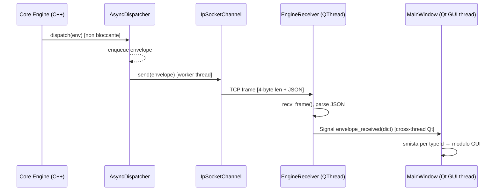

# GUI lib per GameLib

## Language
La GUI la voglio creare in python con pyQt ultima versione

## Connesoine
si aggancerà al Core Engine tramite il gmDispatch
Suggerisci il modo migliore per gestire questo canale 

## Layout
mi serve con sezoini staccabili, spostabili e dockabili a piacere
ogni sezione si può dockare in una delle Aree della figura 

## GUI Moule
Sarà composta da moduli GUI che gestiscono 1:1 le lib
- gmActor
- gmAlea diviso in 2 moduli diversi GmCompDeck, GmDice
- gmFlow 
- gmMap

Dammi suggerimenti su come progettare al meglio queste GUI", no results

Prima di rispondere, leggo le API delle librerie coinvolte per dare suggerimenti precisi.  

Read [](file:///c%3A/_GLT_/Qt%20Prj/game_lib/gmDispatch/IDispatcher.hpp#1-1), lines 1 to 80

Read [](file:///c%3A/_GLT_/Qt%20Prj/game_lib/gmDispatch/gmDispatch_API.md#1-1), lines 1 to 80

Read [](file:///c%3A/_GLT_/Qt%20Prj/game_lib/gmDispatch/Envelope.hpp#1-1), lines 1 to 70

Read [](file:///c%3A/_GLT_/Qt%20Prj/game_lib/gmDispatch/channels)

Read [](file:///c%3A/_GLT_/Qt%20Prj/game_lib/gmDispatch/dispatchers)

Read [](file:///c%3A/_GLT_/Qt%20Prj/game_lib/gmDispatch/channels/IpSocketChannel.hpp#1-1), lines 1 to 60

Read [](file:///c%3A/_GLT_/Qt%20Prj/game_lib/gmDispatch/channels/EventBusChannel.hpp#1-1), lines 1 to 80

Ora ho abbastanza contesto. Posso rispondere in modo preciso e completo.

---

## Architettura GUI Python/PyQt6 per GameLib

---

### 1. Stack tecnologico consigliato

| Componente | Scelta | Motivazione |
|---|---|---|
| Framework GUI | **PyQt6** | Qt6 nativo, DockWidget di qualità, licensing LGPL-3 |
| Bridge C++ ↔ Python | **pybind11** o **ctypes/cffi** | vedi §2 |
| Serializzazione messaggi | **JSON** (via `gmDispatch::JsonSerializer`) | già implementata nel C++ |
| Canale di comunicazione | **TCP socket** (`IpSocketChannel`) | processo separato, no GIL |

---

### 2. Collegamento al Core Engine tramite gmDispatch

Il modo **migliore e più sicuro** è tenere il Core Engine C++ e la GUI Python in **processi separati**, collegati via `IpSocketChannel` + `JsonSerializer`.

**Perché non in-process (pybind11 + EventBusChannel)?**

- Il GIL Python blocca i thread C++.
- Il `SyncDispatcher` chiamerebbe callback Python dentro il suo mutex → deadlock garantito (è avvertito esplicitamente nell'EventBusChannel.hpp, righe 29-32).
- Un crash della GUI non abbatte il motore.

#### Architettura raccomandata: TCP bridge

```
┌─────────────────────────────┐       TCP/JSON-Lines
│  Core Engine (C++17 process)│ ────────────────────────►  ┌─────────────────────┐
│                             │                            │  GUI Python process │
│  Dispatcher                 │                            │                     │
│    └─ IpSocketChannel ──────┼──────── localhost:9000 ───►│  TcpBridgeReceiver  │
│                             │                            │    └─ Qt Signals    │
│  ← subscribe("*")           │◄───────── localhost:9001 ──┤  TcpBridgeSender    │
│    per ricevere cmd dalla GUI│                            └─────────────────────┘
└─────────────────────────────┘
```

Lato Python, un `QThread` dedicato legge frames dal socket, li deserializza in `dict` Python e li emette come **Qt Signals** verso i widget. I widget inviano comandi al motore su un secondo socket (o sulla stessa connessione con un distinguishing `source` field).

```python
class EngineReceiver(QThread):
    envelope_received = Signal(dict)   # payload: {'typeId':..., 'payload':...}

    def run(self):
        while self._running:
            frame = self._read_length_prefixed_frame()   # uint32_t + bytes
            msg   = json.loads(frame)
            self.envelope_received.emit(msg)
```

> Se in futuro vuoi tutto in-process, usa **pybind11** + un `EventBusChannel` con handler che posta in una `queue.Queue` letta da un `QTimer` ogni 16 ms — mai chiamare widget Qt da thread non-GUI.

---

### 3. Layout dockabile

Usa `QMainWindow` + `QDockWidget`. Ogni modulo GUI è un `QDockWidget` che si può sganciare, spostare e ri-ancorare alle aree della figura.

#### Mapping aree figura → Qt

| Area figura | `Qt::DockWidgetArea` / widget Qt |
|---|---|
| `Header` | `QMenuBar` + `QToolBar` (fissi) |
| `Body_Header` | `QDockWidget` → `TopDockWidgetArea` |
| `L_Panel` | `QDockWidget` → `LeftDockWidgetArea` |
| `Body` | `QMainWindow::setCentralWidget()` (non dockabile) |
| `R_Panel` | `QDockWidget` → `RightDockWidgetArea` |
| `Body_Footer` | `QDockWidget` → `BottomDockWidgetArea` (sopra status bar) |
| `Footer` | `QStatusBar` (fisso) |

```python
class MainWindow(QMainWindow):
    def __init__(self):
        super().__init__()
        self.setDockNestingEnabled(True)   # permette tabs + split
        self._setup_docks()

    def _setup_docks(self):
        for module in [GmMapModule(), GmFlowModule(), ...]:
            dock = QDockWidget(module.title, self)
            dock.setWidget(module.widget())
            dock.setFeatures(
                QDockWidget.DockWidgetMovable  |
                QDockWidget.DockWidgetFloatable|
                QDockWidget.DockWidgetClosable
            )
            self.addDockWidget(module.default_area, dock)
```

Salva/ripristina il layout con `QMainWindow.saveState()` / `restoreState()` via `QSettings`.

---

### 4. Struttura moduli GUI

Ogni modulo è una **classe Python** con interfaccia uniforme:

```python
class IGmGuiModule:
    @property
    def title(self) -> str: ...
    @property
    def default_area(self) -> Qt.DockWidgetArea: ...
    def widget(self) -> QWidget: ...
    def connect_engine(self, receiver: EngineReceiver, sender: EngineSender): ...
    def on_envelope(self, msg: dict): ...   # chiamato via Signal
```

---

### 5. Moduli specifici — suggerimenti di design

#### `GmMapModule` → `LeftDockWidgetArea` (default) o centrale

- Widget principale: `QGraphicsScene` + `QGraphicsView` con griglia di tile.
- Ogni cella della mappa è un `QGraphicsRectItem` colorato per tipo terreno.
- Quando arriva `envelope.typeId == "map.cell_changed"` → aggiorna la cella corrispondente.
- Barra laterale: lista filtri terreno, zoom slider.

#### `GmFlowModule` → `TopDockWidgetArea`

- Visualizza la timeline come una `QGraphicsScene` con blocchi orizzontali (turni/fasi).
- Il blocco attivo è evidenziato. Pulsanti: `Next Turn`, `Pause`, `Reset`.
- Subscrive a `"flow.phase_changed"`, `"flow.tick"`.

#### `GmCompDeckModule` → `RightDockWidgetArea`

- Lista di zone (mazzo, mano, scarti, …) come `QListWidget` verticale.
- Drag & drop tra zone tramite `QAbstractItemView::DragDrop`.
- Subscrive a `"deck.card_moved"`, `"deck.zone_changed"`.

#### `GmDiceModule` → `BottomDockWidgetArea` (piccolo)

- Una riga con selettori `QSpinBox` (numero dadi, facce) + pulsante `Roll`.
- Risultati mostrati in `QLabel` con animazione CSS-like (`QPropertyAnimation`).
- Invia `envelope.typeId = "dice.roll_request"`, riceve `"dice.roll_result"`.

#### `GmActorModule` → `RightDockWidgetArea` (tab con GmCompDeck)

- `QTreeWidget` con gerarchia attori: radice → gruppo → singolo attore.
- Selezionando un attore, pannello di dettaglio (stats, status, items) in `QFormLayout`.
- Subscrive a `"actor.stat_changed"`, `"actor.status_added"`.

---

### 6. Struttura directory consigliata

```
gui/
├── main.py
├── main_window.py          ← QMainWindow + dock manager
├── engine_bridge/
│   ├── __init__.py
│   ├── receiver.py         ← EngineReceiver(QThread) — lettura socket
│   └── sender.py           ← EngineSender — scrittura socket
├── modules/
│   ├── base_module.py      ← IGmGuiModule (ABC)
│   ├── gm_map_module.py
│   ├── gm_flow_module.py
│   ├── gm_comp_deck_module.py
│   ├── gm_dice_module.py
│   └── gm_actor_module.py
├── widgets/                ← widget riusabili (tile_grid, timeline_bar, …)
└── settings.py             ← QSettings wrapper (salva layout dock)
```

---

### 7. Formato Envelope sul socket

Usa il formato già definito in gmDispatch — JSON Lines con length-prefix (`uint32_t` big-endian + bytes UTF-8):

```json
{
  "typeId":  "map.cell_changed",
  "source":  "GmMap",
  "payload": { "x": 3, "y": 7, "terrain": "water" },
  "headers": {}
}
```

Lato Python, un singolo dispatcher di routing smista per `typeId`:

```python
def on_envelope(self, msg: dict):
    router = {
        "map.cell_changed":   self._map_module.on_envelope,
        "flow.phase_changed": self._flow_module.on_envelope,
        "dice.roll_result":   self._dice_module.on_envelope,
        "actor.stat_changed": self._actor_module.on_envelope,
    }
    handler = router.get(msg.get("typeId"))
    if handler:
        handler(msg)
```

---

### Riepilogo scelte chiave

| Decisione | Scelta | Alternativa scartata |
|---|---|---|
| Bridge C++/Python | TCP + `IpSocketChannel` | pybind11 in-process (GIL + deadlock) |
| Direzione comandi | socket bidirezionale (due porte) | callback C++ in Python (unsafe) |
| Layout | `QMainWindow` + `QDockWidget` | layout fisso (non dockabile) |
| Threading GUI | `QThread` per receiver, widget solo sul main thread | `asyncio` (incompatibile con event loop Qt) |
| Persistenza layout | `QSettings` + `saveState()` | file JSON manuale |

*********************************

## Design dettagliato: TCP Bridge gmDispatch ↔ Python GUI

---

### 1. Vincoli architetturali emersi dal codice

| Fatto dal codice | Impatto sul design |
|---|---|
| `IpSocketChannel` è solo **client** TCP (lazy-connect su primo `send()`) | Il C++ non può "ascoltare" — serve una soluzione asimmetrica per ciascuna direzione |
| Wire format: `[uint32_t big-endian, 4 byte] + [payload JSON UTF-8]` | Python deve implementare lo stesso framing |
| `JsonSerializer.payload` = `type().name()` stringa (**non** i dati) | I dati reali vanno messi in `headers["data"]` come JSON string |
| `AsyncDispatcher` disponibile | Il game loop non si blocca mentre la GUI è lenta |
| `headers` è `std::map<std::string,std::string>` | Può trasportare JSON serializzato come stringa |

---

### 2. Due canali distinti (bidirezionalità)

Dato che `IpSocketChannel` è solo client, servono **due server TCP** — uno per direzione:

```
C++ Core Engine (process)              Python GUI (process)
──────────────────────────             ──────────────────────────────
                                       :9000  QTcpServer / socket.server
IpSocketChannel  ──── TCP ──────────►  EngineReceiver (QThread)
("127.0.0.1", 9000)                    legge frames, emette Signal

CmdServer (thread)  ◄─── TCP ─────────  EngineSender
ascolta :9001                           scrive frames
```

| Porta | Server | Client | Direzione |
|---|---|---|---|
| `9000` | Python (`socket.server`) | C++ (`IpSocketChannel`) | Engine → GUI (eventi) |
| `9001` | C++ (thread dedicato) | Python (`socket.socket`) | GUI → Engine (comandi) |

---

### 3. Lato C++: setup del bridge

#### 3a. Dispatcher da usare: `AsyncDispatcher`

Il canale verso la GUI **non deve bloccare il game loop**. Usa `AsyncDispatcher` + `IpSocketChannel`:

```cpp
// In CoreEngine::init_gui_bridge()
auto router = std::make_unique<gmDispatch::SyncRouter>();
gmDispatch::GmDispatcher gui_bus(
    gmDispatch::DispatcherConfig{ "GuiBus", true },
    std::make_unique<gmDispatch::AsyncDispatcher>(std::move(router))
);

auto gui_channel = std::make_shared<gmDispatch::IpSocketChannel>(
    "127.0.0.1",
    9000,
    "gui-sink"
);
gui_bus.subscribe("*", gui_channel);   // riceve tutti gli eventi
```

#### 3b. Payload serialization: usare `headers["data"]`

Poiché `JsonSerializer.payload` emette solo il nome del tipo, la **convenzione del bridge** è:

```cpp
// Helper da mettere in un file bridges/GmGuiBridge.hpp
template<typename T>
gmDispatch::Envelope make_gui_envelope(
    const std::string& typeId,
    const std::string& source,
    const T& data)
{
    gmDispatch::Envelope env;
    env.typeId  = typeId;
    env.source  = source;
    env.headers["data"] = serialize_to_json(data);   // JSON string
    // env.payload rimane vuoto — non usato dal bridge GUI
    return env;
}
```

`serialize_to_json` usa **nlohmann/json** (già presente in gmSave):

```cpp
// in bridges/GmGuiBridge.cpp — usa gmSave/json.hpp
#include "../gmSave/json.hpp"

template<typename T>
std::string serialize_to_json(const T& data)
{
    nlohmann::json j = data;   // richiede to_json(j, data) ADL
    return j.dump();
}
```

> Nota: questo helper vive in `gmDispatch/bridges/gui/` e dipende da `nlohmann/json`. Non inquina le intestazioni core di gmDispatch.

#### 3c. Server TCP per i comandi dalla GUI (porta 9001)

Un thread C++ semplice che legge frames e re-dispatcha come `Envelope` interni:

```cpp
// CmdServer: thread separato, NON parte di gmDispatch core
void CmdServer::run()
{
    // accept(), poi loop:
    while (_running)
    {
        uint32_t len_be = 0;
        recv_all(_client_fd, &len_be, 4);
        uint32_t len = ntohl(len_be);

        std::string buf(len, '\0');
        recv_all(_client_fd, buf.data(), len);

        // Deserializza e re-dispatcha
        nlohmann::json j = nlohmann::json::parse(buf);
        gmDispatch::Envelope env;
        env.typeId  = j.value("typeId", "");
        env.source  = "GUI";
        if (j.contains("data"))
            env.headers["data"] = j["data"].dump();
        _internal_bus.dispatch(env);
    }
}
```

---

### 4. Lato Python: `engine_bridge/`

#### 4a. Framing — funzioni condivise

```python
# engine_bridge/framing.py
import struct, socket

def send_frame(sock: socket.socket, payload: str) -> None:
    data  = payload.encode("utf-8")
    frame = struct.pack(">I", len(data)) + data   # uint32 big-endian
    sock.sendall(frame)

def recv_frame(sock: socket.socket) -> str:
    raw_len = _recv_exact(sock, 4)
    length  = struct.unpack(">I", raw_len)[0]
    return _recv_exact(sock, length).decode("utf-8")

def _recv_exact(sock: socket.socket, n: int) -> bytes:
    buf = b""
    while len(buf) < n:
        chunk = sock.recv(n - len(buf))
        if not chunk:
            raise ConnectionError("Socket closed")
        buf += chunk
    return buf
```

#### 4b. `EngineReceiver` — QThread lato GUI

```python
# engine_bridge/receiver.py
import socket, json
from PySide6.QtCore import QThread, Signal
from .framing import recv_frame

class EngineReceiver(QThread):
    envelope_received = Signal(dict)   # {"typeId":..., "source":..., "data":...}
    connection_lost   = Signal()

    def __init__(self, host: str = "127.0.0.1", port: int = 9000):
        super().__init__()
        self._host    = host
        self._port    = port
        self._running = False

    def run(self) -> None:
        self._running = True
        srv = socket.socket(socket.AF_INET, socket.SOCK_STREAM)
        srv.setsockopt(socket.SOL_SOCKET, socket.SO_REUSEADDR, 1)
        srv.bind((self._host, self._port))
        srv.listen(1)
        srv.settimeout(1.0)   # sblocca il thread per stop()

        client = None
        while self._running:
            try:
                if client is None:
                    client, _ = srv.accept()   # C++ si connette qui
                raw = recv_frame(client)
                msg = json.loads(raw)
                # Estrae headers["data"] se presente
                if "headers" in msg and "data" in msg["headers"]:
                    msg["data"] = json.loads(msg["headers"]["data"])
                self.envelope_received.emit(msg)
            except socket.timeout:
                continue
            except (ConnectionError, OSError):
                self.connection_lost.emit()
                client = None   # attende riconnessione C++

    def stop(self) -> None:
        self._running = False
        self.wait()
```

#### 4c. `EngineSender` — comandi verso C++

```python
# engine_bridge/sender.py
import socket, json
from .framing import send_frame

class EngineSender:
    def __init__(self, host: str = "127.0.0.1", port: int = 9001):
        self._host = host
        self._port = port
        self._sock: socket.socket | None = None

    def _ensure_connected(self) -> None:
        if self._sock is None:
            self._sock = socket.socket(socket.AF_INET, socket.SOCK_STREAM)
            self._sock.connect((self._host, self._port))

    def send_command(self, type_id: str, data: dict) -> None:
        self._ensure_connected()
        msg = {"typeId": type_id, "source": "GUI", "data": data}
        send_frame(self._sock, json.dumps(msg))

    def close(self) -> None:
        if self._sock:
            self._sock.close()
            self._sock = None
```

---

### 5. Sequenza completa di un evento Engine → GUI



---

### 6. Startup / shutdown

#### Ordine di avvio (importante)

```
1. Python GUI avvia  EngineReceiver → srv.bind(9000), srv.listen(1)
2. C++  Core Engine avvia  CmdServer      → bind(9001), listen(1)
3. Python GUI avvia  EngineSender   → connect(9001)  [può ritentare]
4. C++  IpSocketChannel             → connect(9000) al primo dispatch
```

#### Ordine di spegnimento

```
1. GUI invia {"typeId": "gui.shutdown"} via EngineSender
2. C++ riceve → avvia shutdown ordinato del motore
3. C++ chiude IpSocketChannel → EngineReceiver.connection_lost emesso
4. GUI chiama EngineReceiver.stop() + EngineSender.close()
```

---

### 7. `typeId` convention consigliata per il bridge

| Direzione | `typeId` | data |
|---|---|---|
| Engine → GUI | `"map.cell_changed"` | `{"x":3,"y":7,"terrain":"water"}` |
| Engine → GUI | `"actor.stat_changed"` | `{"id":"p1","hp":80,"max_hp":100}` |
| Engine → GUI | `"flow.phase_changed"` | `{"phase":"combat","turn":3}` |
| Engine → GUI | `"dice.roll_result"` | `{"dice":[3,5,2],"total":10}` |
| GUI → Engine | `"gui.command"` | `{"action":"move","actor":"p1","to":{"x":4,"y":7}}` |
| GUI → Engine | `"gui.roll_request"` | `{"count":3,"faces":6}` |
| GUI → Engine | `"gui.shutdown"` | `{}` |

---

### 8. Riepilogo dei componenti da creare

#### C++ (in `gmDispatch/bridges/gui/`)

| File | Responsabilità |
|---|---|
| `GmGuiBridge.hpp/.cpp` | `make_gui_envelope<T>()`, `serialize_to_json<T>()` |
| `CmdServer.hpp/.cpp` | TCP server porta 9001, re-dispatch come `Envelope` interni |
| `GmGuiBridgeConfig.hpp` | Struct con `host`, `port_out`, `port_in` |

#### Python (in `gui/engine_bridge/`)

| File | Responsabilità |
|---|---|
| `framing.py` | `send_frame()`, `recv_frame()` — wire protocol |
| `receiver.py` | `EngineReceiver(QThread)` — server porta 9000 |
| `sender.py` | `EngineSender` — client porta 9001 |
| `dispatcher.py` | routing `dict[typeId → callable]` dei Signal |


********************************************


Ho tutto il necessario. Rispondo con il design dettagliato.

---

## Design dettagliato: `IGmGuiModule` e struttura moduli GUI

---

### 1. `IGmGuiModule` — interfaccia base

Ogni modulo è una classe Python che implementa questo contratto:

```python
# gui/modules/base_module.py
from __future__ import annotations
from abc import ABC, abstractmethod
from PySide6.QtCore import Qt
from PySide6.QtWidgets import QWidget


class IGmGuiModule(ABC):
    """Contratto comune a tutti i moduli GUI di GameLib."""

    # ── Identità e layout ─────────────────────────────────────────────────────

    @property
    @abstractmethod
    def module_id(self) -> str:
        """Identificatore univoco usato da QSettings per il restore del layout.
        Esempi: "gm_actor", "gm_flow", "gm_comp_deck", "gm_dice", "gm_map"
        """

    @property
    @abstractmethod
    def title(self) -> str:
        """Titolo del QDockWidget."""

    @property
    @abstractmethod
    def default_area(self) -> Qt.DockWidgetArea:
        """Area dock di default al primo avvio."""

    @abstractmethod
    def widget(self) -> QWidget:
        """Restituisce il widget radice da inserire nel QDockWidget.
        Chiamato una sola volta da MainWindow.
        """

    # ── Ciclo di vita ─────────────────────────────────────────────────────────

    def on_attach(self) -> None:
        """Chiamato da MainWindow dopo che il widget è stato aggiunto al layout.
        Override opzionale: avvia timer, sottoscrizioni, ecc.
        """

    def on_detach(self) -> None:
        """Chiamato da MainWindow prima della chiusura dell'applicazione.
        Override opzionale: ferma timer, rilascia risorse.
        """

    # ── Bridge engine ─────────────────────────────────────────────────────────

    @abstractmethod
    def subscribed_type_ids(self) -> list[str]:
        """Restituisce la lista di typeId gmDispatch che questo modulo consuma.
        Usata dal dispatcher centrale per il routing selettivo.
        """

    @abstractmethod
    def on_envelope(self, msg: dict) -> None:
        """Riceve un envelope deserializzato dal bridge TCP.
        Deve essere chiamato SOLO dal Qt main thread (via Signal cross-thread).

        msg = {
            "typeId":  str,
            "source":  str,
            "data":    dict,   # headers["data"] deserializzato
            "time":    str,    # ISO-8601
        }
        """

    def send_command(self, type_id: str, data: dict) -> None:
        """Helper opzionale: invia un comando al motore via EngineSender.
        Il modulo lo chiama quando l'utente esegue un'azione.
        Implementato da BaseModule (non abstract).
        """
        if self._sender is not None:
            self._sender.send_command(type_id, data)

    # ── Stato visibile ────────────────────────────────────────────────────────

    def save_state(self) -> dict:
        """Stato interno da persistere in QSettings (oltre al layout dock).
        Override opzionale. Default: dizionario vuoto.
        """
        return {}

    def restore_state(self, state: dict) -> None:
        """Ripristina lo stato salvato. Override opzionale."""
```

---

### 2. `BaseModule` — implementazione parziale

Evita di ripetere il boilerplate in ogni modulo:

```python
# gui/modules/base_module.py  (continua)
from engine_bridge.sender import EngineSender

class BaseModule(IGmGuiModule, ABC):
    """Implementazione parziale: gestisce sender, widget caching, on_attach."""

    def __init__(self) -> None:
        self._sender:  EngineSender | None = None
        self._widget:  QWidget | None = None

    def set_sender(self, sender: EngineSender) -> None:
        """Iniettato da MainWindow dopo la costruzione."""
        self._sender = sender

    def widget(self) -> QWidget:
        if self._widget is None:
            self._widget = self._build_widget()
        return self._widget

    @abstractmethod
    def _build_widget(self) -> QWidget:
        """Costruisce il widget la prima volta. Chiamato una volta sola."""
```

---

### 3. Dispatcher centrale in `MainWindow`

`MainWindow` smista gli envelope in arrivo verso il modulo corretto usando la mappa `subscribed_type_ids()`:

```python
# gui/main_window.py
class MainWindow(QMainWindow):

    def _register_modules(self) -> None:
        self._modules: list[BaseModule] = [
            GmActorModule(),
            GmFlowModule(),
            GmCompDeckModule(),
            GmDiceModule(),
            GmMapModule(),
        ]
        # Costruisce routing table: typeId → [modulo, ...]
        self._routing: dict[str, list[BaseModule]] = {}
        for mod in self._modules:
            mod.set_sender(self._sender)
            for tid in mod.subscribed_type_ids():
                self._routing.setdefault(tid, []).append(mod)
            self._add_dock(mod)

    def _on_envelope(self, msg: dict) -> None:
        """Slot collegato a EngineReceiver.envelope_received."""
        tid = msg.get("typeId", "")
        for mod in self._routing.get(tid, []):
            mod.on_envelope(msg)
```

---

### 4. I cinque moduli — design specifico

---

#### `GmActorModule`

Dati reali dalla libreria: ActorEvents.hpp (8 event types).

```python
class GmActorModule(BaseModule):

    @property
    def module_id(self) -> str: return "gm_actor"

    @property
    def title(self) -> str: return "Actors"

    @property
    def default_area(self) -> Qt.DockWidgetArea:
        return Qt.DockWidgetArea.RightDockWidgetArea

    def subscribed_type_ids(self) -> list[str]:
        return [
            "gmActor.actor.hp_changed",
            "gmActor.actor.status_added",
            "gmActor.actor.status_removed",
            "gmActor.actor.moved_area",
            "gmActor.actor.life_state_changed",
            "gmActor.actor.item_equipped",
            "gmActor.actor.item_unequipped",
        ]
```

**Layout widget:**

```
┌─ GmActorModule ──────────────────────────────┐
│  [Filter: tutti | eroi | mostri | alleati]   │
│                                              │
│  ┌─ QTreeWidget ────────────────────────┐    │
│  │  ▶ Hero                              │    │
│  │    ├ Aragorn    ██████░░  80/100 HP  │    │
│  │    └ Gandalf    ████████  100/100 HP │    │
│  │  ▶ Monster                           │    │
│  │    └ Orc#1      ███░░░░░  30/80 HP  │    │
│  └──────────────────────────────────────┘    │
│                                              │
│  ─── Dettaglio: Aragorn ───────────────────  │
│  HP:  80 / 100   [▓▓▓▓▓▓▓▓░░]              │
│  STR: 15   DEX: 12   AC: 16                 │
│  Status: [Avvelenato x2] [Benedetto]         │
│  Equip:  [Spada+2] [Scudo di Mithril]        │
└──────────────────────────────────────────────┘
```

`on_envelope` aggiorna solo la riga/cella dell'attore interessato (no full-refresh).

---

#### `GmFlowModule`

Dati reali: FlowEvents.hpp + TimelineEvents.hpp.

```python
class GmFlowModule(BaseModule):

    @property
    def module_id(self) -> str: return "gm_flow"

    @property
    def title(self) -> str: return "Flow / Timeline"

    @property
    def default_area(self) -> Qt.DockWidgetArea:
        return Qt.DockWidgetArea.TopDockWidgetArea

    def subscribed_type_ids(self) -> list[str]:
        return [
            "gmFlow.session.started",
            "gmFlow.session.paused",
            "gmFlow.session.completed",
            "gmFlow.phase.entered",
            "gmFlow.phase.exited",
            "gmFlow.round.started",
            "gmFlow.round.ended",
            "gmFlow.turn.started",
            "gmFlow.turn.ended",
            "gmFlow.timeline.actor_selected",
            "gmFlow.timeline.time_advanced",
        ]
```

**Layout widget:**

```
┌─ GmFlowModule ──────────────────────────────────────────────────────────┐
│  Session: "Campagna 1 - Missione 3"   [■ PAUSE]  [▶ RESUME]  [■ STOP]  │
│  Phase: COMBAT   Round: 3 / ∞   Turn: Aragorn                           │
│                                                                          │
│  Timeline (QGraphicsScene):                                              │
│  t=0────────────────────────────────────────────── t=120                │
│       [Aragorn:10] [Orc#1:25] [Gandalf:35] [Orc#2:60]                  │
│                ▲ attivo                                                  │
│                                                                          │
│  Log eventi:  [Phase COMBAT entered]  [Round 3 started]  [Turn Aragorn] │
└──────────────────────────────────────────────────────────────────────────┘
```

La `TimelineValue` da `TimelineActorSelectedEvent.timeline_position` è il valore X nella `QGraphicsScene`.

---

#### `GmCompDeckModule`

Dati reali: 5 zone di `GmCompDeck` (MainDeck, CardHand, PlayArea, DiscardPile, BanishZone).

```python
class GmCompDeckModule(BaseModule):

    @property
    def module_id(self) -> str: return "gm_comp_deck"

    @property
    def title(self) -> str: return "Deck Manager"

    @property
    def default_area(self) -> Qt.DockWidgetArea:
        return Qt.DockWidgetArea.RightDockWidgetArea

    def subscribed_type_ids(self) -> list[str]:
        return [
            "gmAlea.deck.card_moved",      # token spostato tra zone
            "gmAlea.deck.zone_changed",    # stato zona aggiornato
            "gmAlea.deck.shuffled",        # main deck rimescolato
            "gmAlea.deck.drawn",           # carta pescata
        ]
```

**Layout widget** (5 zone visualizzate come colonne):

```
┌─ GmCompDeckModule ──────────────────────────────────────────────────────┐
│  Deck: [Player1 ▾]                                                      │
│                                                                          │
│  MainDeck    CardHand       PlayArea     DiscardPile   BanishZone        │
│  ┌────────┐  ┌────────────┐ ┌─────────┐ ┌──────────┐  ┌─────────┐      │
│  │ ████   │  │ Card#102   │ │Card#103 │ │ Card#106 │  │ (vuoto) │      │
│  │ ████   │  │ Card#104   │ │         │ │          │  │         │      │
│  │ 3 rem  │  │            │ │         │ │ 1 card   │  │         │      │
│  └────────┘  └────────────┘ └─────────┘ └──────────┘  └─────────┘      │
│  [Draw 1]    ←drag & drop→             [Shuffle Discard→Main]           │
└──────────────────────────────────────────────────────────────────────────┘
```

Ogni zona è un `QListWidget` con `DragDropMode = DragDrop`. Il drop invia `send_command("gmAlea.deck.move_card", {"card_id": ..., "from": ..., "to": ...})`.

---

#### `GmDiceModule`

Dati reali: `GmDice` (facce custom pesate), `StdDice` (range min-max).

```python
class GmDiceModule(BaseModule):

    @property
    def module_id(self) -> str: return "gm_dice"

    @property
    def title(self) -> str: return "Dice"

    @property
    def default_area(self) -> Qt.DockWidgetArea:
        return Qt.DockWidgetArea.BottomDockWidgetArea

    def subscribed_type_ids(self) -> list[str]:
        return [
            "gmAlea.dice.roll_result",    # risultato dal motore
        ]
```

**Layout widget:**

```
┌─ GmDiceModule ────────────────────────────────────────────────┐
│  Tipo: [Standard ▾]  Dadi: [3 ▲▼]  Facce: [6 ▲▼]            │
│                      oppure                                    │
│  Tipo: [Custom  ▾]  Profilo dado: [d_combat ▾]  n: [2 ▲▼]   │
│                                                                │
│  [     LANCIA     ]                                            │
│                                                                │
│  Risultato:  3  +  5  +  2  =  ❰ 10 ❱                        │
│  Storico: [8] [10] [4] [15] [10] [6]     [Clear]             │
└────────────────────────────────────────────────────────────────┘
```

Il pulsante `LANCIA` chiama `send_command("gmAlea.dice.roll_request", {"count": 3, "faces": 6})`. Il risultato arriva via `on_envelope` e anima il `QLabel` con `QPropertyAnimation` sull'opacity.

---

#### `GmMapModule`

Dati reali: `LocationId` (uint32), metadata, adjacency edges, items `ItemT`.

```python
class GmMapModule(BaseModule):

    @property
    def module_id(self) -> str: return "gm_map"

    @property
    def title(self) -> str: return "Map"

    @property
    def default_area(self) -> Qt.DockWidgetArea:
        return Qt.DockWidgetArea.LeftDockWidgetArea

    def subscribed_type_ids(self) -> list[str]:
        return [
            "gmMap.map.loaded",           # snapshot iniziale della mappa
            "gmMap.location.item_added",
            "gmMap.location.item_removed",
            "gmMap.location.metadata_changed",
            "gmActor.actor.moved_area",   # riuso diretto da ActorEvents
            "gmActor.actor.position_changed",
        ]
```

**Layout widget:**

```
┌─ GmMapModule ────────────────────────────────────────────────┐
│  [Zoom -]  [Zoom +]  [Fit]    Layer: [terrain ▾]            │
│  ┌──────────────────────────────────────────────────────┐    │
│  │          QGraphicsView (QGraphicsScene)              │    │
│  │                                                      │    │
│  │   [101]──[102]──[103]   ← nodi LocationId           │    │
│  │    │       │             ← archi = adjacency         │    │
│  │   [104]──[105]           ← colore = metadata terrain │    │
│  │          [A]             ← icona = attore presente   │    │
│  │                                                      │    │
│  └──────────────────────────────────────────────────────┘    │
│  Selezionato: Location#105  Terrain: forest  Items: [Sword]  │
└──────────────────────────────────────────────────────────────┘
```

Ogni `QGraphicsEllipseItem` = un `LocationId`. Il colore viene dal metadata `terrain`. Le icone degli attori si spostano su `gmActor.actor.moved_area`.

---

### 5. Tabella riepilogativa

| Modulo | `module_id` | `default_area` | Sorgente eventi (C++) | Comandi inviati |
|---|---|---|---|---|
| `GmActorModule` | `gm_actor` | `Right` | ActorEvents.hpp (8 eventi) | nessuno (read-only) |
| `GmFlowModule` | `gm_flow` | `Top` | FlowEvents.hpp + TimelineEvents.hpp | `pause`, `resume`, `stop` |
| `GmCompDeckModule` | `gm_comp_deck` | `Right` (tab con Actor) | eventi deck custom | `move_card`, `draw`, `shuffle` |
| `GmDiceModule` | `gm_dice` | `Bottom` | `gmAlea.dice.roll_result` | `roll_request` |
| `GmMapModule` | `gm_map` | `Left` | `gmMap.*` + `gmActor.actor.moved_area` | nessuno (read-only) |

---

### 6. Struttura file completa dei moduli

```
gui/modules/
├── base_module.py          ← IGmGuiModule (ABC) + BaseModule
├── gm_actor_module.py      ← GmActorModule
│   ├── _actor_tree.py      ← QTreeWidget con item personalizzati
│   └── _actor_detail.py    ← pannello dettaglio HP/status/equip
├── gm_flow_module.py       ← GmFlowModule
│   └── _timeline_scene.py  ← QGraphicsScene con blocchi attori
├── gm_comp_deck_module.py  ← GmCompDeckModule
│   └── _zone_list.py       ← QListWidget con drag&drop
├── gm_dice_module.py       ← GmDiceModule
└── gm_map_module.py        ← GmMapModule
    └── _map_scene.py       ← QGraphicsScene nodi/archi
```


****************************************************************


