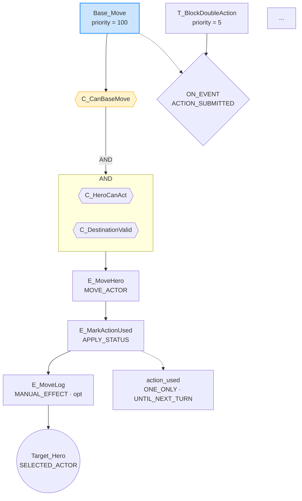
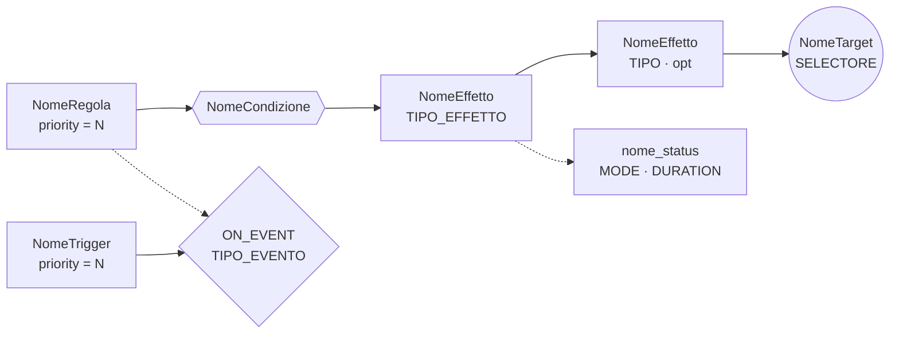
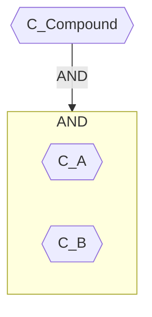

# GRS Tool — Manuale d'uso

**Versione tool:** 0.3.0 | **GRS DSL:** v0.3 | **Python richiesto:** ≥ 3.9

---

## Indice

1. [Panoramica](#1-panoramica)
2. [Installazione e avvio](#2-installazione-e-avvio)
3. [Sintassi generale](#3-sintassi-generale)
4. [Sottocomando `lint`](#4-sottocomando-lint)
5. [Sottocomando `validate`](#5-sottocomando-validate)
6. [Sottocomando `check`](#6-sottocomando-check)
7. [Sottocomando `yaml`](#7-sottocomando-yaml)
8. [Sottocomando `grapho`](#8-sottocomando-grapho)
9. [Opzioni comuni](#9-opzioni-comuni)
10. [Codici di uscita](#10-codici-di-uscita)
11. [Tabella codici diagnostici](#11-tabella-codici-diagnostici)
12. [Formato output JSON](#12-formato-output-json)
13. [Guida rapida ai diagrammi Mermaid](#13-guida-rapida-ai-diagrammi-mermaid)
14. [Casi d'uso tipici](#14-casi-duso-tipici)
15. [Struttura del package](#15-struttura-del-package)

---

## 1. Panoramica

`grs` è uno strumento CLI a stdlib-only (nessuna dipendenza esterna)
per lavorare con file **GRS — Game Rule Script v0.3**.

Offre cinque sottocomandi:

| Sottocomando | Scopo |
|---|---|
| `lint` | Controlla la struttura sintattica interna (L-xxx) |
| `validate` | Verifica la coerenza semantica tra blocchi (V-xxx) |
| `check` | Esegue `lint` + `validate` in un'unica passata |
| `yaml` | Genera il YAML canonico dal documento GRS |
| `grapho` | Genera diagrammi Mermaid (TD) delle regole |

---

## 2. Installazione e avvio

### Modalità modulo Python (consigliata, senza installazione)

```bash
cd tools
python -m grs <sottocomando> [argomenti]
```

### Installazione come comando `grs`

```bash
pip install -e tools/
grs <sottocomando> [argomenti]
```

Il `pyproject.toml` nella cartella `tools/` definisce l'entry point
`grs = "grs.cli:main"`.

### Verifica

```bash
python -m grs --help
```

Output atteso:

```
usage: grs [-h] {lint,validate,check,yaml,grapho} ...

Tool per file GRS — Game Rule Script v0.3

positional arguments:
  {lint,validate,check,yaml,grapho}
    lint                Controlli strutturali (L-xxx)
    validate            Validazioni semantiche (V-xxx)
    check               lint + validate (tutti i controlli)
    yaml                Genera YAML canonico da un file .grs
    grapho              Genera diagramma Mermaid da un file .grs
```

---

## 3. Sintassi generale

```
python -m grs <sottocomando> <file.grs> [opzioni]
```

- `<file.grs>` è l'**unico argomento posizionale obbligatorio** per ogni
  sottocomando.
- Le opzioni variano per sottocomando (vedi sezioni seguenti).
- L'help contestuale è disponibile con `python -m grs <sottocomando> --help`.

---

## 4. Sottocomando `lint`

Esegue i **controlli strutturali** (L-001 … L-008) sull'AST del documento.
Non verifica i riferimenti incrociati tra blocchi (quello spetta a `validate`).

### Sintassi

```
python -m grs lint <file.grs> [--format text|json] [-o <output>]
```

### Comportamento

1. Parsa il file `.grs`.
2. Stampa un riepilogo del documento (numero di blocchi per tipo).
3. Esegue i controlli L-xxx.
4. Stampa i diagnostici (testo o JSON) e un conteggio finale.

### Esempio — nessun problema

```
$ python -m grs lint rules/base.grs

Parsed  rules/base.grs
  game=dungeon  ns=dungeon.turn  v=1.0.0
  targets=5  conditions=8  effects=12  statuses=2  rules=6  triggers=4
  lint: OK — nessun problema strutturale
```

### Esempio — con errori

```
$ python -m grs lint rules/broken.grs

Parsed  rules/broken.grs
  ...
[ERROR  ] line   14 [L-001] regola 'Bad_Rule': clausola ON (target) mancante
[ERROR  ] line   14 [L-002] regola 'Bad_Rule': clausola THEN (effect chain) mancante
  lint: 2 error(i), 0 warning(s)
```

### Esempio — output JSON

```
$ python -m grs lint rules/broken.grs --format json

Parsed  rules/broken.grs
  ...
[
  {
    "severity": "ERROR",
    "line": 14,
    "code": "L-001",
    "message": "regola 'Bad_Rule': clausola ON (target) mancante"
  }
]
  lint: 1 error(i), 0 warning(s)
```

---

## 5. Sottocomando `validate`

Esegue le **validazioni semantiche** (V-001 … V-010): verifica i riferimenti
incrociati tra blocchi, nomi non definiti, cicli, argomenti in eccesso, ecc.

### Sintassi

```
python -m grs validate <file.grs> [--format text|json] [-o <output>]
```

### Comportamento

Identico a `lint` (riepilogo → diagnostici → conteggio), ma applica le
regole V-xxx invece delle L-xxx.

### Note sulle severità

- **ERROR**: il documento è non conforme; il sottocomando termina con
  exit code 1.
- **WARNING**: segnalazione non bloccante (es. V-009 — `[stop]` dopo
  `[optional]` nella stessa chain); il sottocomando termina con exit code 0.

### Esempio

```
$ python -m grs validate rules/base.grs

Parsed  rules/base.grs
  ...
[WARNING] line   42 [V-009] effetto 'E_DiscardPlayedCard [optional]' precede '[stop]' in 'Card_Attack'
[WARNING] line   42 [V-009] effetto 'E_DiscardPlayedCard [optional]' precede '[stop]' in 'Card_Heal'
  validate: 0 error(i), 2 warning(s)
```

---

## 6. Sottocomando `check`

Esegue **`lint` + `validate`** in una singola chiamata. I diagnostici vengono
uniti, ordinati per riga e presentati una volta sola.

### Sintassi

```
python -m grs check <file.grs> [--format text|json] [-o <output>]
```

### Quando usarlo

`check` è il comando ideale per la validazione completa in CI/CD o come
passata finale prima di distribuire un file `.grs`.

```bash
python -m grs check rules/final.grs && echo "OK"
```

---

## 7. Sottocomando `yaml`

Genera il **YAML canonico** dal documento GRS seguendo la tabella di mapping
della spec `grs-spec.md`.

### Sintassi

```
python -m grs yaml <file.grs> [-o <output.yaml>]
```

### Comportamento

- Parsa il file `.grs` senza eseguire lint/validate.
- Serializza l'intero AST in YAML ordinato per sezione.
- Se `-o` è assente, stampa su stdout.
- Se `-o` è presente, scrive il file e stampa `→ <percorso>` su stdout.

### Struttura dell'output YAML

```yaml
meta:
  game_id: dungeon
  namespace: dungeon.turn
  schema_version: 1.0.0
  compatibility:
    gmRules_min: 0.5.0

targets:
  - id: Target_Hero
    kind: ACTOR
    selector: SELECTED_ACTOR
    range_type: NONE
    required: true
    allow_self: true

conditions:
  - id: C_CanBaseMove
    op: ALL_OF
    children:
      - type: ACTOR_HP_AT_OR_ABOVE
        subject_id_ref: input.hero_id
        amount: 1
      - type: LOCATION_EXISTS
        location_ref: input.destination

effects:
  - id: E_MoveHero
    type: MOVE_ACTOR
    target: Target_Hero
    value_ref: input.destination
    optional: false
    stop_on_failure: true

statuses:
  - id: action_used
    stacking_policy:
      mode: ONE_ONLY
    default_duration:
      type: UNTIL_NEXT_TURN
    on_apply:
      - type: ADD_TAG
        target: Target_Self
        tag: action_spent
        optional: false
        stop_on_failure: true

rules:
  - id: Base_Move
    priority: 100
    enabled: true
    target: Target_Hero
    conditions:
      ref: C_CanBaseMove
    effects:
      - ref: E_MoveHero
      - ref: E_MarkActionUsed
      - ref: E_MoveLog
        optional: true

triggers:
  - id: T_BlockDoubleAction
    priority: 5
    enabled: true
    type: ON_ACTION_SUBMITTED
    conditions:
      type: ACTOR_HAS_STATUS
      subject_id_ref: event.actor_id
      status_id: action_used
    effects:
      - ref: E_ActionBlocked
        optional: true
```

### Convenzioni di serializzazione

| Valore GRS | YAML |
|---|---|
| Numero intero (es. `2`) | scalare intero: `amount: 2` |
| Stringa semver (es. `1.0.0`) | scalare plain: `schema_version: 1.0.0` |
| Stringa dotted (es. `dungeon.turn`) | scalare plain: `namespace: dungeon.turn` |
| Parole riservate YAML (`true`, `false`, `null`, `yes`, `on`, `off`) | stringa quotata: `"true"` |
| Condizione AND | `op: ALL_OF` + lista `children:` |
| Condizione OR | `op: ANY_OF` + lista `children:` |
| Condizione NOT | `op: NOT` + lista `children:` con un elemento |
| Tipo evento trigger | prefisso `ON_`: `ACTION_SUBMITTED → ON_ACTION_SUBMITTED` |

### Esempio

```bash
python -m grs yaml rules/dungeon.grs -o output/dungeon.yaml
# → output/dungeon.yaml
```

---

## 8. Sottocomando `grapho`

Genera **diagrammi Mermaid TD** delle regole GRS in formato Markdown.

### Sintassi

```
python -m grs grapho <file.grs> [-o <output.md>] [--rule <NOME_REGOLA>]
```

### Modalità

| Modalità | Comando | Output |
|---|---|---|
| Tutte le regole | `grapho file.grs` | Un blocco Mermaid per ogni regola |
| Singola regola | `grapho file.grs --rule Base_Move` | Un solo blocco Mermaid |
| Su file | `grapho file.grs -o diagrams.md` | File Markdown con intestazione `# GRS Rule Graphs` |

### Stile visivo approvato

| Colore | Forma | Elemento GRS |
|---|---|---|
| Blu `#CCE5FF` | Rettangolo | Nodo regola (`@rules`) |
| Giallo `#FFF3CD` | Esagono `{{ }}` | Condizione (`@conditions`) |
| Giallo chiaro `#FFFDE7` | Subgraph | Gruppo AND / OR |
| Verde `#C8E6C9` | Rettangolo | Effetto nella chain (`@effects`) |
| Arancio `#FFE0B2` | Rettangolo | Status (target di `APPLY_STATUS`) |
| Viola `#E1BEE7` | Cerchio `(( ))` | Target (`@targets`) |
| Rosso `#FFCDD2` | Rettangolo | Header trigger + evento ON_EVENT (rombo) |

### Connessioni trigger

Il grafo di una regola include automaticamente i trigger correlati, collegati
con frecce tratteggiate (`-.->`) secondo queste regole:

| Tipo evento trigger | Origine freccia |
|---|---|
| `ACTION_SUBMITTED` | Dal nodo regola |
| `ACTION_COMPLETED` + controlla uno status applicato dalla regola | Dall'ultimo effetto |
| `ACTOR_MOVED` + la regola usa `MOVE_ACTOR` | Dall'ultimo effetto |
| Qualsiasi altro trigger + controlla un status applicato dalla regola | Dall'ultimo effetto |

I trigger non correlati alla regola selezionata **non vengono inclusi**.

### Esempio di output (singola regola)

````markdown
# GRS Graph — Base_Move


````

### Come visualizzare i diagrammi

I blocchi Mermaid sono renderizzati automaticamente da:

- **GitHub / GitLab** — nel preview Markdown di qualsiasi `.md`
- **VS Code** — con l'estensione *Markdown Preview Enhanced* o *Mermaid Preview*
- **Obsidian** — nativamente
- **Mermaid Live Editor** — <https://mermaid.live> (copia il contenuto del blocco)

---

## 9. Opzioni comuni

### `--format text|json`

Disponibile per `lint`, `validate`, `check`.

| Valore | Comportamento |
|---|---|
| `text` (default) | Output leggibile: `[ERROR  ] line  14 [L-001] …` |
| `json` | Array JSON con campi `severity`, `line`, `code`, `message` |

### `-o <percorso>` / `--output <percorso>`

Disponibile per tutti i sottocomandi.

- Se omesso: output su **stdout**.
- Se presente: scrive il file al percorso indicato (UTF-8) e stampa
  `→ <percorso>` su stdout come conferma.
- Le directory intermedie **non** vengono create automaticamente; devono
  esistere già.

### `--rule <NOME_REGOLA>`

Solo per `grapho`. Filtra il diagramma sulla singola regola specificata.
Se il nome non esiste nel documento, il tool emette un messaggio
`'<nome>': regola non found` e termina con exit code 0.

---

## 10. Codici di uscita

| Codice | Significato |
|---|---|
| `0` | Successo (anche se ci sono WARNING) |
| `1` | Almeno un diagnostico di severità ERROR, oppure il file non esiste o non è parsabile |

I sottocomandi `yaml` e `grapho` terminano sempre con `0` se il parse ha
successo (non eseguono lint né validate).

---

## 11. Tabella codici diagnostici

### Lint (L-xxx) — controlli strutturali

| Codice | Severità | Condizione |
|---|---|---|
| `L-001` | ERROR | Regola senza clausola `ON` (target mancante) |
| `L-002` | ERROR | Regola senza clausola `THEN` (chain effetti mancante) |
| `L-003` | ERROR | Trigger senza `ON_EVENT` |
| `L-004` | ERROR | Trigger senza clausola `THEN` |
| `L-005` | ERROR | `stacking_mode` non nel vocabolario (`ONE_ONLY`, `REFRESH`, `ADD_STACK`, `REPLACE`, `UNIQUE_BY_SOURCE`) |
| `L-006` | ERROR | `duration_type` non nel vocabolario (`PERMANENT`, `UNTIL_REMOVED`, `FOR_N`, `UNTIL_NEXT_TURN`, `WHILE_IN_LOCATION`) |
| `L-007` | ERROR | Durata `FOR_N` senza attributo `amount` |
| `L-008` | ERROR | Durata `WHILE_IN_LOCATION` senza attributo `value` |

### Validate (V-xxx) — validazioni semantiche

| Codice | Severità | Condizione |
|---|---|---|
| `V-001` | ERROR | Nome usato in `@rules`/`@triggers`/`@conditions` non definito in nessun blocco |
| `V-002` | ERROR | `effect_type` non nel vocabolario `EffectType` |
| `V-003` | ERROR | `cond_type` non nel vocabolario `ConditionType` |
| `V-004` | ERROR | Ref `input.xxx` usato in un `@trigger` (deve essere `event.xxx`) |
| `V-005` | ERROR | Ref `event.xxx` usato in una `@rule` (deve essere `input.xxx`) |
| `V-006` | ERROR | Troppi argomenti posizionali per il tipo di effetto o condizione |
| `V-007` | ERROR | ID duplicato nella stessa categoria (`@targets`, `@rules`, ecc.) |
| `V-008` | ERROR | Ciclo diretto in condizioni composite (DFS) |
| `V-009` | WARNING | `[stop]` dopo `[continue]`/`[optional]` nella stessa chain di effetti |
| `V-010` | ERROR | Status referenziato in `APPLY_STATUS` non dichiarato in `@statuses` |

---

## 12. Formato output JSON

Con `--format json`, i diagnostici vengono emessi come array JSON indentato
(2 spazi) intercalato al riepilogo testuale del documento:

```json
[
  {
    "severity": "ERROR",
    "line": 14,
    "code": "L-001",
    "message": "regola 'Bad_Rule': clausola ON (target) mancante"
  },
  {
    "severity": "WARNING",
    "line": 42,
    "code": "V-009",
    "message": "effetto 'E_Discard [optional]' precede '[stop]' in 'Card_Attack'"
  }
]
```

L'array è ordinato per numero di riga crescente.
Con `-o file.json`, l'intero array viene scritto su file (senza il riepilogo
testuale che rimane su stdout).

---

## 13. Guida rapida ai diagrammi Mermaid

### Legenda nodi



### Frecce

| Stile | Significato |
|---|---|
| `-->` | Flusso normale (regola → condizione → effetti → target) |
| `-.->` | Connessione secondaria (APPLY_STATUS → status, regola/effetto → trigger) |
| `-- AND -->` | Espansione di condizione composta AND |
| `-- OR -->` | Espansione di condizione composta OR |

### Subgraph AND / OR

Le condizioni composite (`C_A AND C_B`, `C_A OR C_B`) vengono espanse in un
subgraph con le condizioni figlie allineate orizzontalmente (`direction LR`).



---

## 14. Casi d'uso tipici

### Verifica rapida in sviluppo

```bash
python -m grs check rules/dungeon.grs
```

### Generazione YAML per serializzazione runtime

```bash
python -m grs yaml rules/dungeon.grs -o dist/dungeon.yaml
```

### Generazione di tutti i diagrammi

```bash
python -m grs grapho rules/dungeon.grs -o docs/diagrams.md
```

### Ispezione di una singola regola

```bash
python -m grs grapho rules/dungeon.grs --rule Base_Move
```

### Report JSON per CI/CD

```bash
python -m grs check rules/dungeon.grs --format json -o reports/grs-report.json
if [ $? -ne 0 ]; then echo "GRS: errori rilevati"; exit 1; fi
```

### Pipeline completa

```bash
# 1. Verifica
python -m grs check rules/dungeon.grs || exit 1

# 2. Export
python -m grs yaml   rules/dungeon.grs -o dist/dungeon.yaml
python -m grs grapho rules/dungeon.grs -o docs/diagrams.md

echo "Pipeline completata."
```

---

## 15. Struttura del package

```
tools/
├── pyproject.toml          # Metadati packaging; entry point grs = "grs.cli:main"
└── grs/
    ├── __init__.py         # Package marker
    ├── __main__.py         # Entry point: python -m grs
    ├── cli.py              # argparse subparsers + routing
    ├── ast_nodes.py        # 15 dataclass AST (GrsDocument, RuleDef, …)
    ├── lexer.py            # Tokenizer regex → List[Token]
    ├── parser.py           # Recursive descent → GrsDocument
    ├── diagnostic.py       # Diagnostic dataclass + format_text / format_json
    ├── linter.py           # Controlli L-001 … L-008
    ├── validator.py        # Controlli V-001 … V-010
    ├── yaml_gen.py         # GrsDocument → YAML canonico (stdlib-only)
    ├── graph_gen.py        # GrsDocument → Mermaid TD (stdlib-only)
    └── tests/
        ├── test_lexer.py       # 19 test
        ├── test_parser.py      # 26 test
        ├── test_linter.py      # 13 test
        ├── test_validator.py   # 29 test
        ├── test_yaml_gen.py    # 28 test
        ├── test_graph_gen.py   # 23 test
        └── test_cli.py         # 30 test
```

**Totale test:** 168 — tutti eseguibili con:

```bash
cd tools
python -m pytest grs/tests/ -q
```
