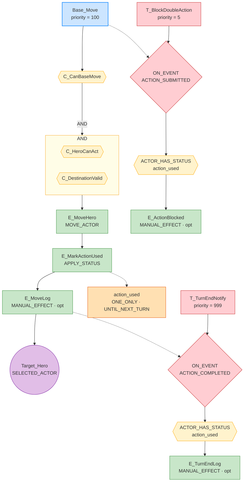
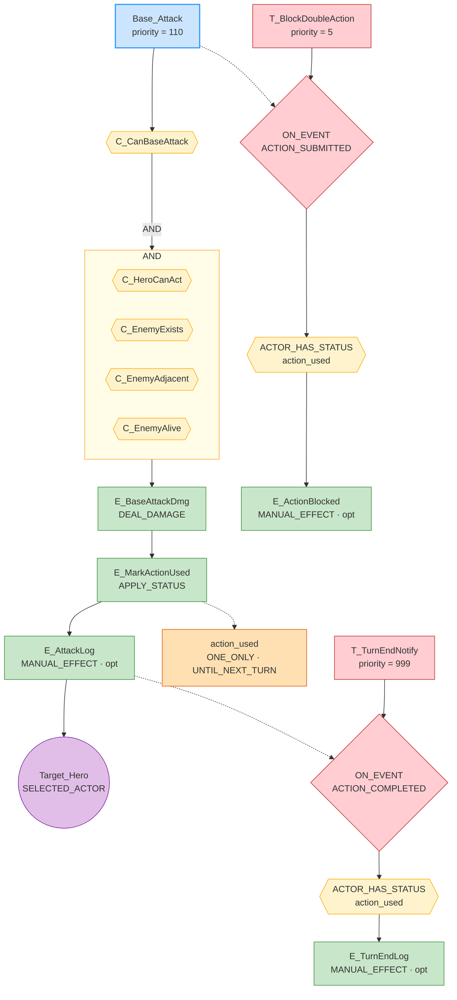
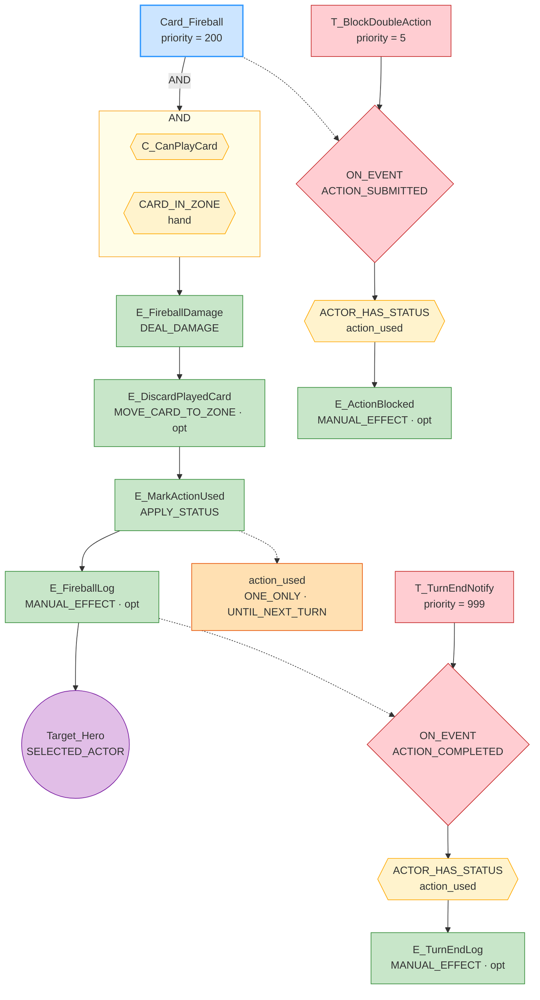
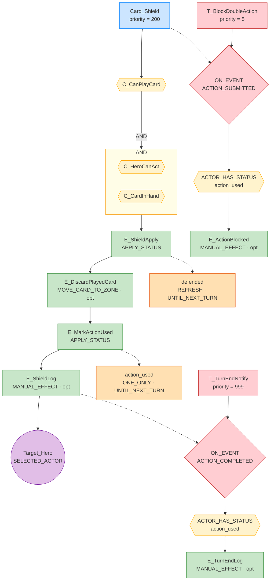
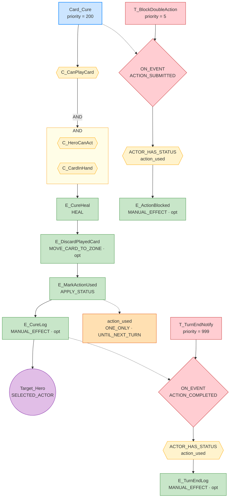
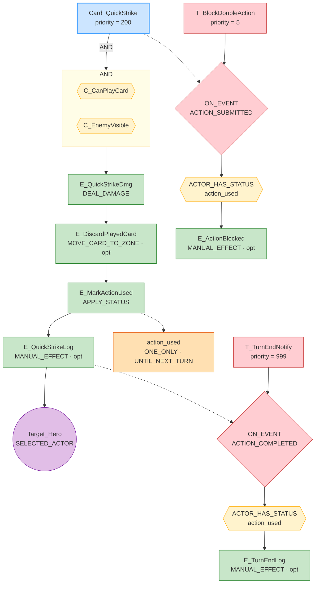
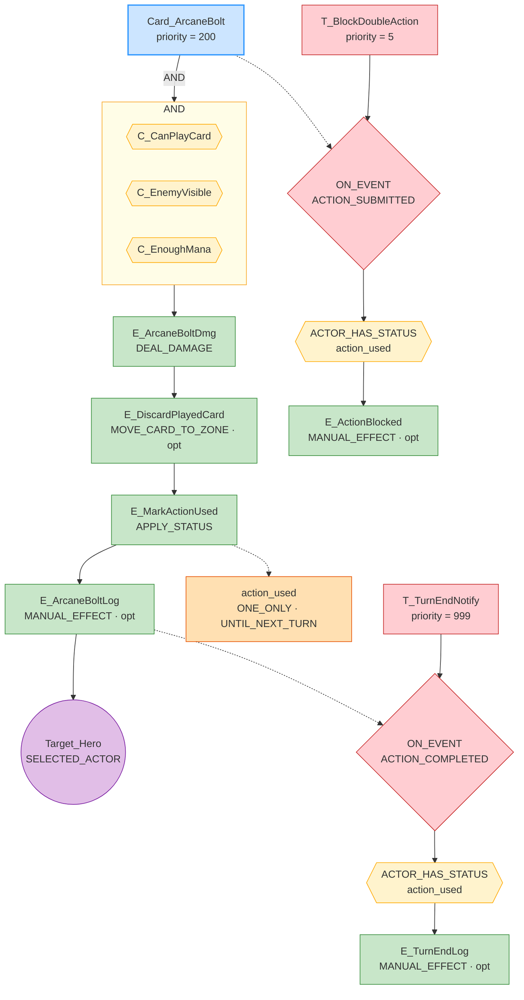

# GRS Rule Graphs — turn_card_dungeon

## Base_Move

---

## Base_Attack

---

## Card_Fireball

---

## Card_Shield

---

## Card_Cure

---

## Card_QuickStrike

---

## Card_ArcaneBolt

---

## Card_Rally

